<div style="font-family: Arial, sans-serif; padding: 40px; width: 600px; margin: auto; text-align: center;">
    <div style="margin-bottom: 20px;">
        
    </div>
    <h1 style="font-size: 20px; text-transform: uppercase; margin: 5px 0;">Universidad Peruana de Ciencias Aplicadas</h1>
    <h2 style="font-size: 18px; margin: 5px 0;">Facultad de Ingeniería</h2>
    <hr style="margin: 20px 0; border: 0; border-top: 1px solid #000;">
    <div style="text-align: left; margin-bottom: 30px;">
        <p><strong>Curso:</strong> 1ASI0732 - Diseño de Experimentos de Ingeniería de Software</p>
        <p><strong>NRC:</strong> 2610</p>
        <p><strong>Nombre del profesor:</strong> Noriega Melendez, Julio Manuel</p>
    </div>
    <h2 style="font-size: 22px; margin: 40px 0;">"Informe del Trabajo Final"</h2>
    <div style="text-align: left; margin-bottom: 30px;">
        <p><strong>Nombre del grupo:</strong> AgroMind</p>
        <p><strong>Nombre del producto:</strong> EcoTrack</p>
        <p><strong>Integrantes:</strong></p>
    </div>
    <table style="width: 100%; border-collapse: collapse; margin-bottom: 50px;">
        <thead>
            <tr>
                <th style="border: 1px solid #000; padding: 8px; text-align: center;">Código</th>
                <th style="border: 1px solid #000; padding: 8px; text-align: center;">Apellidos y Nombres</th>
            </tr>
        </thead>
        <tbody>
            <tr>
                <td style="border: 1px solid #000; padding: 8px;">202313665</td>
                <td style="border: 1px solid #000; padding: 8px;">Chi Cruzatt, Kevin Jorge</td>
            </tr>
            <tr>
                <td style="border: 1px solid #000; padding: 8px;">202312874</td>
                <td style="border: 1px solid #000; padding: 8px;">Mostajo Orosco, Maria Fernanda</td>
            </tr>
            <tr>
                <td style="border: 1px solid #000; padding: 8px;">202220783</td>
                <td style="border: 1px solid #000; padding: 8px;">Orozco Torres, Alvaro Joaquin</td>
            </tr>
            <tr>
                <td style="border: 1px solid #000; padding: 8px;">20211f955</td>
                <td style="border: 1px solid #000; padding: 8px;">Paucar De La Cruz, Tatiana Medalith</td>
            </tr>
            <tr>
                <td style="border: 1px solid #000; padding: 8px;">20201f051</td>
                <td style="border: 1px solid #000; padding: 8px;">Ramos Aguirre, Aldair Joaquin</td>
            </tr>
            <tr>
                <td style="border: 1px solid #000; padding: 8px;">20221e247</td>
                <td style="border: 1px solid #000; padding: 8px;">Reaño Delgadillo, Henry Paolo</td>
            </tr>
        </tbody>
    </table>
    <div style="margin-top: 50px;">
        <p>Lima - abril 2026</p>
    </div>
</div>

<div style="page-break-after: always;"></div>

# Registro de Versiones del Informe


<div style="page-break-after: always;"></div>

# Project Report Collaboration Insights


<div style="page-break-after: always;"></div>

# Contenido

## Tabla de contenidos

- [Caratula](#caratula)
- [Registro de Versiones del Informe](#registro-de-versiones-del-informe)
- [Project Report Collaboration Insights](#project-report-collaboration-insights)
- [Contenido](#contenido)
- [Student Outcome](#student-outcome)
- [Capítulo I: Introducción](#capitulo-i-introduccion)
  - [1.1. Startup Profile](#11-startup-profile)
    - [1.1.1. Descripción de la Startup](#111-descripcion-de-la-startup)
    - [1.1.2. Perfiles de integrantes del equipo](#112-perfiles-de-integrantes-del-equipo)
  - [1.2. Solution Profile](#12-solution-profile)
    - [1.2.1. Antecedentes y problemática](#121-antecedentes-y-problematica)
    - [1.2.2. Lean UX Process](#122-lean-ux-process)
      - [1.2.2.1. Lean UX Problem Statements](#1221-lean-ux-problem-statements)
      - [1.2.2.2. Lean UX Assumptions](#1222-lean-ux-assumptions)
      - [1.2.2.3. Lean UX Hypothesis Statements](#1223-lean-ux-hypothesis-statements)
      - [1.2.2.4. Lean UX Canvas](#1224-lean-ux-canvas)
  - [1.3. Segmentos objetivo](#13-segmentos-objetivo)
- [Capítulo II: Requirements Elicitation & Analysis](#capitulo-ii-requirements-elicitation-analysis)
  - [2.1. Competidores](#21-competidores)
    - [2.1.1. Análisis competitivo](#211-analisis-competitivo)
    - [2.1.2. Estrategias y tácticas frente a competidores](#212-estrategias-y-tacticas-frente-a-competidores)
  - [2.2. Entrevistas](#22-entrevistas)
    - [2.2.1. Diseño de entrevistas](#221-diseno-de-entrevistas)
    - [2.2.2. Registro de entrevistas](#222-registro-de-entrevistas)
    - [2.2.3. Análisis de entrevistas](#223-analisis-de-entrevistas)
  - [2.3. Needfinding](#23-needfinding)
    - [2.3.1. User Personas](#231-user-personas)
    - [2.3.2. User Task Matrix](#232-user-task-matrix)
    - [2.3.3. User Journey Mapping](#233-user-journey-mapping)
    - [2.3.4. Empathy Mapping](#234-empathy-mapping)
  - [2.4. Big Picture EventStoring](#24-big-picture-eventstoring)
  - [2.5. Ubiquitous Language](#25-ubiquitous-language)
- [Capítulo III: Requirements Specification](#capitulo-iii-requirements-specification)
  - [3.1. User Stories](#31-user-stories)
  - [3.2. Impact Mapping](#32-impact-mapping)
  - [3.3. Product Backlog](#33-product-backlog)
- [Capítulo IV: Product Design](#capitulo-iv-product-design)
  - [4.1. Style Guidelines](#41-style-guidelines)
    - [4.1.1. General Style Guidelines](#411-general-style-guidelines)
    - [4.1.2. Web Style Guidelines](#412-web-style-guidelines)
  - [4.2. Information Architecture](#42-information-architecture)
    - [4.2.1. Organization Systems](#421-organization-systems)
    - [4.2.2. Labeling Systems](#422-labeling-systems)
    - [4.2.3. SEO Tags and Meta Tags](#423-seo-tags-and-meta-tags)
    - [4.2.4. Searching Systems](#424-searching-systems)
    - [4.2.5. Navigation Systems](#425-navigation-systems)
  - [4.3. Landing Page UI Design](#43-landing-page-ui-design)
    - [4.3.1. Landing Page Wireframe](#431-landing-page-wireframe)
    - [4.3.2. Landing Page Mock-up](#432-landing-page-mock-up)
  - [4.4. Web Applications UX/UI Design](#44-web-applications-ux-ui-design)
    - [4.4.1. Web Applications Wireframes](#441-web-applications-wireframes)
    - [4.4.2. Web Applications Wireflow Diagrams](#442-web-applications-wireflow-diagrams)
    - [4.4.2. Web Applications Mock-ups](#442-web-applications-mock-ups)
    - [4.4.3. Web Applications User Flow Diagrams](#443-web-applications-user-flow-diagrams)
  - [4.5. Web Applications Prototyping](#45-web-applications-prototyping)
  - [4.6. Domain-Driven Software Architecture](#46-domain-driven-software-architecture)
    - [4.6.1. Design-Level EventStorming](#461-design-level-eventstorming)
    - [4.6.2. Software Architecture Context Diagram](#462-software-architecture-context-diagram)
    - [4.6.3. Software Architecture Container Diagrams](#463-software-architecture-container-diagrams)
    - [4.6.4. Software Architecture Components Diagrams](#464-software-architecture-components-diagrams)
  - [4.7. Software Object-Oriented Design](#47-software-object-oriented-design)
    - [4.7.1. Class Diagrams](#471-class-diagrams)
  - [4.8. Database Design](#48-database-design)
    - [4.8.1. Database Diagram](#481-database-diagram)
- [Capítulo V: Product Implementation, Validation & Deployment](#capitulo-v-product-implementation-validation-deployment)
  - [5.1. Software Configuration Management](#51-software-configuration-management)
    - [5.1.1. Software Development Environment Configuration](#511-software-development-environment-configuration)
    - [5.1.2. Source Code Management](#512-source-code-management)
    - [5.1.3. Source Code Style Guide & Conventions](#513-source-code-style-guide-conventions)
    - [5.1.4. Software Deployment Configuration](#514-software-deployment-configuration)
  - [5.2. Landing Page, Services & Applications Implementation](#52-landing-page-services-applications-implementation)
    - [5.2.1. Sprint 1](#521-sprint-1)
      - [5.2.1.1. Sprint Planning 1](#5211-sprint-planning-1)
      - [5.2.1.2. Aspect Leaders and Collaborators](#5212-aspect-leaders-and-collaborators)
      - [5.2.1.3. Sprint Backlog 1](#5213-sprint-backlog-1)
      - [5.2.1.4. Development Evidence for Sprint Review](#5214-development-evidence-for-sprint-review)
      - [5.2.1.5. Execution Evidence for Sprint Review](#5215-execution-evidence-for-sprint-review)
      - [5.2.1.6. Services Documentation Evidence for Sprint Review](#5216-services-documentation-evidence-for-sprint-review)
      - [5.2.1.7. Software Deployment Evidence for Sprint Review](#5217-software-deployment-evidence-for-sprint-review)
      - [5.2.1.8. Team Collaboration Insights during Sprint](#5218-team-collaboration-insights-during-sprint)
    - [5.2.2. Sprint 2](#522-sprint-2)
      - [5.2.2.1. Sprint Planning 2.](#5221-sprint-planning-2)
      - [5.2.2.2. Aspect Leaders and Collaborators.](#5222-aspect-leaders-and-collaborators)
      - [5.2.2.3. Sprint Backlog 2.](#5223-sprint-backlog-2)
      - [5.2.2.4. Development Evidence for Sprint Review.](#5224-development-evidence-for-sprint-review)
      - [5.2.2.5. Execution Evidence for Sprint Review.](#5225-execution-evidence-for-sprint-review)
      - [5.2.2.6. Services Documentation Evidence for Sprint Review.](#5226-services-documentation-evidence-for-sprint-review)
      - [5.2.2.7. Software Deployment Evidence for Sprint Review.](#5227-software-deployment-evidence-for-sprint-review)
      - [5.2.2.8. Team Collaboration Insights during Sprint.](#5228-team-collaboration-insights-during-sprint)
    - [5.2.3. Sprint 3](#523-sprint-3)
      - [5.2.3.1. Sprint Planning 3](#5231-sprint-planning-3)
      - [5.2.3.2. Aspect Leaders and Collaborators](#5232-aspect-leaders-and-collaborators)
      - [5.2.3.3. Sprint Backlog 3](#5233-sprint-backlog-3)
      - [5.2.3.4. Development Evidence for Sprint Review](#5234-development-evidence-for-sprint-review)
      - [5.2.3.5. Execution Evidence for Sprint Review](#5235-execution-evidence-for-sprint-review)
      - [5.2.3.6. Services Documentation Evidence for Sprint Review](#5236-services-documentation-evidence-for-sprint-review)
      - [5.2.3.7. Software Deployment Evidence for Sprint Review](#5237-software-deployment-evidence-for-sprint-review)
      - [5.2.3.8. Team Collaboration Insights during Sprint](#5238-team-collaboration-insights-during-sprint)
    - [5.2.4. Sprint 4](#524-sprint-4)
      - [5.2.4.1. Sprint Planning 4](#5241-sprint-planning-4)
      - [5.2.4.2. Aspect Leaders and Collaborators](#5242-aspect-leaders-and-collaborators)
      - [5.2.4.3. Sprint Backlog 4](#5243-sprint-backlog-4)
      - [5.2.4.4. Development Evidence for Sprint Review](#5244-development-evidence-for-sprint-review)
      - [5.2.4.5. Execution Evidence for Sprint Review](#5245-execution-evidence-for-sprint-review)
      - [5.2.4.6. Services Documentation Evidence for Sprint Review](#5246-services-documentation-evidence-for-sprint-review)
      - [5.2.4.7. Software Deployment Evidence for Sprint Review](#5247-software-deployment-evidence-for-sprint-review)
      - [5.2.4.8. Team Collaboration Insights during Sprint](#5248-team-collaboration-insights-during-sprint)
  - [5.3. Validation Interviews](#53-validation-interviews)
    - [5.3.1. Diseño de entrevistas](#531-diseno-de-entrevistas)
    - [5.3.2. Registro de entrevistas](#532-registro-de-entrevistas)
    - [5.3.3. Evaluaciones según heurísticas](#533-evaluaciones-segun-heuristicas)
  - [5.4. Video About the Product](#54-video-about-the-product)
- [Capítulo VI: Product Verification & Validation](#capitulo-vi-product-verification-validation)
  - [6.1. Testing Suites & Validation](#61-testing-suites-validation)
    - [6.1.1. Core Entities Unit Tests](#611-core-entities-unit-tests)
    - [6.1.2. Core Integration Tests](#612-core-integration-tests)
    - [6.1.3. Core Behavior-Driven Development](#613-core-behavior-driven-development)
    - [6.1.4. Core System Tests](#614-core-system-tests)
- [Capítulo VII: DevOps Practices](#capitulo-vii-devops-practices)
  - [7.1. Continuous Integration](#71-continuous-integration)
    - [7.1.1. Tools and Practices](#711-tools-and-practices)
    - [7.1.2. Build & Test Suite Pipeline Components](#712-build-test-suite-pipeline-components)
  - [7.2. Continuous Delivery](#72-continuous-delivery)
    - [7.2.1. Tools and Practices](#721-tools-and-practices)
    - [7.2.2. Stages Deployment Pipeline Components](#722-stages-deployment-pipeline-components)
  - [7.3. Continuous Deployment](#73-continuous-deployment)
    - [7.3.1. Tools and Practices](#731-tools-and-practices)
    - [7.3.2. Production Deployment Pipeline Components](#732-production-deployment-pipeline-components)
- [Conclusiones](#conclusiones)
- [Bibliografía](#bibliografia)
- [Anexos](#anexos)


<div style="page-break-after: always;"></div>

# Student Outcome


<div style="page-break-after: always;"></div>

# Capítulo I: Introducción

## 1.1. Startup Profile

### 1.1.1. Descripción de la Startup

**Agromind** es una startup tecnológica creada por estudiantes de Ingeniería de Software de la Universidad Peruana de Ciencias Aplicadas, enfocada en el desarrollo de soluciones digitales para el sector agrícola. Nuestro producto principal, **EcoTrack**, es una aplicación diseñada para mejorar la productividad y la trazabilidad en el campo, conectando a agricultores y agrónomos a través de un ecosistema digital colaborativo que facilita el registro, monitoreo y análisis de cultivos en tiempo real.

**Misión:** Desarrollar soluciones tecnológicas innovadoras que impulsen la eficiencia y sostenibilidad del sector agrícola, ofreciendo herramientas que fortalezcan la relación entre agricultores y agrónomos, y que contribuyan al crecimiento económico y la seguridad alimentaria.

**Visión:** Convertirnos en la startup agrotech líder en Latinoamérica, reconocida por transformar la manera en que se gestiona la producción agrícola mediante tecnología intuitiva, generando un impacto positivo en la productividad, la trazabilidad y la competitividad del sector.


<div style="page-break-after: always;"></div>

### 1.1.2. Perfiles de integrantes del equipo

Se presenta en formato de tabla una breve descripción de cada uno de los integrantes del equipo.

<table>
    <thead>
        <tr>
            <th scope="col">Fotografía</th>
            <th scope="col">Nombres y Apellidos</th>
            <th scope="col">Código de estudiante</th>
            <th scope="col">Carrera</th>
            <th scope="col">Principales habilidades técnicas</th>
        </tr>
    </thead>
    <tbody>
        <!-- Integrante 1 -->
        <tr>
            <td></td>
            <td>Kevin Jorge Chi Cruzatt</td>
            <td>202313665</td>
            <td>Ingeniería de Software</td>
            <td>
                Diseño de arquitectura de software</br>
                Programación en Java</br>
                Programación en PHP</br>
            </td>
        </tr>
        <!-- Integrante 2 -->
        <tr>
            <td></td>
            <td>Maria Fernanda Mostajo Orosco</td>
            <td>202312874</td>
            <td>Ingeniería de Software</td>
            <td>
                Programación en C++</br>
                Programación en Python</br>
                HTML, CSS, JavaScript y SQL</br>
            </td>
        </tr>
        <!-- Integrante 3 -->
        <tr>
            <td></td>
            <td>Álvaro Joaquín Orozco Torres</td>
            <td>202220783</td>
            <td>Ingeniería de Software</td>
            <td>
                Dominio en framework Scrum</br>
                DevOps</br>
                Gestión de bases de datos</br>
            </td>
        </tr>
        <!-- Integrante 4 -->
        <tr>
            <td></td>
            <td>Tatiana Medalith Paucar De La Cruz</td>
            <td>20211f955</td>
            <td>Ingeniería de Software</td>
            <td></td>
        </tr>
        <!-- Integrante 5 -->
        <tr>
            <td></td>
            <td>Aldair Joaquin Ramos Aguirre</td>
            <td>20201f051</td>
            <td>Ingeniería de Software</td>
            <td></td>
        </tr>
        <!-- Integrante 6 -->
        <tr>
            <td></td>
            <td>Henry Paolo Reaño Delgadillo</td>
            <td>20221e247</td>
            <td>Ingeniería de Software</td>
            <td>
                Programación Java SpringBoot</br>
                Programación C#</br>
                Diseño de arquitectura de software</br>
            </td>
        </tr>
    </tbody>
</table>

<div style="page-break-after: always;"></div>

## 1.2. Solution Profile

### 1.2.1. Antecedentes y problemática

**What? (¿Qué?)**

**¿Cuál es el problema?**

El problema es que los agricultores en el Perú todavia registran sus cultivos de manera manual o desordenada, lo que provoca falta de control sobre costos, baja productividad, lo que provoca falta de control sobre costos, baja productividad, y dificulta la trazabilidad de los productos agrícolas causando mayores perdidas económicas. Además, la comunicación entre agricultores y agrónomos es limitada, lo que impide el acceso a asesoramiento técnico oportuno y personalizado.

**When? (¿Cuándo?)**

**¿Cuándo ocurre el problema?**

El problema ocurre de manera continua durante todo el ciclo agrícola, desde la siembra hasta la cosecha. En las etapas iniciales surge por la falta de planificación y registro de insumos, durante el desarrollo del cultivo por la ausencia de un seguimiento ordenado de labores como riego y fertilización, y al momento de la cosecha por la carencia de datos claros sobre rendimientos y trazabilidad que permitan acceder a mercados más exigentes. En consecuencia, se trata de una dificultad recurrente en cada campaña agrícola.

**Where? (¿Dónde?)**

**¿Dónde surge el problema?**

El problema ocurre principalmente en zonas rurales y agrícolas del Perú, donde la agricultores aún dependen de registros manuales que generan desorden, baja productividad y falta de trazabilidad. Los agrónomos que los asesoran tampoco cuentan con herramientas digitales simples para centralizar información y gestionar mejor a sus clientes.

**¿A dónde se dirige?

La solución se dirige a agricultores y agrónomos en el Perú que buscan mejorar la gestión de sus cultivos mediante herramientas digitales.

**Who? (¿Quién?)**

**¿Quiénes están involucrados?**

Los principales usuarios serán los agricultores y los agrónomos.

**¿Quién lo utilizará?

Los agricultores utilizarán la aplicación para registrar labores agrícolas, insumos y rendimientos de sus cultivos, mientras que los agrónomos la emplearán para supervisar fincas, dar seguimiento a las actividades registradas y generar reportes técnicos que respalden sus recomendaciones

**Why? (¿Por qué?)**

**¿Cuál es la causa del problema?**

La causa principal del problema es la baja digitalización en el sector agrícola en el Perú. Muchos agricultores aún continuan usando registros manuales porque no cuentan con herramientas tecnológicas accesibles, simples y adaptadas a su realidad. A esto se suma la resistencia al cambio hacia métodos digitales y la escasez de soluciones locales, lo que mantiene la brecha entre agricultores y agrónomos.

**How? (¿Cómo?)**

**¿En qué condiciones los usuarios usarán nuestro producto?**

Los agricultores y agrónomos usarán EcoTrack principalmente durante sus actividades de campo y en la planificación de campañas agrícolas. El agricultor lo empleará para registrar labores y rendimientos al finalizar o durante sus jornadas de trabajo, mientras que el agrónomo lo usará para supervisar los datos de sus clientes y generar reportes técnicos que respalden su asesoría.

**¿Cómo nos conocieron nuestros compradores?**

Nuestros usuarios podrán conocernos a través de campañas digitales dirigidas al sector agro, ferias especializadas en innovación agrícola, y el contacto directo entre agrónomos y agricultores que ya utilicen la app y la recomienden dentro de su red de trabajo.

**¿Cómo prefieren nuestros consumidores acceder a nuestro producto?

Los agricultores prefieren acceder a EcoTrack desde sus teléfonos móviles mediante la plataforma web responsive, ya que les permite registrar sus actividades de manera rápida y práctica mientras gestionan sus labores. Por su parte, los agrónomos prefieren usar la misma plataforma tanto en el celular como en la computadora, para analizar la información de varias fincas, comparar resultados y generar reportes técnicos de manera más detallada.

**How much? (¿Cuánto?)**

**Estadísticas que sustentan la problemática**

Según el Ministerio de Desarrollo Agrario y Riego (MIDAGRI, 2023), la agricultura familiar representó el 97,6% de todas las unidades agropecuarias en el Perú, lo que refleja que la gran mayoría de productores depende de métodos tradicionales de gestión. Dentro de esta, el 88% corresponde a subsistencia, el 10,6% a intermedia y el 1,4% a consolidada, evidenciando que solo una pequeña parte de agricultores cuenta con mejores condiciones para integrarse a mercados exigentes.

Sin embargo, existe un potencial de mejora: un 36,6% de los agricultores de subsistencia ya destina más de la mitad de su producción a la venta, lo que demuestra que incluso dentro de este grupo existe interés por generar ingresos. Asimismo, un 29,7% de los agricultores familiares intermedios y consolidados transforma su producción para la venta, lo que evidencia un sector con disposición a mejorar sus procesos y dar valor agregado.

Estas cifras muestran que gran parte de la agricultura en el país carece de herramientas digitales que faciliten la organización y la trazabilidad. En este contexto, EcoTrack puede ser una solución útil al permitir que agricultores y agrónomos registren información, organicen sus actividades y generen reportes que respalden la calidad de la producción, mejorando la productividad y el acceso a mercados más competitivos.

<div style="page-break-after: always;"></div>

### 1.2.2. Lean UX Process

El **Lean UX Process** es una metodología ágil que se centra en la colaboración, la experimentación rápida y el aprendizaje validado. En este proyecto se utiliza este enfoque para comprender las experiencias y problemáticas de agricultores y agrónomos, validando hipótesis mediante prototipos y retroalimentación constante.


<div style="page-break-after: always;"></div>

#### 1.2.2.1. Lean UX Problem Statements

Nuestro sistema busca facilitar a los agricultores el registro de sus actividades agrícolas para mejorar la organización de su producción.

Hemos observado que muchos agricultores llevan sus registros de forma manual o dispersa, lo que dificulta el seguimiento de sus cultivos y la planificación futura.

**¿Cómo podemos lograr que los agricultores registren y gestionen sus actividades de manera más ordenada y confiable?**

El producto tiene como objetivo apoyar a los agrónomos con datos de campo que respalden sus recomendaciones técnicas.

Actualmente, los agrónomos no reciben información actualizada ni centralizada, lo que afecta la precisión de sus decisiones.

**¿Cómo podemos mejorar el acceso de los agrónomos a información confiable y en tiempo real para optimizar la asesoría técnica?**

Nuestro servicio está orientado a que los agricultores con parcelas reducidas optimicen la planificación de sus cultivos.

Sin embargo, observamos que muchos productores carecen de información organizada para proyectar rendimientos y tomar decisiones de siembra eficientes.

#### 1.2.2.2. Lean UX Assumptions

**Business Assumptions**

1. **Creo que mis clientes necesitan**una forma confiable y sencilla de organizar, dar seguimiento y profesionalizar la gestión de sus cultivos.
2. **Estas necesidades se pueden resolver con**una aplicación web que integre registro productivo, alertas y asesoría especializada.
3. **Mis clientes iniciales serán**agricultores pequeños y medianos interesados en digitalizar su producción, y agrónomos que requieren datos de campo.
4. **EL valor más importante que el cliente quiere de mi servicio es**mejorar la productividad y reducir riesgos al tomar decisiones basadas en datos reales.
5. **El cliente también puede obtener estos beneficios adicionales:**acceso a alertas por clima e IoT, gestión de inventario, trazabilidad y asesoría profesional.
6. **Voy a adquirir la mayoría de mis clientes a través de**alianzas con asociaciones de agricultores, ferias agropecuarias, y marketing digital en redes sociales.
7. **Haré dinero a través de**un modelo de suscripción mensual con planes escalonados: AgroStart (5 USD), AgroSmart (25 USD) y AgroExpert (50 USD).
8. **Mi competencia principal en el mercado será**otras apps agrícolas de gestión y plataformas de IoT que ofrecen monitoreo de cultivos.
9. **Los venceremos debido a**un enfoque local adaptado al contexto peruano, facilidad de uso y el valor agregado de la asesoría profesional.
10. **Mi mayor riesgo de producto es que**los agricultores pequeños no adopten la aplicación por falta de familiaridad con la tecnología o baja disposición a pagar.
11. **Resolveremos esto a través de**capacitaciones simples, tutoriales dentro de la app, y un plan de entrada accesible (AgroStart) que facilite la adopción gradual.

**User Assumptions**

**¿Quién es el usuario?**

Los usuarios de Ecotrack son agricultores de diferentes escalas (pequeños y medianos) que buscan organizar y mejorar la gestión de sus cultivos, así como agrónomos que necesitan información de campo confiable y en tiempo real para optimizar sus recomendaciones técnicas.

**¿Qué problemas tiene nuestro producto que resolver?**

Ecotrack busca resolver la desorganización en el registro de actividades agrícolas, la falta de trazabilidad en la producción, la ausencia de alertas preventivas relacionadas con el clima o riesgos del cultivo y la baja adopción tecnológica que limita la eficiencia de los productores.

**¿Que caraterísticas son importantes?**

Las características clave son la posibilidad de registrar y dar seguimiento a los cultivos de manera sencilla, recibir alertas climáticas e integrar datos de IoT, gestionar inventarios agrícolas, mantener trazabilidad de la producción y, en planes avanzados, acceder a asesoría especializada de agrónomos.

**¿Dónde encaja nuestro producto en su trabajo o vida?**

El producto encaja en la rutina diaria de los agricultores como una herramienta que reemplaza los registros manuales y centraliza la información productiva, convirtiéndose en apoyo esencial para la planificación de cultivos, la toma de decisiones y la mejora continua de la productividad.

**¿Cuándo y cómo nuestro producto es usado?**

Ecotrack se utiliza en distintos momentos del ciclo agrícola: al planificar cultivos, registrar actividades de campo, gestionar inventario y recibir notificaciones relacionadas con el clima o posibles riesgos. Su uso principal es a través de una aplicación web accesible desde navegadores en computadoras o dispositivos móviles, lo que permite a los usuarios consultarla y actualizar información de manera práctica en cualquier lugar con conexión a internet.

**¿Cómo debe verse nuetro producto y cómo comportarse?**

El producto debe tener un diseño visual simple y claro, con iconos intuitivos y un lenguaje accesible que permita a los usuarios aprender a usarlo rápidamente; además, debe comportarse de forma ágil, confiable y proactiva, enviando notificaciones oportunas y garantizando una experiencia sin fricciones.

#### 1.2.2.3. Lean UX Hypothesis Statements

- **Hypothesis 01:**

  **Creemos que** los agricultores pequeños registrarán con mayor frecuencia sus actividades agrícolas si cuentan con una herramienta digital sencilla.

  **Sabremos que** hemos tenido éxito.

  **Cuando** los usuarios ingresen al menos dos registros semanales en la aplicación.


- **Hypothesis 02:**

  **Creemos que** los agricultores medianos reducirán pérdidas productivas si reciben alertas en tiempo real sobre el clima y condiciones críticas.

  **Sabremos que** hemos tenido éxito.

  **Cuando** los usuarios reporten menos incidentes climáticos en entrevistas y un 20% de reducción en pérdidas en sus cultivos.


- **Hypothesis 03:**

  **Creemos que** los agricultores aumentarán su eficiencia si pueden controlar su inventario agrícola desde la plataforma.

  **Sabremos que** hemos tenido éxito.

  **Cuando** los usuarios utilicen la función de inventario al menos una vez por semana y reporten mejoras en la gestión de insumos.


- **Hypothesis 04:**

  **Creemos que** los agricultores estarán más satisfechos y fidelizados si reciben asesoría directa de agrónomos desde la plataforma.

  **Sabremos que** hemos tenido éxito.

  **Cuando** la tasa de retención del plan AgroExpert supere el 80% después de seis meses de uso.


- **Hypothesis 05:**

  **Creemos que** los agrónomos podrán brindar recomendaciones más precisas y rápidas si tienen acceso a datos actualizados de los cultivos en Ecotrack.

  **Sabremos que** hemos tenido éxito.

  **Cuando** los agrónomos reporten en entrevistas que la aplicación mejora su trabajo diario y al menos el 60% use la plataforma para consultar datos antes de dar asesorías.

#### 1.2.2.4. Lean UX Canvas

El Lean UX Canvas es una herramienta visual que permite alinear al equipo en torno a problemas, usuarios e hipótesis de manera ágil. En este proyecto se utilizó para comprender mejor a los agricultores y agrónomos, identificar sus necesidades y definir cómo Ecotrack puede generar valor real en su trabajo diario.

Aquí se presenta el Lean UX Canvas desarrollado para Ecotrack:

**Figura 1. Lean UX Canvas de Ecotrack**


<div style="page-break-after: always;"></div>

## 1.3. Segmentos objetivo

En el análisis del segmento objetivo para                                                              , hemos previsto que nuestros principales usuarios serán **agricultores y agrónomos.**

**Agricultores**

Según el Ministerio de Desarrollo Agrario y Riego (MIDAGRI, 2023) **el 78,5% de las unidades agropecuarias en Perú tienen menos de 5 hectáreas**, lo que refleja la prevalencia de productores de pequeña escala con limitaciones de organización y acceso a mercados. Este grupo requiere soluciones digitales simples que les permitan mejorar la gestión de sus cultivos y profesionalizar sus procesos productivos.

- **Edad:** 25 a 60 años.

- **Necesidad clave:** Organizar cultivos, prevenir riesgos climáticos y mejorar trazabilidad.

- **Nivel educativo:** Organizar cultivos, prevenir riesgos climáticos y mejorar trazabilidad.

- **Uso de tecnología:** Uso básico de teléfonos móviles o computadoras, con necesidad de soluciones adaptadas a su contexto.

**Agrónomos**

De acuerdo con Puntel et al. (2022), la adopción de la agricultura digital en Sudamérica aún presenta limitaciones, lo que genera dificultades para acceder a datos confiables y actualizados en el campo. En este contexto, los agrónomos requieren plataformas que centralicen la información y les permitan brindar recomendaciones técnicas más precisas y oportunas.

- **Edad:** 28 a 5 años.

- **Necesidad clave:** Acceso a datos de campo confiables para optimizar asesorías.

- **Nivel educativo:** Profesionales con formación en agronomía o ciencias agrícolas.

- **Uso de tecnología:** Familiarizados con herramientas digitales, pero necesitan soluciones específicas para el sector agro.


<div style="page-break-after: always;"></div>

# Capítulo II: Requirements Elicitation & Analysis

## 2.1. Competidores

### 2.1.1. Análisis competitivo

<table>
    <thead>
        <tr>
            <th scope="col"><strong>Competitive Analysis Landscape</strong></th>
        </tr>
    </thead>
    <tbody>
        <tr>
            <th scope="row" colspan="2">¿Por qué llevar a cabo este análisis?</th>
            <td colspan="4">Este análisis se realiza principalmente para identificar el estado del mercado y los segmentos objetivo que son atendidos actualmente, a fin de refinar la propuesta de valor central de la startup.</td>
        </tr>
        <tr>
            <th scope="row" colspan="2"></th>
            <td style="width: 25%; vertical-align: top;">EcoTrack<br></td>
            <td style="width: 25%; vertical-align: top;">Agroptima<br></td>
            <td style="width: 25%; vertical-align: top;">Auravant<br></td>
            <td style="width: 25%; vertical-align: top;">OneSoil<br></td>
        </tr>
        <tr>
            <th scope="row" rowspan="2">Perfil</th>
            <th scope="row">Overview</th>
            <td>Aplicación web que ofrece servicios para el seguimiento de cultivos, control de inventario y ganancias y recibir alertar climáticas. Incluyendo modo colaborativo y foros.</td>
            <td>Aplicación móvil y web en la nube que ofrece servicios para registrar labores, controlar inventario y calcular costos en el campo, incluso sin conexión a internet</td>
            <td>Aplicación móvil y web que ofrece servicios para monitorear cultivos de manera satelital, gestionar datos agronómicos y herramientas de agricultura de precisión.</td>
            <td>Aplicación móvil y web que ofrece los servicios de Monitoreo satelital de cultivos, planificación agrícola y herramientas de precisión para ahorrar insumos y mejorar el rendimiento</td>
        </tr>
        <tr>
            <th scope="row">Ventaja competitiva ¿Qué valor ofrece a los clientes?</th>
            <td>Posee un sistema que permite la gestión de cultivos, inventario y ganancias desde una misma plataforma. Además, ofrece alertas tanto climáticas como de humedad o temperatura, lo que facilita la toma de decisiones en tiempo real. Incorpora un modo colaborativo y foros que fomentan la cooperación entre agricultores. Asimismo, permite visualizar graficas de progreso poder analizar la rentabilidad</td>
            <td>Dispone de un cuaderno de campo digital que tiene funciones avanzadas de registro y filtrado de labores, insumos y costos, esto es adaptable a distintos tipos de cultivos. Además, cuenta con la facilidad del funcionamiento sin conexión a internet, lo que permite trabar en el capo y sincronizar los datos al recuperar la conexión a internet. Asimismo, también cuenta con reportes automáticos</td>
            <td>Integra imágenes satelitales y datos georreferenciados en un sistema de monitoreo lo que permite identificar anomalías en los cultivos y filtrar información por cultivo, lote, índice de vegetación o fecha. Además, ofrece mapas de prescripción para fertilización siembra variable, lo que incrementa la eficiencia productiva</td>
            <td>Cuenta con un sistema gratuito y accesible de monitoreo satelital que permite filtrar información por lote, índice NDVI y estado del cultivo. Además, ofrece planificación agrícola mediante mapas de fertilización y siembra variable, ayudando a ahorrar insumos y mejorar el rendimiento. Su aplicación móvil posibilita registrar observaciones como fotos y problemas detectados en campo que complementan la versión web</td>
        </tr>
        <tr>
            <th scope="row" rowspan="2">Perfil de Marketing</th>
            <th scope="row">Mercado objetivo</th>
            <td>Pequeños y medianos agricultores que busquen digitalizar su producción, así como agrónomos que requieren datos de campo</td>
            <td>Agricultores profesionales y empresas agrícolas, que buscan digitalizar su gestión de una manera eficiente</td>
            <td>Productores agrícolas y agrónomos que buscan implementar agricultura de precisión, así como empresas vinculadas al sector agroindustrial</td>
            <td>Agricultores (pequeños, medianos y grandes) que estén interesados en implementar un monitoreo satelital.</td>
        </tr>
        <tr>
            <th scope="row">Estrategias de marketing</th>
            <td>Publicidad en redes sociales, colaborar con expertos ambientales y lideres comunitarios, promover testimonios reales de agricultores.</td>
            <td>Colaboraciones con lideres de opinión en el sector agropecuario</td>
            <td>Publicidad en redes sociales, alianzas con instituciones educativas y empresas del sector, participación en ferias y eventos del sector</td>
            <td>Trabaja junto con ONGs, colabora con expertos en tecnología y sostenibilidad para promover el uso de su plataforma, publicidad digital</td>
        </tr>
        <tr>
            <th scope="row" rowspan="3">Perfil de Producto</th>
            <th scope="row">Productos & Servicios</th>
            <td>Ofrece una plataforma web la cual permite la gestión agrícola de manera digita, conectando tanto a agricultores como productores con herramientas para el seguimiento de cultivos, control de inventario, ganancias y alertas climáticas</td>
            <td>Ofrece una plataforma web y móvil en la nube la cual cumple la función de cuaderno de campo digital, el cual permite registrar labores agrícolas, controlar inventarios y calcular los costos de una manera más eficiente</td>
            <td>Ofrece una plataforma web y móvil la cual permite monitorear los cultivos mediante imágenes satelitales, gestionar los datos agronómicos, tales como lluvias entre otros, generas mapas de prescripción y trazar procesos completos</td>
            <td>Ofrece una plataforma web y móvil que permite monitorear cultivos con el índice NDVI utilizando imágenes satelitales, también permite planificar tareas de campo, generar mapas de siembra y fertilización variable y analizar datos climáticos</td>
        </tr>
        <tr>
            <th scope="row">Precios & Costos</th>
            <td>Los precios varían dependiendo del plan de suscripción seleccionado, esto se adapta a las necesidades de los agricultores. Cuenta con 3 planes escalonados de suscripciones mensuales: AgroStart con un costo de 15 USD, cuenta con funciones básicas como seguimiento de cultivos y alertas climáticas, AgroSmart, el cual cuenta con un costo de 50 USD, este plan incluye más funcionalidades que AgroStart, y AgroExpert, el cual es el plan más completo con un costo de 100 USD, este plan incluye todas las funcionalidades de EcoTrack</td>
            <td>Los precios que ofrecen varían dependiendo del número de hectáreas y los módulos contratados. Ofrecen un plan anual de 249 USD el cual incluye el cuaderno de campo digital, inventario y reportes, con actualizaciones en la nube. El registro inicial es gratuito y cuenta con una prueba gratuita por un tiempo limitado. Sin embargo, una vez finaliza este periodo de prueba, es necesario pagar una cuota de suscripción</td>
            <td>Ofrecen un plan gratuito el cual cuenta con un acceso básico a imágenes satelitales y monitores de cultivos, también cuenta con planes de pago para poder acceder a funcionalidades más avanzadas como mapas de prescripción, gestión multiusuario y análisis avanzados. El registro, de igual manera, es gratuito y el acceso a la plataforma no tiene costo, pero las funciones avanzadas requieren una suscripción anual la cual va desde los USD 708 hasta los USD 2.028</td>
            <td>OneSoil ofrece un modelo mixto, cuenta con una versión estándar la cual es completamente gratuita, brinda acceso a imágenes satelitales, monitoreo NDVI y gestión básica de lotes. Para acceder a OneSoil PRO se requiere una suscripción de pago, el precio varia dependiendo de la cantidad de hectareas que se maneje, el precio por hectaria va desd los 2 USD hasta los 10 USD anuales.</td>
        </tr>
        <tr>
            <th scope="row">Canales de distribución (Web y/o Móvil)</th>
            <td>Aplicaciones web</td>
            <td>Aplicaciones web y móvil</td>
            <td>Aplicaciones web y móvil</td>
            <td>Aplicaciones web y móvil</td>
        </tr>
        <tr>
            <th scope="row" rowspan="4">Análisis SWOT</th>
            <th scope="row">Fortalezas</th>
            <td>Startup integral, accesible y enfocada en pequeños y medianos agricultores, cuenta con planes de pago escalonados que se pueden adaptar a todo tipo de usuarios</td>
            <td>Plataforma ya reconocida principalmente en Europa, fue desarrollada junto con agricultores reales, cuenta con un soporte confiable y algunas funcionalidades específicas para trazabilidad</td>
            <td>Marca en expansión internación gracias a la ayuda de su plan gratuito y la integración de datos satelitales y meteorológicos, además cuenta con alianzas estratégicas con instituciones y empresas agroindustriales</td>
            <td>Ya cuenta con una base global de usuarios, tiene una versión gratuita accesible, es reconocida por su uso innovador de imágenes satelitales y algoritmos de aprendizaje para mejorar la precisión de cultivos</td>
        </tr>
        <tr>
            <th scope="row">Debilidades</th>
            <td>Poco reconocimiento y baja visibilidad en el mercado, fuerte competencia con experiencia internacional y sin alianzas que brinden una ventaja competitiva</td>
            <td>Dependencia de una suscripción anual, lo que puede llegar a limitar la flexibilidad de pago, además su funcionalidades menos avanzadas en agricultura de precisión</td>
            <td>Tiene una curva de aprendizaje elevada para usuarios que no tienen mucha experiencia en el mundo digital y foco menor en el aspecto financiero o inventario</td>
            <td>Presencia limitada para soporte técnico en idiomas que no sean ingles o ruso, dependencia de una suscripción PRO para poder sostener su modelo de negocio</td>
        </tr>
        <tr>
            <th scope="row">Oportunidades</th>
            <td>Aumento de la digitalización en sectores agrícolas de mercado emergente interesados en soluciones sostenibles, posibilidad de integrar nuevas tecnologías a futuro</td>
            <td>Incremento de las regulaciones en agricultura que requieren cuadernos digitales lo que le da facilidad para expandirse a nuevos mercados y genera una mayor demanda de soluciones</td>
            <td>Expansión a América Latina y Europa gracias al crecimiento de la demanda de soluciones de agricultura digital</td>
            <td>Crecida de la demanda mundial por herramientas gratuitas, crecimiento de la agricultura de precisión en medianos y pequeños productores</td>
        </tr>
        <tr>
            <th scope="row">Amenazas</th>
            <td>Competencia ya consolidada que cuenta con planes o pruebas gratuitos, posible resistencia tecnología de algunos agricultores</td>
            <td>Aparición de nuevas plataformas mas económicas, dificultad de adopción digital para pequeños agricultores, creciente presión de competidores con más visibilidad</td>
            <td>Competencia creciente en la agricultura satelital, riesgo de regulaciones con respecto al uso de datos geoespaciales, rápida innovación tecnológica</td>
            <td>Fuerte competencia en el mercado del monitoreo satelital, depende de financiamiento externo para poder sostener algunas operaciones</td>
        </tr>
    </tbody>
</table>

### 2.1.2. Estrategias y tácticas frente a competidores

**Estrategia de Transparencia y Confianza**
* Abordar el temor a la falta de ciberseguridad en el segmento objetivo mediante una comunicación transparente.
* Publicar políticas de privacidad y términos de servicio de forma explita y accesible.
* Garantizar la ausencia de recopilación de datos sensibles para consolidar la credibilidad y visibilidad en el mercado.

**Estrategia de Lanzamiento y Accesibilidad Web**
* Priorizar un despliegue web directo al usuario para eludir los procesos de aprobación de las tiendas de aplicaciones.
* Garantizar la implementación inmediata de actualizaciones y nuevas funcionalidades en el sistema.
* Asegurar el acceso desde cualquier dispositivo y navegador sin necesidad de descargas, maximizando así el alcance del mercado.

**Estrategia de Diferenciación de Valor y Monetización**
* Implementar un modelo de precios escalonado y accesible que contraste con los planes gratuitos básicos de la competencia.
* Proveer funcionalidades integradas superiores, incluyendo seguimiento de cultivos, control de inventario/ganancias, alertas climáticas y modo colaborativo.
* Capturar a los usuarios sensibles al costo mediante la demostración clara del retorno de inversión (ROI) a largo plazo.

<div style="page-break-after: always;"></div>

## 2.2. Entrevistas

Esta sección expone la investigación basada en entrevistas realizadas a agricultores y agrónomos, segmentos clave del proyecto. A través de sus testimonios se buscó identificar las principales dificultades en la gestión agrícola y explorar cómo una solución digital podría responder de manera efectiva a sus necesidades.

<div style="page-break-after: always;"></div>

### 2.2.1. Diseño de entrevistas

**Segmento 1: Agricultores**

**Gestión agrícola actual**
* ¿Cómo organizas tus actividades en la parcela día a día?
* ¿Qué herramientas utilizas para registrar información sobre tus cultivos (libretas, Excel, ninguna)?
* ¿Sueles planificar la siembra, riego o cosecha con anticipación? ¿Cómo lo haces?

**Monitoreo y control**
* ¿Cómo haces seguimiento al crecimiento de tus plantas (conteo de hojas, botones, frutos, tamaño, etc.)?
* ¿Qué información te sería útil recibir en reportes para mejorar tu producción?
* ¿Qué tan fácil es para ti acceder a un agrónomo cuando necesitas apoyo en el campo?

**Uso de tecnología**
* ¿Usas el celular u otro dispositivo para apoyar tu trabajo agrícola?
* ¿Has probado alguna herramienta digital relacionada con agricultura? ¿Qué te gustó o no?

**Dolores y frustraciones**
* ¿Qué es lo más complicado de gestionar tus cultivos?
* ¿Cómo te afecta no tener datos organizados de tu parcela?

**Expectativas**
* Si tuvieras una aplicación para apoyarte en la gestión agrícola, ¿qué problemas te gustaría que te ayude a resolver?
* ¿Qué tipo de información o apoyo te sería más útil recibir en una aplicación agrícola?
* ¿Estarías dispuesto a aprender a usar una aplicación si esta te ayuda a mejorar la gestión de tus cultivos?
* ¿Qué necesitarías para sentirte cómodo usando una aplicación agrícola (capacitación, soporte, facilidad de uso)?

**Segmento 2: Agrónomos**

**Trabajo actual**
* ¿Cómo recopilas la información de las parcelas que supervisas?
* ¿Qué métodos usas para dar recomendaciones a agricultores?
* ¿Con qué frecuencia visitas a tus clientes o parcelas?

**Herramientas y procesos**
* ¿Qué herramientas digitales (si alguna) usas actualmente para tu trabajo?
* ¿Cómo te comunicas con los agricultores (WhatsApp, llamadas, correo)?
* ¿Qué tipo de reportes o datos sueles preparar para tus clientes?

**Problemas y limitaciones**
* ¿Qué es lo más difícil al dar asesoría a agricultores?
* ¿Qué consecuencias tiene para ti no contar con información confiable o actualizada?
* ¿Qué obstáculos encuentras al transmitir tus recomendaciones a agricultores?

**Tecnología y digitalización**
* ¿Has probado apps o sistemas digitales para agricultura? ¿Cómo fue tu experiencia?
* ¿Qué funcionalidades valoras más en un sistema para dar asesoría técnica?

**Expectativas**
* Si contaras con una herramienta digital para tu labor, ¿qué funciones te facilitarían el trabajo con los agricultores?
* ¿Qué tipo de datos o reportes consideras indispensables para brindar recomendaciones más precisas?

<div style="page-break-after: always;"></div>

### 2.2.2. Registro de entrevistas

**SEGMENTO AGRICULTOR:**

**Entrevista 1:**

<table>
    <thead>
        <tr>
            <th scope="col">Atributo</th>
            <th scope="col">Detalle</th>
        </tr>
    </thead>
    <tbody>
        <tr>
            <th scope="row">Nombre</th>
            <td>Rommer Tuesta</td>
        </tr>
        <tr>
            <th scope="row">Edad</th>
            <td>62 años</td>
        </tr>
        <tr>
            <th scope="row">Distrito</th>
            <td>Santiago de Surco</td>
        </tr>
        <tr>
            <th scope="row">Ocupación</th>
            <td>Emprendedor agricultor</td>
        </tr>
        <tr>
            <th scope="row">Fecha de entrevista</th>
            <td>09 de Setiembre del 2025</td>
        </tr>
        <tr>
            <th scope="row">Timing</th>
            <td>00:00:00 - 00:15:09</td>
        </tr>
        <tr>
            <th scope="row">Enlace a la grabación</th>
            <td><a href="https://upcedupe-my.sharepoint.com/:v:/g/personal/u20221g044_upc_edu_pe/EWIynez_N45IjdJ6JFNpOusBxo9mDCzON9DF0V6rEsRh9A?e=S7WqUn"><em>Ver en Microsoft Stream</em></a></td>
        </tr>
        <tr>
            <th scope="row">Captura de pantalla de la grabación</th>
            <td></td>
        </tr>
        <tr>
            <th scope="row">Resumen</th>
            <td>Rommer comenta que utiliza principalmente la aplicación Whatsapp en su celular para mantener registro de los avances, trabajos, etc. que se realicen en las plantas, algunas veces, pasa la información de su celular a Excel o Word, pero que no cuenta con una aplicación determinada para esto. Con respecto al trabajo diario, manifiesta que se organizan de manera semanal para cumplir con las necesidades de cuidado de las plantas, asigna las tareas por medio de Whatsapp y manteniene record de esto mismo en la misma aplicación. Además, expresó que desearía conocer con exactitud la ubicación de cada planta con un tablero y mantener un registro de las caracteristicas principales de cada planta como tamaño, ramaje, etc. Cuenta con el trabajo de un agrónomo y a su vez con asesoría de un grupo de agrónomos que son proporcionados por la empresa que compra el producto cocechado. Finalmente, menciona que estaría dispuesto a utilizar una solución tecnológica si es que esta es sencilla y llamativa de usar.</td>
        </tr>
    </tbody>
</table>

**Entrevista 2:**

<table>
    <thead>
        <tr>
            <th scope="col">Atributo</th>
            <th scope="col">Detalle</th>
        </tr>
    </thead>
    <tbody>
        <tr>
            <th scope="row">Nombre</th>
            <td>Miguel Naito</td>
        </tr>
        <tr>
            <th scope="row">Edad</th>
            <td>53 años</td>
        </tr>
        <tr>
            <th scope="row">Distrito</th>
            <td>Lima</td>
        </tr>
        <tr>
            <th scope="row">Ocupación</th>
            <td>Paisajista</td>
        </tr>
        <tr>
            <th scope="row">Fecha de entrevista</th>
            <td>10 de Setiembre del 2025</td>
        </tr>
        <tr>
            <th scope="row">Timing</th>
            <td>00:15:10 - 00:40:46</td>
        </tr>
        <tr>
            <th scope="row">Enlace a la grabación</th>
            <td><a href="https://upcedupe-my.sharepoint.com/:v:/g/personal/u20221g044_upc_edu_pe/EWIynez_N45IjdJ6JFNpOusBxo9mDCzON9DF0V6rEsRh9A?e=S7WqUn"><em>Ver en Microsoft Stream</em></a></td>
        </tr>
        <tr>
            <th scope="row">Captura de pantalla de la grabación</th>
            <td></td>
        </tr>
        <tr>
            <th scope="row">Resumen</th>
            <td>Miguel, comentó que durante la época de cultivo de arándanos se solía utilizar hojas impresas con los planos y posición de cada planta, en estas registraban las caracteristicas de cada una, esto debido a que existía la posibilidad de malograr los dispositivos electrónicos en el barro o averiar de alguna manera, lo cual generaría costo extra y posible pérdida de información valiosa; Realizaban la planificación de la siembra, cosecha, desplantación, abono, etc. anual, mensual y semanalmente. La tecnología que utilizaban eran sensores de tierra que mandaban alertas casi a tiempo real. Expresó que podria utilizar una aplicación dirigida a la gestión agrícola siempre y cuando sea fácil de usar, intuitiva, especifica para cada cultivo y rápida.</td>
        </tr>
    </tbody>
</table>

**Entrevista 3:**

<table>
    <thead>
        <tr>
            <th scope="col">Atributo</th>
            <th scope="col">Detalle</th>
        </tr>
    </thead>
    <tbody>
        <tr>
            <th scope="row">Nombre</th>
            <td>Erica Marin</td>
        </tr>
        <tr>
            <th scope="row">Edad</th>
            <td>45 años</td>
        </tr>
        <tr>
            <th scope="row">Distrito</th>
            <td>Santiago de Surco</td>
        </tr>
        <tr>
            <th scope="row">Ocupación</th>
            <td>Emprendedor agricultor - administrador</td>
        </tr>
        <tr>
            <th scope="row">Fecha de entrevista</th>
            <td>12 de Setiembre del 2025</td>
        </tr>
        <tr>
            <th scope="row">Timing</th>
            <td>00:00:00 - 00:15:09</td>
        </tr>
        <tr>
            <th scope="row">Enlace a la grabación</th>
            <td><a href="https://upcedupe-my.sharepoint.com/:v:/g/personal/u20221g044_upc_edu_pe/EWIynez_N45IjdJ6JFNpOusBxo9mDCzON9DF0V6rEsRh9A?e=S7WqUn"><em>Ver en Microsoft Stream</em></a></td>
        </tr>
        <tr>
            <th scope="row">Captura de pantalla de la grabación</th>
            <td></td>
        </tr>
        <tr>
            <th scope="row">Resumen</th>
            <td>Erica comenta que utiliza ocasionalmente Excel en su computadora para llevar el registro de los avances, tareas y actividades realizadas en las plantas. En ocasiones, complementa esta información trasladándola a documentos en Word. En cuanto a la organización del trabajo diario, explica que planifican las labores de forma semanal para atender las necesidades de cuidado de las plantas, asignando las tareas en Excel y manteniendo allí el registro de las mismas. Además, manifestó que le gustaría contar con un tablero que le permita visualizar con precisión la ubicación de cada planta y registrar sus principales características, como tamaño, ramaje, entre otras. Actualmente trabaja con un agrónomo y recibe asesoría de un grupo de especialistas proporcionados por la empresa compradora de la cosecha. Finalmente, mencionó que estaría dispuesto a adoptar una solución tecnológica siempre que sea sencilla y en el que no deba de invertir mucho en capacitación del personal.</td>
        </tr>
    </tbody>
</table>

**Segmento 2: Agrónomos**

**Entrevista 1:**

<table>
    <thead>
        <tr>
            <th scope="col">Atributo</th>
            <th scope="col">Detalle</th>
        </tr>
    </thead>
    <tbody>
        <tr>
            <th scope="row">Nombre</th>
            <td>Luis Mendoza</td>
        </tr>
        <tr>
            <th scope="row">Edad</th>
            <td>30 años</td>
        </tr>
        <tr>
            <th scope="row">Distrito</th>
            <td>Villa el Salvador</td>
        </tr>
        <tr>
            <th scope="row">Ocupación</th>
            <td>Ingeniero Agrónomo</td>
        </tr>
        <tr>
            <th scope="row">Fecha de entrevista</th>
            <td>06 de Setiembre del 20245</td>
        </tr>
        <tr>
            <th scope="row">Timing</th>
            <td>40:46 - 48:23</td>
        </tr>
        <tr>
            <th scope="row">Enlace a la grabación</th>
            <td><a href="https://upcedupe-my.sharepoint.com/:v:/g/personal/u20221g044_upc_edu_pe/EWIynez_N45IjdJ6JFNpOusBxo9mDCzON9DF0V6rEsRh9A?e=FnurJA&nav=eyJyZWZlcnJhbEluZm8iOnsicmVmZXJyYWxBcHAiOiJTdHJlYW1XZWJBcHAiLCJyZWZlcnJhbFZpZXciOiJTaGFyZURpYWxvZy1MaW5rIiwicmVmZXJyYWxBcHBQbGF0Zm9ybSI6IldlYiIsInJlZmVycmFsTW9kZSI6InZpZXcifSwicGxheWJhY2tPcHRpb25zIjp7InN0YXJ0VGltZUluU2Vjb25kcyI6MjQ0OC4xfX0%3D"><em>Ver en Microsoft Stream</em></a></td>
        </tr>
        <tr>
            <th scope="row">Captura de pantalla de la grabación</th>
            <td></td>
        </tr>
        <tr>
            <th scope="row">Resumen</th>
            <td>Luis comenta que utiliza su celular para anotar en el bloc de notas los conteos que realiza y luego transfiere la información a Excel. Señala que, en ocasiones, resulta complicado trabajar con los agrónomos, ya que muchos no cuentan con conocimientos especializados sobre el suelo y otros aspectos técnicos. Considera que lo ideal sería realizar visitas semanales, y en su labor prepara reportes sobre análisis de suelo, consumo de agua y estudios meteorológicos. También menciona que los agricultores suelen mostrarse reacios a incorporar nuevos conocimientos. En el pasado probó una aplicación que solo permitía registrar conteos, pero no le resultó útil porque funcionaba prácticamente como un bloc de notas. Para él, sería valioso contar con una aplicación que le permita registrar información más completa y que, además, facilite la comunicación directa con los agricultores.</td>
        </tr>
    </tbody>
</table>

**Entrevista 2:**

<table>
    <thead>
        <tr>
            <th scope="col">Atributo</th>
            <th scope="col">Detalle</th>
        </tr>
    </thead>
    <tbody>
        <tr>
            <th scope="row">Nombre</th>
            <td>Lucas Aliaga</td>
        </tr>
        <tr>
            <th scope="row">Edad</th>
            <td>24 años</td>
        </tr>
        <tr>
            <th scope="row">Distrito</th>
            <td>Jicamarca</td>
        </tr>
        <tr>
            <th scope="row">Ocupación</th>
            <td>Ingeniero Agrónomo</td>
        </tr>
        <tr>
            <th scope="row">Fecha de entrevista</th>
            <td>05 de  Setiembre del 2025</td>
        </tr>
        <tr>
            <th scope="row">Timing</th>
            <td>48:23 - 01:05:59</td>
        </tr>
        <tr>
            <th scope="row">Enlace a la grabación</th>
            <td><a href="https://upcedupe-my.sharepoint.com/:v:/g/personal/u20221g044_upc_edu_pe/EWIynez_N45IjdJ6JFNpOusBxo9mDCzON9DF0V6rEsRh9A?e=hsBPPh&nav=eyJyZWZlcnJhbEluZm8iOnsicmVmZXJyYWxBcHAiOiJTdHJlYW1XZWJBcHAiLCJyZWZlcnJhbFZpZXciOiJTaGFyZURpYWxvZy1MaW5rIiwicmVmZXJyYWxBcHBQbGF0Zm9ybSI6IldlYiIsInJlZmVycmFsTW9kZSI6InZpZXcifSwicGxheWJhY2tPcHRpb25zIjp7InN0YXJ0VGltZUluU2Vjb25kcyI6MjkwOS4yMn19"><em>Ver en Microsoft Stream</em></a></td>
        </tr>
        <tr>
            <th scope="row">Captura de pantalla de la grabación</th>
            <td></td>
        </tr>
        <tr>
            <th scope="row">Resumen</th>
            <td>Lucas comenta que, para recopilar información, debe necesariamente acudir al lugar. Su trabajo se enfoca en el control de plagas y en la selección de productos adecuados para resolver esos problemas. Generalmente, realiza visitas al campo una vez o cuando lo llaman. Actualmente no utiliza ninguna aplicación digital que le ayude a registrar sus datos y señala que resulta complicado conectar con los agricultores al intentar enseñarles nuevas prácticas. Sin embargo, percibe una oportunidad de mejora en los jóvenes, quienes muestran mayor disposición a adaptarse a los cambios y a mejorar los procesos. En el pasado probó una aplicación que brindaba información sobre insecticidas y sus componentes, pero no fue suficiente para sus necesidades. Para él, sería valioso contar con una aplicación que le permita conocer el tipo de suelo, las condiciones climáticas y la información básica de los cultivos en cada parcela. Además, considera útil que la app ofrezca gráficos de barras para representar los datos recopilados.</td>
        </tr>
    </tbody>
</table>

**Entrevista 3:**

<table>
    <thead>
        <tr>
            <th scope="col">Atributo</th>
            <th scope="col">Detalle</th>
        </tr>
    </thead>
    <tbody>
        <tr>
            <th scope="row">Nombre</th>
            <td>Sofia Riquez Esteban</td>
        </tr>
        <tr>
            <th scope="row">Edad</th>
            <td>25 años</td>
        </tr>
        <tr>
            <th scope="row">Distrito</th>
            <td>San Mateo de Otao</td>
        </tr>
        <tr>
            <th scope="row">Ocupación</th>
            <td>Ingeniera Agrónoma</td>
        </tr>
        <tr>
            <th scope="row">Fecha de entrevista</th>
            <td>05 de Setiembre del 2025</td>
        </tr>
        <tr>
            <th scope="row">Timing</th>
            <td>01:00:08 - 01:05:44</td>
        </tr>
        <tr>
            <th scope="row">Enlace a la grabación</th>
            <td><a href="https://upcedupe-my.sharepoint.com/:v:/g/personal/u20221g044_upc_edu_pe/EWIynez_N45IjdJ6JFNpOusBxo9mDCzON9DF0V6rEsRh9A?e=L84IuG&nav=eyJyZWZlcnJhbEluZm8iOnsicmVmZXJyYWxBcHAiOiJTdHJlYW1XZWJBcHAiLCJyZWZlcnJhbFZpZXciOiJTaGFyZURpYWxvZy1MaW5rIiwicmVmZXJyYWxBcHBQbGF0Zm9ybSI6IldlYiIsInJlZmVycmFsTW9kZSI6InZpZXcifSwicGxheWJhY2tPcHRpb25zIjp7InN0YXJ0VGltZUluU2Vjb25kcyI6MzYwOS4zOH19"><em>Ver en Microsoft Stream</em></a></td>
        </tr>
        <tr>
            <th scope="row">Captura de pantalla de la grabación</th>
            <td></td>
        </tr>
        <tr>
            <th scope="row">Resumen</th>
            <td>Sofía comenta que realiza el recuento de datos utilizando plataformas como Excel y Python. Su trabajo se centra en identificar plagas, enfermedades de las plantas y en evaluar el estado del suelo de cada parcela. Generalmente, realiza visitas de campo cada 15 días o una vez al mes, lo que le lleva a manejar una gran cantidad de información por parcela. Sin embargo, enfrenta conflictos con los agricultores, ya que muchos suelen confiar únicamente en sus propios conocimientos. Además, las aplicaciones que ha probado hasta ahora no le han resultado útiles. Para ella, sería valioso contar con una aplicación que le permita registrar la información necesaria y recibir alertas sobre el clima.</td>
        </tr>
    </tbody>
</table>

<div style="page-break-after: always;"></div>

### 2.2.3. Análisis de entrevistas

**Segmento: Agricultores**

**Total de entrevistados:** 3
**Edades:** 62, 53, 45
**Distritos:** Santiago de Surco, Lima

**Características objetivas**

**Uso de herramientas digitales básicas (WhatsApp, Excel, Word):** 100% (3/3) utilizan herramientas simples para registrar y organizar datos, sin plataformas especializadas para el manejo de cultivos.

**Planificación y registro manual en campo:** 33% (1/3: Miguel) emplea hojas impresas con planos y registros físicos de cada planta para evitar daños a dispositivos electrónicos.

**Organización de tareas agrícolas planificada:** 100% (3/3) planifican las actividades agrícolas (siembra, cosecha, abono, etc.) de manera semanal, mensual o anual.

**Uso de tecnología de monitoreo ambiental:** 33% (1/3: Miguel) utiliza sensores de tierra que envían alertas casi en tiempo real sobre el estado del terreno.

**Asesoría profesional externa:** 100% (2/2) cuentan con agrónomos, Miguel es agrónomo de profesión, y asesores externos proporcionados por la empresa compradora en el caso de Rommer y Erica.

**Características subjetivas**

**Percepción de riesgo en el uso de dispositivos electrónicos en campo:** 33% (1/3: Miguel) evita dispositivos electrónicos en campo por temor a que se dañen y se pierda información valiosa.

**Deseo de centralizar y organizar la información agrícola:** 100% (3/3) expresan la necesidad de tener una plataforma única para registrar y consultar datos de sus plantas y tareas.

**Valoración de una interfaz sencilla, rápida y llamativa:** 100% (3/3) señalan que usarían una aplicación si es fácil de usar, intuitiva y visualmente atractiva.

**Interés en la identificación individual de plantas:** 100% (3/3) consideran importante registrar las características principales (tamaño, ramaje, etc.) y la ubicación exacta de cada planta.

**Valoración de baja necesidad de capacitación:** 33% (1/3: Erica) indica que adoptaría una solución tecnológica solo si no requiere invertir mucho en capacitar al personal.

**Disposición positiva hacia nuevas tecnologías agrícolas:** 100% (3/3) están abiertos a adoptar una solución tecnológica si satisface sus expectativas** de usabilidad y simplicidad.

**Segmento: Agrónomos**

**Total de entrevistados:** 3
**Edades:** 25, 30, 24
**Distritos:** San Mateo de Otao, Villa El Salvador, Jicamarca

**Características objetivas**

- **Uso de herramientas digitales básicas (Excel, bloc de notas, etc.):** 100% (3/3) usan herramientas simples para registrar datos, sin plataformas especializadas.

- **Visitas de campo frecuentes:** 100% (3/3) realizan visitas para recopilar información, aunque con distinta frecuencia (cada 15 días, semanal o cuando los llaman).

- **Enfoque en análisis técnico (plagas, suelo, clima, agua):** 100% (3/3) centran su labor en recopilar información técnica de los cultivos.

- **Aplicaciones digitales probadas sin éxito:** 100% (3/3) han probado apps, pero no les fueron útiles por ser limitadas o poco funcionales.

**Características subjetivas**

- **Conflicto con agricultores reacios al cambio:** 100% (3/3) mencionan que los agricultores suelen desconfiar o resistirse a nuevos conocimientos.

- **Valoración de una app más completa y práctica:** 100% (3/3) coinciden en que necesitan una app que les permita registrar datos relevantes (clima, suelo, plagas, cultivos).

- **Interés en funciones específicas adicionales:**
    - 67% (2/3) valoran información climática en tiempo real.
    - 33% (1/3) destaca la necesidad de comunicación directa con los agricultores.
    - 33% (1/3) menciona la utilidad de gráficos visuales (barras) para mostrar datos.

- **Reconocimiento de oportunidades en jóvenes agricultores:** 33% (1/3: Lucas) percibe que los jóvenes son más receptivos a adaptarse al cambio tecnológico.

<div style="page-break-after: always;"></div>

## 2.3. Needfinding

### 2.3.1. User Personas

**Agricultores**


**Agrónomos**


<div style="page-break-after: always;"></div>

### 2.3.2. User Task Matrix

**Agricultores**

| Tarea | Frecuencia | Importancia |
|-------|------------|-------------|
| Registrar labores agrícolas (riego, fertilización, cosecha) | Alta | Alta |
| Organizar costos de producción e insumos (semillas, fertilizantes, agua) | Media | Alta |
| Planificar cultivos y campañas agrícolas futuras | Media | Alta |
| Recibir alertas sobre clima y riesgos de plagas/enfermedades | Media | Alta |
| Registrar rendimientos de cosecha (volumen, calidad) | Media | Alta |
| Llevar el control de inventario de insumos | Media | Alta |
| Acceder a información de trazabilidad para comercialización | Baja | Alta |
| Consultar historial de actividades y compararlo con campañas anteriores | Baja | Media |
| Compartir información con agrónomos o asociaciones | Baja | Media |
| Revisar tutoriales o capacitaciones dentro de la app | Baja | Media |

**Agrónomos**

| Tarea | Frecuencia | Importancia |
|-------|------------|-------------|
| Revisar datos de campo actualizados en tiempo real | Alta | Alta |
| Dar recomendaciones técnicas (riego, fertilización, control de plagas) | Alta | Alta |
| Generar reportes técnicos y de trazabilidad para clientes | Media | Alta |
| Comparar información entre distintos agricultores/cultivos | Media | Alta |
| Supervisar el cumplimiento de labores agrícolas registradas | Media | Alta |
| Centralizar información dispersa de múltiples clientes en un solo sistema | Media | Alta |
| Contactar agricultores para aclarar dudas o coordinar | Media | Media |
| Analizar alertas de clima o riesgos para anticipar problemas | Media | Alta |
| Organizar su agenda de visitas y asesorías | Alta | Media |
| Capacitar agricultores en buenas prácticas agrícolas | Baja | Media |
| Buscar nuevos agricultores para asesorar y ampliar su red de clientes | Baja | Media |

### 2.3.3. User Journey Mapping

**Agricultores**


**Agrónomos**


<div style="page-break-after: always;"></div>

### 2.3.4. Empathy Mapping

**Agricultores**


**Agrónomos**


<div style="page-break-after: always;"></div>

## 2.4. Big Picture EventStoring

En esta sección se introduce y resume el proceso realizado por el equipo para el Big Picture Event Storming, que fue realizado mediante una llamada en discord y plasmado con la ayuda de la herramienta Miro. A continuación, se explica el proceso 

**1. Open:**

En esta etapa el equipo se concentró en generar la mayor cantidad de eventos de dominio posibles (cosas que suceden en el negocio) escribiendo en los post-its naranjas.


**2. Explore:**

Después de la anterior etapa, en esta se concentró en ordenar cronológicamente los eventos, eliminar los eventos repetidos, identificar sus actores y posibles sistemas externos, y finalmente algunos puntos de dolor en post-its morados.


**3. Close:**

En esta última etapa, se documentaron en post-its rosados los problemas más relevantes detectados,junto con aspectos que debíamos investigar más a fondo o descartar según el alcance definido.


Luego de conversar un poco, el equipo descartó algunos eventos y identificó mejor un sistema externo:


Finalmente, se presenta el Big Picture Event Storming:


<div style="page-break-after: always;"></div>

## 2.5. Ubiquitous Language

**Farmer (Agricultor)**
Persona que se dedica a trabajar la tierra y cultivar alimentos, ya sea para una empresa o para sustento propio.

**Agronomist (Agrónomo)**
Profesional que trabaja a par con los Agricultores y les brinda asesoría experta sobre técnicas de cultivo, fertilización, protección contra plagas y enfermedades. Así mismo, les ayuda a gestionar sus recursos y evalúan la salud y rendimiento de sus cultivos.

**Plot (Parcela)**
Porción de tierra que mide entre 100 y 500 metros cuadrados, donde se siembra un tipo de cultivo y representa un espacio delimitado para registrar observaciones sobre los cultivos.

**Crop (Cultivo):**
Conjunto de plantas de un mismo tipo sembradas en una parcela.

**Plant (Planta)**
Ejemplar individual o muestra representativa de un cultivo en una parcela.
Se utiliza para registrar observaciones específicas como altura o cantidad de hojas.

**Organization (Organización)**
Espacio de trabajo colaborativo entre el agrónomo y varios agricultores asignados en varias parcelas

**Monitoring (Monitoreo)**
Es la revisión del entorno donde crece el cultivo como la temperatura, humedad o pH del suelo.

**Activity management (Gestión de actividades)**
Es la gestión de tareas dejadas por el agrónomo a realizar en una o varias parcelas, donde también se registra el material empleado dado el caso.

<div style="page-break-after: always;"></div>

# Capítulo III: Requirements Specification

## 3.1. User Stories

Las user stories representan los *requisitos funcionales* de **Ecotrack** desde la perspectiva de los Agricultores y los Agrónomos. Cada historia de usuario desceribe una interaccion especifica que los usuarios necesitan realizar, como registrar cultivos o crear organizaciones. Estas historias se desglozan en tareas conceretas que guiaran el desarrollo de la plataforma, asegurando que se cumplan con las necesidades reales y expectativas de los usuarios finales, y que EcoTrack brinde una experiencia eficiente, justa y centrada en el valor de las conexiones profesionales


**USER STORIES**

<table>
    <tbody>
        <tr>
            <td>US01</td>
            <td>Crear parcela</td>
            <td>Como Agrónomo, quiero crear una parcela con sus datos específicos para gestionar las áreas de cultivo de mi organización</td>
            <td>
                <strong>Escenario 1: Creación de parcela exitosa</strong><br>
                <strong>Dado que</strong> el Agrónomo pertenece a una organización y está autenticado<br>
                <strong>Y</strong> los valores ingresados son válidos (nombre no vacío, área decimal positivo, ubicación no vacía y cultivo no vacío)<br>
                <strong>Cuando</strong> confirme la creación de la parcela<br>
                <strong>Entonces</strong> el sistema registra la parcela, asociándola a su organización<br>
                <strong>Y</strong> muestra un mensaje de confirmación<br>
                <strong>Escenario 2: Error por validación de campos</strong><br>
                <strong>Dado que</strong> el Agrónomo pertenece a una organización y está autenticado<br>
                <strong>Y</strong> se omiten datos obligatorios o se ingresan valores inválidos<br>
                <strong>Cuando</strong> confirme la creación de la parcela<br>
                <strong>Entonces</strong> el sistema rechaza el registro de la parcela<br>
                <strong>Y</strong> alerta sobre los campos incorrectos o faltantes<br>
                <strong>Escenario 3: Fallo general</strong><br>
                <strong>Dado que</strong> el Agrónomo confirmó la creación de la parcela<br>
                <strong>Cuando</strong> la operación falla por pérdida de conexión a internet, tiempo de espera agotado u otro error generalizado<br>
                <strong>Entonces</strong> el sistema no registra la parcela ni altera los datos existentes<br>
                <strong>Y</strong> muestra un mensaje alertando sobre la causa del error
            </td>
            <td>EP01</td>
        </tr>
        <tr>
            <td>US02</td>
            <td>Listado de parcelas</td>
            <td>Como Agrónomo, quiero visualizar un listado de parcelas para tener un panorama rápido de los terrenos asociados a mi organización</td>
            <td>
                <strong>Escenario 1: Visualización de parcelas con registros</strong><br>
                <strong>Dado que</strong> el Agrónomo está autenticado<br>
                <strong>Y</strong> la organización tiene parcelas registradas<br>
                <strong>Cuando</strong> solicite visualizar el listado de parcelas<br>
                <strong>Entonces</strong> el sistema retorna todas las parcelas correspondientes a su organización<br>
                <strong>Escenario 2: Visualización de listado vacío</strong><br>
                <strong>Dado que</strong> el Agrónomo está autenticado<br>
                <strong>Y</strong> la organización no tiene parcelas registradas<br>
                <strong>Cuando</strong> solicite visualizar el listado de parcelas<br>
                <strong>Entonces</strong> el sistema retorna un listado vacío<br>
                <strong>Y</strong> notifica la ausencia de registros<br>
                <strong>Escenario 3: Fallo general</strong><br>
                <strong>Dado que</strong> el Agrónomo solicitó visualizar el listado de parcelas<br>
                <strong>Cuando</strong> la operación falla por pérdida de conexión a internet, tiempo de espera agotado u otro error generalizado<br>
                <strong>Entonces</strong> el sistema no retorna el listado de parcelas ni altera los datos existentes<br>
                <strong>Y</strong> muestra un mensaje alertando sobre la causa del error
            </td>
            <td>EP01</td>
        </tr>
        <tr>
            <td>US03</td>
            <td>Modificar parcela</td>
            <td>Como Agrónomo, quiero editar los datos de una parcela existente para mantener la información de mi organización actualizada</td>
            <td>
                <strong>Escenario 1: Modificación exitosa</strong><br>
                <strong>Dado que</strong> el Agrónomo está autenticado<br>
                <strong>Y</strong> la parcela a modificar pertenece a su organización<br>
                <strong>Y</strong> los nuevos valores ingresados son válidos<br>
                <strong>Cuando</strong> confirme la actualización de la parcela<br>
                <strong>Entonces</strong> el sistema actualiza la información de la parcela<br>
                <strong>Y</strong> muestra un mensaje de éxito<br>
                <strong>Escenario 2: Error al modificar con datos inválidos</strong><br>
                <strong>Dado que</strong> el Agrónomo está autenticado<br>
                <strong>Y</strong> la parcela a modificar pertenece a su organización<br>
                <strong>Y</strong> se ingresan valores inválidos<br>
                <strong>Cuando</strong> confirme la actualización de la parcela<br>
                <strong>Entonces</strong> el sistema evita guardar los cambios<br>
                <strong>Y</strong> alerta sobre el formato incorrecto<br>
                <strong>Escenario 3: Fallo general</strong><br>
                <strong>Dado que</strong> el Agrónomo confirmó la actualización de la parcela<br>
                <strong>Cuando</strong> la operación falla por pérdida de conexión a internet, tiempo de espera agotado u otro error generalizado<br>
                <strong>Entonces</strong> el sistema no actualiza la información de la parcela ni altera los datos existentes<br>
                <strong>Y</strong> muestra un mensaje alertando sobre la causa del error
            </td>
            <td>EP01</td>
        </tr>
        <tr>
            <td>US04</td>
            <td>Eliminar parcela</td>
            <td>Como Agrónomo, quiero eliminar una parcela para remover áreas que ya no son administradas por la organización</td>
            <td>
                <strong>Escenario 1: Eliminación exitosa</strong><br>
                <strong>Dado que</strong> el Agrónomo está autenticado<br>
                <strong>Y</strong> la parcela a eliminar pertenece a su organización<br>
                <strong>Cuando</strong> confirme la eliminación de la parcela<br>
                <strong>Entonces</strong> el sistema remueve la parcela de forma permanente<br>
                <strong>Y</strong> actualiza el listado de parcelas<br>
                <strong>Escenario 2: Cancelación de la eliminación</strong><br>
                <strong>Dado que</strong> el Agrónomo está autenticado<br>
                <strong>Y</strong> se requiere confirmación para eliminar una parcela<br>
                <strong>Cuando</strong> rechace la eliminación de la parcela<br>
                <strong>Entonces</strong> el sistema conserva los datos de la parcela inalterados<br>
                <strong>Escenario 3: Fallo general</strong><br>
                <strong>Dado que</strong> el Agrónomo confirmó la eliminación de la parcela<br>
                <strong>Cuando</strong> la operación falla por pérdida de conexión a internet, tiempo de espera agotado u otro error generalizado<br>
                <strong>Entonces</strong> el sistema no remueve la parcela ni altera los datos existentes<br>
                <strong>Y</strong> muestra un mensaje alertando sobre la causa del error
            </td>
            <td>EP01</td>
        </tr>
        <tr>
            <td>US05</td>
            <td>Crear tarea</td>
            <td>Como Agrónomo, quiero crear una tarea asignando un agricultor y una parcela específicos para planificar las labores de la organización</td>
            <td>
                <strong>Escenario 1: Carga exitosa de listas de selección (Agricultores o Parcelas)</strong><br>
                <strong>Dado que</strong> el Agrónomo está autenticado en el formulario de creación de tarea<br>
                <strong>Y</strong> existen agricultores o parcelas registrados en su organización<br>
                <strong>Cuando</strong> quiera elegir un agricultor o parcela<br>
                <strong>Entonces</strong> el sistema despliega las listas de agricultores y parcelas disponibles para su selección<br>
                <strong>Escenario 2: Listas de selección vacías (Agricultores y Parcelas)</strong><br>
                <strong>Dado que</strong> el Agrónomo está autenticado en el formulario de creación de tarea<br>
                <strong>Y</strong> no existen agricultores o parcelas registrados en su organización<br>
                <strong>Cuando</strong> quiera elegir un agricultor o parcela<br>
                <strong>Entonces</strong> el sistema muestra un mensaje indicando que no hay opciones disponibles, recomendando la creación del recurso faltante<br>
                <strong>Escenario 3: Fallo general al cargar listas de selección</strong><br>
                <strong>Dado que</strong> el Agrónomo intentó seleccionar un agricultor o una parcela<br>
                <strong>Cuando</strong> la operación falle por pérdida de conexión a internet, tiempo de espera agotado u otro error generalizado<br>
                <strong>Entonces</strong> el sistema muestra un mensaje de error sobre la imposibilidad de recuperar los datos<br>
                <strong>Escenario 4: Creación de tarea exitosa</strong><br>
                <strong>Dado que</strong> el Agrónomo está autenticado y las listas de selección han cargado correctamente<br>
                <strong>Y</strong> los valores ingresados son válidos (nombre de tarea no vacío, agricultor asignado seleccionado y parcela seleccionada)<br>
                <strong>Cuando</strong> confirme la creación de la tarea<br>
                <strong>Entonces</strong> el sistema registra la tarea asociándola a la parcela y al agricultor correspondiente<br>
                <strong>Y</strong> muestra un mensaje de confirmación<br>
                <strong>Escenario 5: Error por validación de formulario</strong><br>
                <strong>Dado que</strong> el Agrónomo está autenticado en el formulario de creación de tarea<br>
                <strong>Y</strong> se omiten datos obligatorios (nombre vacío, agricultor sin seleccionar o parcela sin seleccionar)<br>
                <strong>Cuando</strong> confirme la creación de la tarea<br>
                <strong>Entonces</strong> el sistema rechaza el registro de la tarea<br>
                <strong>Y</strong> alerta sobre los campos incorrectos o faltantes<br>
                <strong>Escenario 6: Fallo general al guardar la tarea</strong><br>
                <strong>Dado que</strong> el Agrónomo confirmó la creación de la tarea<br>
                <strong>Cuando</strong> la operación falla por pérdida de conexión a internet, tiempo de espera agotado u otro error generalizado<br>
                <strong>Entonces</strong> el sistema no registra la tarea ni altera los datos existentes<br>
                <strong>Y</strong> muestra un mensaje alertando sobre la causa del error
            </td>
            <td>EP02</td>
        </tr>
<tr>
            <td>US06</td>
            <td>Listado de tareas general</td>
            <td>Como Agrónomo, quiero visualizar un listado de todas las tareas registradas para tener un panorama global de la planificación de labores en mi organización</td>
            <td>
                <strong>Escenario 1: Visualización de tareas con registros</strong><br>
                <strong>Dado que</strong> el Agrónomo está autenticado<br>
                <strong>Y</strong> la organización tiene tareas registradas<br>
                <strong>Cuando</strong> solicite visualizar el listado de tareas<br>
                <strong>Entonces</strong> el sistema retorna todas las tareas correspondientes a su organización<br>
                <strong>Escenario 2: Visualización de listado vacío</strong><br>
                <strong>Dado que</strong> el Agrónomo está autenticado<br>
                <strong>Y</strong> la organización no tiene tareas registradas<br>
                <strong>Cuando</strong> solicite visualizar el listado de tareas<br>
                <strong>Entonces</strong> el sistema retorna un listado vacío<br>
                <strong>Y</strong> notifica la ausencia de registros<br>
                <strong>Escenario 3: Fallo general</strong><br>
                <strong>Dado que</strong> el Agrónomo solicitó visualizar el listado de tareas<br>
                <strong>Cuando</strong> la operación falla por pérdida de conexión a internet, tiempo de espera agotado u otro error generalizado<br>
                <strong>Entonces</strong> el sistema no retorna el listado de tareas ni altera los datos existentes<br>
                <strong>Y</strong> muestra un mensaje alertando sobre la causa del error
            </td>
            <td>EP02</td>
        </tr>
        <tr>
            <td>US07</td>
            <td>Listado de tareas asignadas</td>
            <td>Como Agricultor, quiero visualizar un listado de las tareas específicas asignadas a mi usuario para conocer mis responsabilidades pendientes</td>
            <td>
                <strong>Escenario 1: Visualización de tareas asignadas</strong><br>
                <strong>Dado que</strong> el Agricultor está autenticado<br>
                <strong>Y</strong> tiene tareas asignadas dentro de la organización<br>
                <strong>Cuando</strong> solicite visualizar el listado de tareas asignadas<br>
                <strong>Entonces</strong> el sistema retorna únicamente las tareas vinculadas a su perfil de usuario<br>
                <strong>Escenario 2: Visualización de listado asignado vacío</strong><br>
                <strong>Dado que</strong> el Agricultor está autenticado<br>
                <strong>Y</strong> no tiene tareas asignadas actualmente<br>
                <strong>Cuando</strong> solicite visualizar el listado de tareas asignadas<br>
                <strong>Entonces</strong> el sistema retorna un listado vacío<br>
                <strong>Y</strong> notifica que no existen labores pendientes<br>
                <strong>Escenario 3: Fallo general</strong><br>
                <strong>Dado que</strong> el Agricultor solicitó visualizar el listado de tareas asignadas<br>
                <strong>Cuando</strong> la operación falla por pérdida de conexión a internet, tiempo de espera agotado u otro error generalizado<br>
                <strong>Entonces</strong> el sistema no retorna el listado de tareas ni altera los datos existentes<br>
                <strong>Y</strong> muestra un mensaje alertando sobre la causa del error
            </td>
            <td>EP02</td>
        </tr>
        <tr>
            <td>US08</td>
            <td>Modificar tarea</td>
            <td>Como Agrónomo, quiero editar los datos de una tarea existente para actualizar la planificación o reasignar la labor a otro agricultor</td>
            <td>
                <strong>Escenario 1: Modificación exitosa</strong><br>
                <strong>Dado que</strong> el Agrónomo está autenticado<br>
                <strong>Y</strong> la tarea a modificar pertenece a su organización<br>
                <strong>Y</strong> los nuevos valores ingresados son válidos<br>
                <strong>Cuando</strong> confirme la actualización de la tarea<br>
                <strong>Entonces</strong> el sistema actualiza la información de la tarea<br>
                <strong>Y</strong> muestra un mensaje de éxito<br>
                <strong>Escenario 2: Error al modificar con datos inválidos</strong><br>
                <strong>Dado que</strong> el Agrónomo está autenticado<br>
                <strong>Y</strong> la tarea a modificar pertenece a su organización<br>
                <strong>Y</strong> se omiten campos obligatorios o se ingresan valores inválidos<br>
                <strong>Cuando</strong> confirme la actualización de la tarea<br>
                <strong>Entonces</strong> el sistema evita guardar los cambios<br>
                <strong>Y</strong> alerta sobre el formato incorrecto o datos faltantes<br>
                <strong>Escenario 3: Fallo general</strong><br>
                <strong>Dado que</strong> el Agrónomo confirmó la actualización de la tarea<br>
                <strong>Cuando</strong> la operación falla por pérdida de conexión a internet, tiempo de espera agotado u otro error generalizado<br>
                <strong>Entonces</strong> el sistema no actualiza la información de la tarea ni altera los datos existentes<br>
                <strong>Y</strong> muestra un mensaje alertando sobre la causa del error
            </td>
            <td>EP02</td>
        </tr>
        <tr>
            <td>US09</td>
            <td>Eliminar tarea</td>
            <td>Como Agrónomo, quiero eliminar una tarea para remover de la planificación aquellas labores que ya no son necesarias o eran erradas</td>
            <td>
                <strong>Escenario 1: Eliminación exitosa</strong><br>
                <strong>Dado que</strong> el Agrónomo está autenticado<br>
                <strong>Y</strong> la tarea a eliminar pertenece a su organización<br>
                <strong>Cuando</strong> confirme la eliminación de la tarea<br>
                <strong>Entonces</strong> el sistema remueve la tarea de forma permanente<br>
                <strong>Y</strong> actualiza el listado de tareas<br>
                <strong>Escenario 2: Cancelación de la eliminación</strong><br>
                <strong>Dado que</strong> el Agrónomo está autenticado<br>
                <strong>Y</strong> se requiere confirmación para eliminar una tarea<br>
                <strong>Cuando</strong> rechace la eliminación de la tarea<br>
                <strong>Entonces</strong> el sistema conserva los datos de la tarea inalterados<br>
                <strong>Escenario 3: Fallo general</strong><br>
                <strong>Dado que</strong> el Agrónomo confirmó la eliminación de la tarea<br>
                <strong>Cuando</strong> la operación falla por pérdida de conexión a internet, tiempo de espera agotado u otro error generalizado<br>
                <strong>Entonces</strong> el sistema no remueve la tarea ni altera los datos existentes<br>
                <strong>Y</strong> muestra un mensaje alertando sobre la causa del error
            </td>
            <td>EP02</td>
        </tr>
        <tr>
            <td>US10</td>
            <td>Agregar checklist a tarea</td>
            <td>Como Agrónomo, quiero agregar un checklist de subtareas al crear o editar una tarea para detallar los pasos específicos a seguir en la labor</td>
            <td>
                <strong>Escenario 1: Intención de agregar checklist</strong><br>
                <strong>Dado que</strong> el Agrónomo está autenticado en el formulario de creación o edición de tarea<br>
                <strong>Cuando</strong> requiera agregar actividades específicas a la tarea<br>
                <strong>Entonces</strong> el sistema habilita la sección del checklist<br>
                <strong>Y</strong> solicita la lista de actividades<br>
                <strong>Escenario 2: Añadir actividad a la lista</strong><br>
                <strong>Dado que</strong> el Agrónomo se encuentra en la sección del checklist<br>
                <strong>Cuando</strong> decida añadir una nueva actividad<br>
                <strong>Entonces</strong> el sistema agrega un nuevo ítem vacío a la lista visible para su edición<br>
                <strong>Escenario 3: Quitar actividad de la lista</strong><br>
                <strong>Dado que</strong> el Agrónomo se encuentra en la sección del checklist<br>
                <strong>Y</strong> existe al menos una actividad en la lista visible<br>
                <strong>Cuando</strong> decida quitar una actividad específica<br>
                <strong>Entonces</strong> el sistema elimina dicho ítem de la lista visible<br>
                <strong>Escenario 4: Guardado exitoso del checklist</strong><br>
                <strong>Dado que</strong> el Agrónomo se encuentra creando o editando una tarea<br>
                <strong>Y</strong> la lista del checklist contiene al menos un ítem con texto válido no vacío<br>
                <strong>Cuando</strong> confirme el guardado de la tarea<br>
                <strong>Entonces</strong> el sistema registra el checklist asociado a la tarea<br>
                <strong>Y</strong> muestra un mensaje de confirmación<br>
                <strong>Escenario 5: Error por checklist sin ítems</strong><br>
                <strong>Dado que</strong> el Agrónomo se encuentra creando o editando una tarea<br>
                <strong>Y</strong> la sección del checklist fue habilitada pero no contiene ítems o estos se encuentran vacíos<br>
                <strong>Cuando</strong> confirme el guardado de la tarea<br>
                <strong>Entonces</strong> el sistema rechaza el registro de la tarea<br>
                <strong>Y</strong> alerta que se debe incluir al menos una actividad válida<br>
                <strong>Escenario 6: Fallo general al guardar</strong><br>
                <strong>Dado que</strong> el Agrónomo confirmó el guardado de la tarea con el checklist<br>
                <strong>Cuando</strong> la operación falle por pérdida de conexión a internet, tiempo de espera agotado u otro error generalizado<br>
                <strong>Entonces</strong> el sistema no registra el checklist ni altera los datos existentes<br>
                <strong>Y</strong> muestra un mensaje alertando sobre la causa del error
            </td>
            <td>EP04</td>
        </tr>
        <tr>
            <td>US11</td>
            <td>Modificar checklist de tarea</td>
            <td>Como Agrónomo, quiero modificar los textos de los ítems de un checklist durante la edición de una tarea para actualizar las indicaciones en las tareas que he asignado</td>
            <td>
                <strong>Escenario 1: Modificación exitosa</strong><br>
                <strong>Dado que</strong> el Agrónomo está autenticado en el formulario de edición de tarea<br>
                <strong>Y</strong> la tarea posee un checklist existente<br>
                <strong>Y</strong> los textos modificados de los ítems son válidos y no vacíos<br>
                <strong>Cuando</strong> confirme la actualización de la tarea<br>
                <strong>Entonces</strong> el sistema actualiza los ítems del checklist<br>
                <strong>Y</strong> muestra un mensaje de éxito<br>
                <strong>Escenario 2: Error al modificar con ítem vacío</strong><br>
                <strong>Dado que</strong> el Agrónomo está autenticado en el formulario de edición de tarea<br>
                <strong>Y</strong> la tarea posee un checklist existente<br>
                <strong>Y</strong> se modifica un ítem dejándolo sin texto<br>
                <strong>Cuando</strong> confirme la actualización de la tarea<br>
                <strong>Entonces</strong> el sistema evita guardar los cambios<br>
                <strong>Y</strong> alerta sobre el formato incorrecto<br>
                <strong>Escenario 3: Fallo general</strong><br>
                <strong>Dado que</strong> el Agrónomo confirmó la actualización de la tarea con checklist<br>
                <strong>Cuando</strong> la operación falla por pérdida de conexión a internet, tiempo de espera agotado u otro error generalizado<br>
                <strong>Entonces</strong> el sistema no actualiza la información ni altera los datos existentes<br>
                <strong>Y</strong> muestra un mensaje alertando sobre la causa del error
            </td>
            <td>EP02</td>
        </tr>
        <tr>
            <td>US12</td>
            <td>Eliminar checklist de tarea</td>
            <td>Como Agrónomo, quiero eliminar ítems específicos o la totalidad del checklist durante la edición de la tarea para mantener la tarea limpia de indicaciones que ya no sean relevantes</td>
            <td>
                <strong>Escenario 1: Eliminación directa de ítem o checklist</strong><br>
                <strong>Dado que</strong> el Agrónomo está autenticado en el formulario de edición de tarea<br>
                <strong>Y</strong> la tarea posee un checklist existente<br>
                <strong>Cuando</strong> confirme la eliminación de elementos del checklist y actualice la tarea<br>
                <strong>Entonces</strong> el sistema remueve los ítems seleccionados<br>
                <strong>Y</strong> muestra un mensaje de éxito<br>
                <strong>Escenario 2: Eliminación en cascada de checklist</strong><br>
                <strong>Dado que</strong> el Agrónomo está autenticado<br>
                <strong>Y</strong> la tarea a eliminar posee un checklist asociado<br>
                <strong>Cuando</strong> confirme la eliminación de la tarea contenedora<br>
                <strong>Entonces</strong> el sistema remueve la tarea de forma permanente<br>
                <strong>Y</strong> elimina en cascada todos los ítems del checklist asociado<br>
                <strong>Escenario 3: Fallo general</strong><br>
                <strong>Dado que</strong> el Agrónomo confirmó la eliminación de elementos o de la tarea contenedora<br>
                <strong>Cuando</strong> la operación falla por pérdida de conexión a internet, tiempo de espera agotado u otro error generalizado<br>
                <strong>Entonces</strong> el sistema no remueve los datos de los ítems ni de la tarea<br>
                <strong>Y</strong> muestra un mensaje alertando sobre la causa del error
            </td>
            <td>EP02</td>
        </tr>
        <tr>
            <td>US11</td>
            <td>Completar tarea</td>
            <td>Como Agricultor asignado, quiero marcar una tarea como completada para registrar la finalización de mi labor asignada en la parcela</td>
            <td>
                <strong>Escenario 1: Completar tarea sin checklist</strong><br>
                <strong>Dado que</strong> el Agricultor está autenticado y tiene una tarea asignada en curso<br>
                <strong>Y</strong> la tarea no posee un checklist asociado<br>
                <strong>Cuando</strong> confirme la finalización de la tarea<br>
                <strong>Entonces</strong> el sistema actualiza el estado de la tarea a "Completada"<br>
                <strong>Y</strong> muestra un mensaje de confirmación<br>
                <strong>Escenario 2: Completar tarea con checklist completo</strong><br>
                <strong>Dado que</strong> el Agricultor está autenticado y tiene una tarea asignada en curso<br>
                <strong>Y</strong> la tarea posee un checklist asociado<br>
                <strong>Y</strong> todos los ítems del checklist han sido marcados como realizados<br>
                <strong>Cuando</strong> confirme la finalización de la tarea<br>
                <strong>Entonces</strong> el sistema actualiza el estado de la tarea a "Completada"<br>
                <strong>Y</strong> muestra un mensaje de confirmación<br>
                <strong>Escenario 3: Error por checklist pendiente</strong><br>
                <strong>Dado que</strong> el Agricultor está autenticado y tiene una tarea asignada en curso<br>
                <strong>Y</strong> la tarea posee un checklist asociado<br>
                <strong>Y</strong> existen ítems del checklist sin marcar como realizados<br>
                <strong>Cuando</strong> confirme la finalización de la tarea<br>
                <strong>Entonces</strong> el sistema rechaza la actualización de estado<br>
                <strong>Y</strong> alerta que se deben completar todos los pasos antes de finalizar la labor<br>
                <strong>Escenario 4: Fallo general al guardar</strong><br>
                <strong>Dado que</strong> el Agricultor confirmó la finalización de la tarea<br>
                <strong>Cuando</strong> la operación falle por pérdida de conexión a internet, tiempo de espera agotado u otro error generalizado<br>
                <strong>Entonces</strong> el sistema no actualiza el estado de la tarea ni altera los datos existentes<br>
                <strong>Y</strong> muestra un mensaje alertando sobre la causa del error
            </td>
            <td>EP04</td>
        </tr>
        <tr>
            <td>US12</td>
            <td>Crear organización</td>
            <td>Como Agrónomo, quiero crear una organización para centralizar a mi equipo de trabajo y gestionar las parcelas de manera conjunta</td>
            <td>
                <strong>Escenario 1: Creación exitosa y asignación de dueño</strong><br>
                <strong>Dado que</strong> el Agrónomo está autenticado<br>
                <strong>Y</strong> los valores ingresados son válidos (nombre no vacío, descripción no vacía y ubicación no vacía)<br>
                <strong>Cuando</strong> confirme la creación de la organización<br>
                <strong>Entonces</strong> el sistema registra la organización<br>
                <strong>Y</strong> lo asigna automáticamente como miembro con el rol de dueño (Owner)<br>
                <strong>Y</strong> muestra un mensaje de confirmación<br>
                <strong>Escenario 2: Error por validación de campos</strong><br>
                <strong>Dado que</strong> el Agrónomo está autenticado<br>
                <strong>Y</strong> se omiten datos obligatorios o se ingresan valores inválidos<br>
                <strong>Cuando</strong> confirme la creación de la organización<br>
                <strong>Entonces</strong> el sistema rechaza el registro de la organización<br>
                <strong>Y</strong> alerta sobre los campos incorrectos o faltantes<br>
                <strong>Escenario 3: Fallo general</strong><br>
                <strong>Dado que</strong> el Agrónomo confirmó la creación de la organización<br>
                <strong>Cuando</strong> la operación falla por pérdida de conexión a internet, tiempo de espera agotado u otro error generalizado<br>
                <strong>Entonces</strong> el sistema no registra la organización ni altera los datos existentes<br>
                <strong>Y</strong> muestra un mensaje alertando sobre la causa del error
            </td>
            <td>EP03</td>
        </tr>
        <tr>
            <td>US13</td>
            <td>Listado de organizaciones</td>
            <td>Como Agrónomo, quiero visualizar el listado de mis organizaciones para acceder rápidamente a su información y gestión</td>
            <td>
                <strong>Escenario 1: Visualización con registros</strong><br>
                <strong>Dado que</strong> el Agrónomo está autenticado<br>
                <strong>Y</strong> pertenece a al menos una organización registrada<br>
                <strong>Cuando</strong> solicite visualizar el listado de organizaciones<br>
                <strong>Entonces</strong> el sistema retorna las organizaciones a las que se encuentra vinculado<br>
                <strong>Escenario 2: Visualización de listado vacío</strong><br>
                <strong>Dado que</strong> el Agrónomo está autenticado<br>
                <strong>Y</strong> no pertenece a ninguna organización registrada<br>
                <strong>Cuando</strong> solicite visualizar el listado de organizaciones<br>
                <strong>Entonces</strong> el sistema retorna un listado vacío<br>
                <strong>Y</strong> notifica la ausencia de registros<br>
                <strong>Escenario 3: Fallo general</strong><br>
                <strong>Dado que</strong> el Agrónomo solicitó visualizar el listado de organizaciones<br>
                <strong>Cuando</strong> la operación falla por pérdida de conexión a internet, tiempo de espera agotado u otro error generalizado<br>
                <strong>Entonces</strong> el sistema no retorna el listado ni altera los datos existentes<br>
                <strong>Y</strong> muestra un mensaje alertando sobre la causa del error
            </td>
            <td>EP03</td>
        </tr>
        <tr>
            <td>US14</td>
            <td>Modificar organización</td>
            <td>Como Agrónomo dueño, quiero editar los datos de mi organización para mantener la información corporativa actualizada</td>
            <td>
                <strong>Escenario 1: Modificación exitosa</strong><br>
                <strong>Dado que</strong> el Agrónomo está autenticado con rol de dueño de la organización<br>
                <strong>Y</strong> los nuevos valores ingresados son válidos<br>
                <strong>Cuando</strong> confirme la actualización de la organización<br>
                <strong>Entonces</strong> el sistema actualiza la información<br>
                <strong>Y</strong> muestra un mensaje de éxito<br>
                <strong>Escenario 2: Error por datos inválidos</strong><br>
                <strong>Dado que</strong> el Agrónomo está autenticado con rol de dueño de la organización<br>
                <strong>Y</strong> se omiten campos obligatorios o se ingresan valores inválidos<br>
                <strong>Cuando</strong> confirme la actualización de la organización<br>
                <strong>Entonces</strong> el sistema evita guardar los cambios<br>
                <strong>Y</strong> alerta sobre el formato incorrecto o faltante<br>
                <strong>Escenario 3: Error por falta de permisos</strong><br>
                <strong>Dado que</strong> el usuario está autenticado pero no posee el rol de dueño de la organización<br>
                <strong>Cuando</strong> confirme la actualización de la organización<br>
                <strong>Entonces</strong> el sistema rechaza la operación<br>
                <strong>Y</strong> alerta que no posee los permisos necesarios<br>
                <strong>Escenario 4: Fallo general</strong><br>
                <strong>Dado que</strong> el Agrónomo confirmó la actualización de la organización<br>
                <strong>Cuando</strong> la operación falla por pérdida de conexión a internet, tiempo de espera agotado u otro error generalizado<br>
                <strong>Entonces</strong> el sistema no actualiza la información ni altera los datos existentes<br>
                <strong>Y</strong> muestra un mensaje alertando sobre la causa del error
            </td>
            <td>EP03</td>
        </tr>
        <tr>
            <td>US15</td>
            <td>Eliminar organización</td>
            <td>Como Agrónomo dueño, quiero eliminar mi organización para dar de baja el espacio de trabajo de manera definitiva</td>
            <td>
                <strong>Escenario 1: Eliminación exitosa y efecto en cascada</strong><br>
                <strong>Dado que</strong> el Agrónomo está autenticado con rol de dueño de la organización<br>
                <strong>Cuando</strong> confirme la eliminación de la organización<br>
                <strong>Entonces</strong> el sistema remueve la organización de forma permanente<br>
                <strong>Y</strong> elimina en cascada todas las invitaciones pendientes y las vinculaciones de sus miembros<br>
                <strong>Y</strong> muestra un mensaje de confirmación<br>
                <strong>Y</strong> actualiza el listado de organizaciones del usuario<br>
                <strong>Escenario 2: Cancelación de la eliminación</strong><br>
                <strong>Dado que</strong> el Agrónomo está autenticado con rol de dueño de la organización<br>
                <strong>Y</strong> se requiere confirmación para eliminar la organización<br>
                <strong>Cuando</strong> rechace la eliminación de la organización<br>
                <strong>Entonces</strong> el sistema conserva los datos de la organización, invitaciones y miembros inalterados<br>
                <strong>Escenario 3: Error por falta de permisos</strong><br>
                <strong>Dado que</strong> el usuario está autenticado pero no posee el rol de dueño de la organización<br>
                <strong>Cuando</strong> confirme la eliminación de la organización<br>
                <strong>Entonces</strong> el sistema rechaza la operación<br>
                <strong>Y</strong> alerta que no posee los permisos necesarios<br>
                <strong>Escenario 4: Fallo general</strong><br>
                <strong>Dado que</strong> el Agrónomo confirmó la eliminación de la organización<br>
                <strong>Cuando</strong> la operación falla por pérdida de conexión a internet, tiempo de espera agotado u otro error generalizado<br>
                <strong>Entonces</strong> el sistema no remueve la organización ni altera los datos existentes<br>
                <strong>Y</strong> muestra un mensaje alertando sobre la causa del error
            </td>
            <td>EP03</td>
        </tr>
        <tr>
            <td>US16</td>
            <td>Crear invitación</td>
            <td>Como Agrónomo dueño, quiero enviar una invitación por correo electrónico para incorporar nuevos agricultores a la organización</td>
            <td>
                <strong>Escenario 1: Envío de invitación exitoso</strong><br>
                <strong>Dado que</strong> el Agrónomo está autenticado con rol de dueño de la organización<br>
                <strong>Y</strong> el correo electrónico ingresado tiene un formato válido y no existe una invitación previa activa para dicho usuario<br>
                <strong>Cuando</strong> confirme el envío de la invitación<br>
                <strong>Entonces</strong> el sistema registra la invitación con el estado "Pendiente"<br>
                <strong>Y</strong> muestra un mensaje de confirmación<br>
                <strong>Escenario 2: Error por correo inválido o duplicado</strong><br>
                <strong>Dado que</strong> el Agrónomo está autenticado con rol de dueño de la organización<br>
                <strong>Y</strong> el correo ingresado es inválido o ya posee una invitación pendiente en la organización<br>
                <strong>Cuando</strong> confirme el envío de la invitación<br>
                <strong>Entonces</strong> el sistema rechaza la operación<br>
                <strong>Y</strong> alerta sobre el inconveniente detectado<br>
                <strong>Escenario 3: Fallo general</strong><br>
                <strong>Dado que</strong> el Agrónomo confirmó el envío de la invitación<br>
                <strong>Cuando</strong> la operación falla por pérdida de conexión a internet, tiempo de espera agotado u otro error generalizado<br>
                <strong>Entonces</strong> el sistema no registra la invitación ni altera los datos existentes<br>
                <strong>Y</strong> muestra un mensaje alertando sobre la causa del error
            </td>
            <td>EP03</td>
        </tr>
        <tr>
            <td>US17</td>
            <td>Listado de invitaciones</td>
            <td>Como Agrónomo dueño, quiero visualizar las invitaciones enviadas filtrando por su estado para gestionar las solicitudes de ingreso pendientes y procesadas</td>
            <td>
                <strong>Escenario 1: Visualización con filtros (Pendientes / No pendientes)</strong><br>
                <strong>Dado que</strong> el Agrónomo está autenticado con rol de dueño de la organización<br>
                <strong>Y</strong> existen invitaciones registradas en el sistema para su organización<br>
                <strong>Cuando</strong> solicite el listado aplicando un filtro de estado específico (pendientes o no pendientes)<br>
                <strong>Entonces</strong> el sistema retorna exclusivamente las invitaciones que coincidan con el criterio seleccionado<br>
                <strong>Escenario 2: Visualización de listado filtrado vacío</strong><br>
                <strong>Dado que</strong> el Agrónomo está autenticado con rol de dueño de la organización<br>
                <strong>Y</strong> no existen invitaciones que correspondan al filtro de estado seleccionado<br>
                <strong>Cuando</strong> solicite el listado de invitaciones<br>
                <strong>Entonces</strong> el sistema retorna una lista vacía<br>
                <strong>Y</strong> notifica la ausencia de registros para ese criterio<br>
                <strong>Escenario 3: Fallo general</strong><br>
                <strong>Dado que</strong> el Agrónomo solicitó visualizar el listado de invitaciones<br>
                <strong>Cuando</strong> la operación falla por pérdida de conexión a internet, tiempo de espera agotado u otro error generalizado<br>
                <strong>Entonces</strong> el sistema no retorna la información ni altera los datos existentes<br>
                <strong>Y</strong> muestra un mensaje alertando sobre la causa del error
            </td>
            <td>EP03</td>
        </tr>
        <tr>
            <td>US18</td>
            <td>Eliminar invitación</td>
            <td>Como Agrónomo dueño, quiero eliminar una invitación pendiente para anular el acceso a un usuario antes de que sea aceptado</td>
            <td>
                <strong>Escenario 1: Eliminación de invitación exitosa</strong><br>
                <strong>Dado que</strong> el Agrónomo está autenticado con rol de dueño de la organización<br>
                <strong>Y</strong> la invitación seleccionada se encuentra en estado "Pendiente"<br>
                <strong>Cuando</strong> confirme la eliminación de la invitación<br>
                <strong>Entonces</strong> el sistema remueve la invitación de forma permanente<br>
                <strong>Y</strong> muestra un mensaje de confirmación<br>
                <strong>Y</strong> actualiza el listado de invitaciones de la organización<br>
                <strong>Escenario 2: Cancelación de la eliminación</strong><br>
                <strong>Dado que</strong> el Agrónomo está autenticado con rol de dueño de la organización<br>
                <strong>Y</strong> se requiere confirmación para eliminar la invitación<br>
                <strong>Cuando</strong> rechace la eliminación de la invitación<br>
                <strong>Entonces</strong> el sistema conserva el registro de la invitación inalterado<br>
                <strong>Escenario 3: Fallo general</strong><br>
                <strong>Dado que</strong> el Agrónomo confirmó la eliminación de la invitación<br>
                <strong>Cuando</strong> la operación falla por pérdida de conexión a internet, tiempo de espera agotado u otro error generalizado<br>
                <strong>Entonces</strong> el sistema no remueve la invitación ni altera los datos existentes<br>
                <strong>Y</strong> muestra un mensaje alertando sobre la causa del error
            </td>
            <td>EP03</td>
        </tr>
        <tr>
            <td>US19</td>
            <td>Listar invitaciones recibidas</td>
            <td>Como Agricultor, quiero visualizar un listado de las invitaciones que se me han enviado para conocer qué organizaciones desean incorporarme</td>
            <td>
                <strong>Escenario 1: Visualización de invitaciones recibidas</strong><br>
                <strong>Dado que</strong> el Agricultor está autenticado<br>
                <strong>Y</strong> posee invitaciones enviadas a su usuario<br>
                <strong>Cuando</strong> solicite visualizar el listado de invitaciones<br>
                <strong>Entonces</strong> el sistema retorna las invitaciones que le corresponden<br>
                <strong>Escenario 2: Visualización de listado vacío</strong><br>
                <strong>Dado que</strong> el Agricultor está autenticado<br>
                <strong>Y</strong> no posee ninguna invitación enviada a su usuario<br>
                <strong>Cuando</strong> solicite visualizar el listado de invitaciones<br>
                <strong>Entonces</strong> el sistema retorna un listado vacío<br>
                <strong>Y</strong> notifica la ausencia de solicitudes<br>
                <strong>Escenario 3: Fallo general</strong><br>
                <strong>Dado que</strong> el Agricultor solicitó visualizar el listado de invitaciones<br>
                <strong>Cuando</strong> la operación falla por pérdida de conexión a internet, tiempo de espera agotado u otro error generalizado<br>
                <strong>Entonces</strong> el sistema no retorna la información ni altera los datos existentes<br>
                <strong>Y</strong> muestra un mensaje alertando sobre la causa del error
            </td>
            <td>EP03</td>
        </tr>
        <tr>
            <td>US20</td>
            <td>Aceptar invitación</td>
            <td>Como Agricultor, quiero aceptar una invitación pendiente para ingresar como miembro activo a la organización</td>
            <td>
                <strong>Escenario 1: Aceptación exitosa</strong><br>
                <strong>Dado que</strong> el Agricultor está autenticado<br>
                <strong>Y</strong> seleccionó una invitación dirigida a él en estado "Pendiente"<br>
                <strong>Cuando</strong> confirme la aceptación de la invitación<br>
                <strong>Entonces</strong> el sistema actualiza el estado de la invitación a "Aceptada"<br>
                <strong>Y</strong> registra al Agricultor como miembro de la organización emisora<br>
                <strong>Y</strong> muestra un mensaje de éxito<br>
                <strong>Escenario 2: Fallo general</strong><br>
                <strong>Dado que</strong> el Agricultor confirmó la aceptación de la invitación<br>
                <strong>Cuando</strong> la operación falla por pérdida de conexión a internet, tiempo de espera agotado u otro error generalizado<br>
                <strong>Entonces</strong> el sistema no actualiza el estado ni altera los datos existentes<br>
                <strong>Y</strong> muestra un mensaje alertando sobre la causa del error
            </td>
            <td>EP03</td>
        </tr>
        <tr>
            <td>US21</td>
            <td>Rechazar invitación</td>
            <td>Como Agricultor, quiero declinar una invitación pendiente para notificar mi rechazo a unirme a la organización</td>
            <td>
                <strong>Escenario 1: Rechazo exitoso</strong><br>
                <strong>Dado que</strong> el Agricultor está autenticado<br>
                <strong>Y</strong> seleccionó una invitación dirigida a él en estado "Pendiente"<br>
                <strong>Cuando</strong> confirme el rechazo de la invitación<br>
                <strong>Entonces</strong> el sistema actualiza el estado de la invitación a "Rechazada"<br>
                <strong>Y</strong> muestra un mensaje de confirmación<br>
                <strong>Escenario 2: Fallo general</strong><br>
                <strong>Dado que</strong> el Agricultor confirmó el rechazo de la invitación<br>
                <strong>Cuando</strong> la operación falla por pérdida de conexión a internet, tiempo de espera agotado u otro error generalizado<br>
                <strong>Entonces</strong> el sistema no actualiza el estado ni altera los datos existentes<br>
                <strong>Y</strong> muestra un mensaje alertando sobre la causa del error
            </td>
            <td>EP03</td>
        </tr>
        <tr>
            <td>US22</td>
            <td>Listar miembros de la organización</td>
            <td>Como Agrónomo dueño, quiero visualizar un listado de los miembros vinculados a mi organización para conocer el equipo de trabajo actual</td>
            <td>
                <strong>Escenario 1: Visualización con miembros registrados</strong><br>
                <strong>Dado que</strong> el Agrónomo está autenticado con rol de dueño de la organización<br>
                <strong>Y</strong> la organización tiene miembros activos vinculados<br>
                <strong>Cuando</strong> solicite visualizar el listado de miembros<br>
                <strong>Entonces</strong> el sistema retorna los usuarios que pertenecen a la organización<br>
                <strong>Escenario 2: Visualización sin miembros adicionales</strong><br>
                <strong>Dado que</strong> el Agrónomo está autenticado con rol de dueño de la organización<br>
                <strong>Y</strong> no existen otros miembros vinculados a la organización<br>
                <strong>Cuando</strong> solicite visualizar el listado de miembros<br>
                <strong>Entonces</strong> el sistema retorna un listado únicamente con sus propios datos<br>
                <strong>Y</strong> notifica la ausencia de otros integrantes<br>
                <strong>Escenario 3: Fallo general</strong><br>
                <strong>Dado que</strong> el Agrónomo solicitó visualizar el listado de miembros<br>
                <strong>Cuando</strong> la operación falla por pérdida de conexión a internet, tiempo de espera agotado u otro error generalizado<br>
                <strong>Entonces</strong> el sistema no retorna la información ni altera los datos existentes<br>
                <strong>Y</strong> muestra un mensaje alertando sobre la causa del error
            </td>
            <td>EP03</td>
        </tr>
        <tr>
            <td>US23</td>
            <td>Eliminar miembro</td>
            <td>Como Agrónomo dueño, quiero remover a un miembro de la organización para revocar su acceso y desvincularlo del equipo de trabajo</td>
            <td>
                <strong>Escenario 1: Eliminación de miembro exitosa</strong><br>
                <strong>Dado que</strong> el Agrónomo está autenticado con rol de dueño de la organización<br>
                <strong>Y</strong> seleccionó a un miembro válido de la organización distinto a sí mismo<br>
                <strong>Cuando</strong> confirme la eliminación del miembro<br>
                <strong>Entonces</strong> el sistema remueve al usuario de la organización de forma permanente<br>
                <strong>Y</strong> actualiza el listado de miembros<br>
                <strong>Y</strong> muestra un mensaje de éxito<br>
                <strong>Escenario 2: Intento de auto-eliminación</strong><br>
                <strong>Dado que</strong> el Agrónomo está autenticado con rol de dueño de la organización<br>
                <strong>Y</strong> la organización requiere mantener a su creador<br>
                <strong>Cuando</strong> confirme la eliminación de su propio usuario<br>
                <strong>Entonces</strong> el sistema rechaza la operación<br>
                <strong>Y</strong> alerta que el dueño no puede ser removido<br>
                <strong>Escenario 3: Cancelación de la eliminación</strong><br>
                <strong>Dado que</strong> el Agrónomo está autenticado con rol de dueño de la organización<br>
                <strong>Y</strong> se requiere confirmación para eliminar a un miembro<br>
                <strong>Cuando</strong> rechace la eliminación del miembro<br>
                <strong>Entonces</strong> el sistema conserva la vinculación del usuario inalterada<br>
                <strong>Escenario 4: Fallo general</strong><br>
                <strong>Dado que</strong> el Agrónomo confirmó la eliminación del miembro<br>
                <strong>Cuando</strong> la operación falla por pérdida de conexión a internet, tiempo de espera agotado u otro error generalizado<br>
                <strong>Entonces</strong> el sistema no remueve al miembro ni altera los datos existentes<br>
                <strong>Y</strong> muestra un mensaje alertando sobre la causa del error
            </td>
            <td>EP03</td>
        </tr>
        <tr>
            <td>US24</td>
            <td>Consultar clima y recomendaciones técnicas</td>
            <td>Como usuario, quiero consultar el pronóstico del clima según mi ubicación y recibir recomendaciones de actividades para planificar mis labores de manera eficiente</td>
            <td>
                <strong>Escenario 1: Visualización exitosa de clima y recomendaciones</strong><br>
                <strong>Dado que</strong> el usuario está autenticado y ha definido una ubicación<br>
                <strong>Cuando</strong> solicite la información climática<br>
                <strong>Entonces</strong> el sistema muestra el pronóstico del tiempo actual para dicha ubicación<br>
                <strong>Y</strong> despliega una lista de recomendaciones técnicas con las actividades apropiadas para realizar bajo esas condiciones<br>
                <strong>Escenario 2: Cambio de ubicación para consulta</strong><br>
                <strong>Dado que</strong> el usuario visualiza la información climática<br>
                <strong>Cuando</strong> decida cambiar la ubicación de consulta por una nueva<br>
                <strong>Entonces</strong> el sistema actualiza el pronóstico y las recomendaciones técnicas de forma inmediata según el nuevo lugar seleccionado<br>
                <strong>Escenario 3: Fallo general</strong><br>
                <strong>Dado que</strong> el usuario solicitó la información climática o intentó cambiar la ubicación<br>
                <strong>Cuando</strong> la operación falla por pérdida de conexión a internet, tiempo de espera agotado u otro error generalizado<br>
                <strong>Entonces</strong> el sistema no actualiza la información climática ni las recomendaciones<br>
                <strong>Y</strong> muestra un mensaje alertando sobre la causa del error
            </td>
            <td>EP04</td>
        </tr>
        <tr>
            <td>US25</td>
            <td>Visualizar resumen estadístico de tareas</td>
            <td>Como Agrónomo dueño, quiero visualizar un resumen estadístico de las tareas de mi organización para analizar el desempeño y avance de las labores</td>
            <td>
                <strong>Escenario 1: Visualización de estadísticas con datos</strong><br>
                <strong>Dado que</strong> el Agrónomo está autenticado con rol de dueño de la organización<br>
                <strong>Y</strong> existen tareas registradas en el sistema para su organización<br>
                <strong>Cuando</strong> solicite visualizar el resumen estadístico<br>
                <strong>Entonces</strong> el sistema retorna indicadores métricos sobre el estado, cumplimiento y distribución de las tareas de la organización<br>
                <strong>Escenario 2: Visualización de resumen sin datos</strong><br>
                <strong>Dado que</strong> el Agrónomo está autenticado con rol de dueño de la organización<br>
                <strong>Y</strong> la organización no cuenta con tareas registradas<br>
                <strong>Cuando</strong> solicite visualizar el resumen estadístico<br>
                <strong>Entonces</strong> el sistema retorna el tablero con valores en cero<br>
                <strong>Y</strong> notifica que no existen datos suficientes para generar métricas<br>
                <strong>Escenario 3: Fallo general</strong><br>
                <strong>Dado que</strong> el Agrónomo solicitó visualizar el resumen estadístico<br>
                <strong>Cuando</strong> la operación falla por pérdida de conexión a internet, tiempo de espera agotado u otro error generalizado<br>
                <strong>Entonces</strong> el sistema no retorna la información estadística ni altera los registros<br>
                <strong>Y</strong> muestra un mensaje alertando sobre la causa del error
            </td>
            <td>EP04</td>
        </tr>
        <tr>
            <td>US26</td>
            <td>Exportar resumen estadístico a PDF</td>
            <td>Como Agrónomo dueño, quiero exportar el resumen estadístico de tareas a un archivo PDF para compartir los reportes de gestión fuera de la plataforma</td>
            <td>
                <strong>Escenario 1: Exportación exitosa</strong><br>
                <strong>Dado que</strong> el Agrónomo visualiza el resumen estadístico de su organización con datos válidos<br>
                <strong>Cuando</strong> confirme la exportación del reporte<br>
                <strong>Entonces</strong> el sistema genera un archivo en formato PDF con las métricas visualizadas y lo descarga en el dispositivo del usuario<br>
                <strong>Escenario 2: Fallo general en la generación</strong><br>
                <strong>Dado que</strong> el Agrónomo confirmó la exportación del reporte estadístico<br>
                <strong>Cuando</strong> la operación falla por pérdida de conexión a internet o un error interno al generar el documento<br>
                <strong>Entonces</strong> el sistema interrumpe la descarga<br>
                <strong>Y</strong> muestra un mensaje alertando sobre la imposibilidad de generar el archivo en ese momento
            </td>
            <td>EP04</td>
        </tr>
<tr>
            <td>US27</td>
            <td>Registrar cuenta de usuario</td>
            <td>Como usuario visitante, quiero registrar una cuenta con mi nombre, apellido, correo y contraseña para acceder a las funcionalidades de la plataforma</td>
            <td>
                <strong>Escenario 1: Registro exitoso con consentimiento</strong><br>
                <strong>Dado que</strong> el usuario no posee una cuenta registrada<br>
                <strong>Y</strong> los datos ingresados son válidos (nombre, apellido, correo y contraseña)<br>
                <strong>Y</strong> marca explícitamente la casilla de consentimiento de uso de datos personales<br>
                <strong>Cuando</strong> confirme el registro de la cuenta<br>
                <strong>Entonces</strong> el sistema registra la cuenta de usuario<br>
                <strong>Y</strong> muestra un mensaje de confirmación<br>
                <strong>Escenario 2: Error por falta de consentimiento o datos inválidos</strong><br>
                <strong>Dado que</strong> el usuario intenta registrar una cuenta<br>
                <strong>Y</strong> se omiten datos obligatorios, se ingresan valores inválidos o no se marca la casilla de consentimiento de uso de datos personales<br>
                <strong>Cuando</strong> confirme el registro de la cuenta<br>
                <strong>Entonces</strong> el sistema rechaza la operación<br>
                <strong>Y</strong> alerta sobre los campos incorrectos o la falta de consentimiento<br>
                <strong>Escenario 3: Fallo general</strong><br>
                <strong>Dado que</strong> el usuario confirmó el registro de la cuenta<br>
                <strong>Cuando</strong> la operación falla por pérdida de conexión a internet, tiempo de espera agotado u otro error generalizado<br>
                <strong>Entonces</strong> el sistema no registra la cuenta ni altera los datos existentes<br>
                <strong>Y</strong> muestra un mensaje alertando sobre la causa del error<br>
                <br>
                * <strong>Consideración legal:</strong> La marcación de la casilla de consentimiento de uso de datos personales es un requerimiento estrictamente obligatorio para finalizar la transacción, en cumplimiento directo con la Ley de Protección de Datos Personales.
            </td>
            <td>EP05</td>
        </tr>
        <tr>
            <td>US28</td>
            <td>Iniciar sesión</td>
            <td>Como usuario registrado, quiero iniciar sesión con mi correo y contraseña para acceder a las funcionalidades de la plataforma</td>
            <td>
                <strong>Escenario 1: Inicio de sesión exitoso</strong><br>
                <strong>Dado que</strong> el usuario posee una cuenta activa<br>
                <strong>Y</strong> las credenciales ingresadas son válidas (correo y contraseña)<br>
                <strong>Cuando</strong> confirme el inicio de sesión<br>
                <strong>Entonces</strong> el sistema autentica al usuario<br>
                <strong>Y</strong> concede acceso a la plataforma<br>
                <strong>Escenario 2: Error por credenciales inválidas</strong><br>
                <strong>Dado que</strong> el usuario intenta iniciar sesión<br>
                <strong>Y</strong> el correo o la contraseña ingresados son incorrectos<br>
                <strong>Cuando</strong> confirme el inicio de sesión<br>
                <strong>Entonces</strong> el sistema rechaza la autenticación<br>
                <strong>Y</strong> alerta sobre el error en las credenciales proporcionadas<br>
                <strong>Escenario 3: Fallo general</strong><br>
                <strong>Dado que</strong> el usuario confirmó el inicio de sesión<br>
                <strong>Cuando</strong> la operación falla por pérdida de conexión a internet, tiempo de espera agotado u otro error generalizado<br>
                <strong>Entonces</strong> el sistema no autentica al usuario<br>
                <strong>Y</strong> muestra un mensaje alertando sobre la causa del error
            </td>
            <td>EP05</td>
        </tr>
        <tr>
            <td>US29</td>
            <td>Información de la Landing Page</td>
            <td>Como visitante, quiero interactuar con una página del startup para entender cómo ayudará para la productividad del campo</td>
            <td>
                <strong>Escenario 1: Acceso inicial</strong><br>
                <strong>Dado que</strong> el visitante ingresa a la landing page<br>
                <strong>Cuando</strong> visualice la cabecera<br>
                <strong>Entonces</strong> el sistema muestra un encabezado con la propuesta de valor clara<br>
                <strong>Y</strong> un subtítulo explicando los beneficios clave<br>
                <strong>Escenario 2: Información adicional</strong><br>
                <strong>Dado que</strong> el visitante navega en la landing page<br>
                <strong>Cuando</strong> llegue a la sección informativa<br>
                <strong>Entonces</strong> el sistema visualiza un resumen del startup con sus objetivos propuestos
            </td>
            <td>EP06</td>
        </tr>
        <tr>
            <td>US30</td>
            <td>Visualizar información de la página</td>
            <td>Como visitante, quiero ver una explicación breve sobre la plataforma, para comprender el producto y su propósito</td>
            <td>
                <strong>Escenario 1: Mostrar explicación del producto</strong><br>
                <strong>Dado que</strong> el visitante interactúa con el menú de navegación<br>
                <strong>Cuando</strong> seleccione la sección "About"<br>
                <strong>Entonces</strong> el sistema despliega esa parte de la página<br>
                <strong>Y</strong> describe brevemente la plataforma incluyendo gráficos o imágenes ilustrativas<br>
                <strong>Escenario 2: Métricas clave</strong><br>
                <strong>Dado que</strong> el visitante navega dentro de la sección "About"<br>
                <strong>Cuando</strong> avance en la lectura<br>
                <strong>Entonces</strong> el sistema muestra métricas clave que refuerzan la propuesta de valor
            </td>
            <td>EP06</td>
        </tr>
        <tr>
            <td>US31</td>
            <td>Visualización de beneficios y características</td>
            <td>Como visitante, quiero conocer los beneficios y características principales del producto, para evaluar si es útil para mis necesidades</td>
            <td>
                <strong>Escenario 1: Visualización de beneficios y características</strong><br>
                <strong>Dado que</strong> el visitante interactúa con el menú de navegación<br>
                <strong>Cuando</strong> seleccione la sección "Servicios"<br>
                <strong>Entonces</strong> el sistema muestra una lista de beneficios<br>
                <strong>Y</strong> acompaña cada uno con un ícono o imagen ilustrativa<br>
                <strong>Escenario 2: Detalle expandido</strong><br>
                <strong>Dado que</strong> el visitante visualiza la lista de beneficios<br>
                <strong>Cuando</strong> seleccione un beneficio específico<br>
                <strong>Entonces</strong> el sistema despliega información adicional con una explicación breve
            </td>
            <td>EP06</td>
        </tr>
        <tr>
            <td>US32</td>
            <td>Sección de testimonios</td>
            <td>Como visitante, quiero poder ver testimonios de agricultores y agrónomos que utilizan EcoTrack para poder confiar más en la solución</td>
            <td>
                <strong>Escenario 1: Visualización de testimonios</strong><br>
                <strong>Dado que</strong> el visitante navega por la landing page<br>
                <strong>Cuando</strong> llegue a la sección de testimonios<br>
                <strong>Entonces</strong> el sistema muestra experiencias incluyendo nombres, fotografías y comentarios de usuarios reales<br>
                <strong>Escenario 2: Ampliar testimonio</strong><br>
                <strong>Dado que</strong> el visitante interactúa con la sección de testimonios<br>
                <strong>Cuando</strong> seleccione un testimonio específico<br>
                <strong>Entonces</strong> el sistema despliega información ampliada con el comentario completo del usuario
            </td>
            <td>EP06</td>
        </tr>
    </tbody>
</table>

**EPICS**

<table>
    <thead>
        <tr>
            <th>Epic ID</th>
            <th>Titulo</th>
            <th>Descripción</th>
        </tr>
    </thead>
    <tbody>
        <tr>
        <tr>
            <td>EP01</td>
            <td>Gestión de parcelas</td>
            <td>Brindar a los Agronomos herramientas para crear, modificar y eliminar parcelas propiedad de sus organizaciones</td>
        </tr>
        <tr>
            <td>EP02</td>
            <td>Gestión de tareas</td>
            <td>Permitir la planificación y gestión de tareas y checklists en parcelas y ejecución</td>
        </tr>
        <tr>
            <td>EP03</td>
            <td>Gestión de organizaciones y miembros</td>
            <td>Facilitar a los Agrónomos la creación de organizaciones, la gestión de agricultores mediante invitaciones y eliminaciones, y el acceso a reportes generales de la organización</td>
        </tr>
        <tr>
            <td>EP04</td>
            <td>Recomendaciones y análisis de datos</td>
            <td>Proporcionar asesoría a los agricultores a través de recomendaciones técnicas usando datos del clima y métricas de trabajo a partir de las tareas creadas en la organización</td>
        </tr>
        <tr>
            <td>EP05</td>
            <td>IAM y Cuentas de usuario</td>
            <td>Permitir que los usuarios puedan registrarse, iniciar sesión, completar y editar su perfil, además de adquirir planes de suscripción para acceder a funcionalidades según su rol</td>
        </tr>
        <tr>
            <td>EP06</td>
            <td>Landing Page</td>
            <td>Dar visibilidad a la propuesta de valor de la plataforma mediante la landing page, incluyendo secciones de información, beneficios, planes, testimonios y formularios de contacto</td>
        </tr>
    </tbody>
</table>

<div style="page-break-after: always;"></div>

## 3.2. Impact Mapping

**Agricultores**


**Agrónomos**


<div style="page-break-after: always;"></div>

## 3.3. Product Backlog

<table>
    <thead>
        <tr>
            <th>User Story</th>
            <th>Titulo</th>
            <th>Descripción</th>
            <th>Criterios de aceptación</th>
            <th>Epic ID</th>
        </tr>
    </thead>
    <tbody>
        <tr>
            <td>US29</td>
            <td>Información de la Landing Page</td>
            <td>Como visitante, quiero interactuar con una página del startup para entender cómo ayudará para la productividad del campo</td>
            <td></td>
            <td>EP06</td>
        </tr>
        <tr>
            <td>US30</td>
            <td>Visualizar información de la página</td>
            <td>Como visitante, quiero ver una explicación breve sobre la plataforma, para comprender el producto y su propósito</td>
            <td></td>
            <td>EP06</td>
        </tr>
        <tr>
            <td>US31</td>
            <td>Visualización de beneficios y características</td>
            <td>Como visitante, quiero conocer los beneficios y características principales del producto, para evaluar si es útil para mis necesidades</td>
            <td></td>
            <td>EP06</td>
        </tr>
        <tr>
            <td>US32</td>
            <td>Sección de testimonios</td>
            <td>Como visitante, quiero poder ver testimonios de agricultores y agrónomos que utilizan EcoTrack para poder confiar más en la solución</td>
            <td></td>
            <td>EP06</td>
        </tr>
        <tr>
            <td>US12</td>
            <td>Crear organización</td>
            <td>Como Agrónomo, quiero crear una organización para centralizar a mi equipo de trabajo y gestionar las parcelas de manera conjunta</td>
            <td></td>
            <td>EP03</td>
        </tr>
        <tr>
            <td>US13</td>
            <td>Listado de organizaciones</td>
            <td>Como Agrónomo, quiero visualizar el listado de mis organizaciones para acceder rápidamente a su información y gestión</td>
            <td></td>
            <td>EP03</td>
        </tr>
        <tr>
            <td>US16</td>
            <td>Crear invitación</td>
            <td>Como Agrónomo dueño, quiero enviar una invitación por correo electrónico para incorporar nuevos agricultores a la organización</td>
            <td></td>
            <td>EP03</td>
        </tr>
        <tr>
            <td>US17</td>
            <td>Listado de invitaciones</td>
            <td>Como Agrónomo dueño, quiero visualizar las invitaciones enviadas filtrando por su estado para gestionar las solicitudes de ingreso pendientes y procesadas</td>
            <td></td>
            <td>EP03</td>
        </tr>
        <tr>
            <td>US19</td>
            <td>Listar invitaciones recibidas</td>
            <td>Como Agricultor, quiero visualizar un listado de las invitaciones que se me han enviado para conocer qué organizaciones desean incorporarme</td>
            <td></td>
            <td>EP03</td>
        </tr>
        <tr>
            <td>US22</td>
            <td>Listar miembros de la organización</td>
            <td>Como Agrónomo dueño, quiero visualizar un listado de los miembros vinculados a mi organización para conocer el equipo de trabajo actual</td>
            <td></td>
            <td>EP03</td>
        </tr>
        <tr>
            <td>US01</td>
            <td>Crear parcela</td>
            <td>Como Agrónomo, quiero crear una parcela con sus datos específicos para gestionar las áreas de cultivo de mi organización</td>
            <td></td>
            <td>EP01</td>
        </tr>
        <tr>
            <td>US02</td>
            <td>Listado de parcelas</td>
            <td>Como Agrónomo, quiero visualizar un listado de parcelas para tener un panorama rápido de los terrenos asociados a mi organización</td>
            <td></td>
            <td>EP01</td>
        </tr>
        <tr>
            <td>US05</td>
            <td>Crear tarea</td>
            <td>Como Agrónomo, quiero crear una tarea asignando un agricultor y una parcela específicos para planificar las labores de la organización</td>
            <td></td>
            <td>EP02</td>
        </tr>
        <tr>
            <td>US06</td>
            <td>Listado de tareas general</td>
            <td>Como Agrónomo, quiero visualizar un listado de todas las tareas registradas para tener un panorama global de la planificación de labores en mi organización</td>
            <td></td>
            <td>EP02</td>
        </tr>
        <tr>
            <td>US07</td>
            <td>Listado de tareas asignadas</td>
            <td>Como Agricultor, quiero visualizar un listado de las tareas específicas asignadas a mi usuario para conocer mis responsabilidades pendientes</td>
            <td></td>
            <td>EP02</td>
        </tr>
        <tr>
            <td>US10</td>
            <td>Agregar checklist a tarea</td>
            <td>Como Agrónomo, quiero agregar un checklist de subtareas al crear o editar una tarea para detallar los pasos específicos a seguir en la labor</td>
            <td></td>
            <td>EP04</td>
        </tr>
        <tr>
            <td>US24</td>
            <td>Consultar clima y recomendaciones técnicas</td>
            <td>Como usuario, quiero consultar el pronóstico del clima según mi ubicación y recibir recomendaciones de actividades para planificar mis labores de manera eficiente</td>
            <td></td>
            <td>EP04</td>
        </tr>
        <tr>
            <td>US25</td>
            <td>Visualizar resumen estadístico de tareas</td>
            <td>Como Agrónomo dueño, quiero visualizar un resumen estadístico de las tareas de mi organización para analizar el desempeño y avance de las labores</td>
            <td></td>
            <td>EP04</td>
        </tr>
        <tr>
            <td>US26</td>
            <td>Exportar resumen estadístico a PDF</td>
            <td>Como Agrónomo dueño, quiero exportar el resumen estadístico de tareas a un archivo PDF para compartir los reportes de gestión fuera de la plataforma</td>
            <td></td>
            <td>EP04</td>
        </tr>
        <tr>
            <td>US14</td>
            <td>Modificar organización</td>
            <td>Como Agrónomo dueño, quiero editar los datos de mi organización para mantener la información corporativa actualizada</td>
            <td></td>
            <td>EP03</td>
        </tr>
        <tr>
            <td>US20</td>
            <td>Aceptar invitación</td>
            <td>Como Agricultor, quiero aceptar una invitación pendiente para ingresar como miembro activo a la organización</td>
            <td></td>
            <td>EP03</td>
        </tr>
        <tr>
            <td>US21</td>
            <td>Rechazar invitación</td>
            <td>Como Agricultor, quiero declinar una invitación pendiente para notificar mi rechazo a unirme a la organización</td>
            <td></td>
            <td>EP03</td>
        </tr>
        <tr>
            <td>US03</td>
            <td>Modificar parcela</td>
            <td>Como Agrónomo, quiero editar los datos de una parcela existente para mantener la información de mi organización actualizada</td>
            <td></td>
            <td>EP01</td>
        </tr>
        <tr>
            <td>US08</td>
            <td>Modificar tarea</td>
            <td>Como Agrónomo, quiero editar los datos de una tarea existente para actualizar la planificación o reasignar la labor a otro agricultor</td>
            <td></td>
            <td>EP02</td>
        </tr>
        <tr>
            <td>US11</td>
            <td>Modificar checklist de tarea</td>
            <td>Como Agrónomo, quiero modificar los textos de los ítems de un checklist durante la edición de una tarea para actualizar las indicaciones en las tareas que he asignado</td>
            <td></td>
            <td>EP02</td>
        </tr>
        <tr>
            <td>US11</td>
            <td>Completar tarea</td>
            <td>Como Agricultor asignado, quiero marcar una tarea como completada para registrar la finalización de mi labor asignada en la parcela</td>
            <td></td>
            <td>EP04</td>
        </tr>
        <tr>
            <td>US15</td>
            <td>Eliminar organización</td>
            <td>Como Agrónomo dueño, quiero eliminar mi organización para dar de baja el espacio de trabajo de manera definitiva</td>
            <td></td>
            <td>EP03</td>
        </tr>
        <tr>
            <td>US18</td>
            <td>Eliminar invitación</td>
            <td>Como Agrónomo dueño, quiero eliminar una invitación pendiente para anular el acceso a un usuario antes de que sea aceptado</td>
            <td></td>
            <td>EP03</td>
        </tr>
        <tr>
            <td>US23</td>
            <td>Eliminar miembro</td>
            <td>Como Agrónomo dueño, quiero remover a un miembro de la organización para revocar su acceso y desvincularlo del equipo de trabajo</td>
            <td></td>
            <td>EP03</td>
        </tr>
        <tr>
            <td>US04</td>
            <td>Eliminar parcela</td>
            <td>Como Agrónomo, quiero eliminar una parcela para remover áreas que ya no son administradas por la organización</td>
            <td></td>
            <td>EP01</td>
        </tr>
        <tr>
            <td>US09</td>
            <td>Eliminar tarea</td>
            <td>Como Agrónomo, quiero eliminar una tarea para remover de la planificación aquellas labores que ya no son necesarias o eran erradas</td>
            <td></td>
            <td>EP02</td>
        </tr>
        <tr>
            <td>US12</td>
            <td>Eliminar checklist de tarea</td>
            <td>Como Agrónomo, quiero eliminar ítems específicos o la totalidad del checklist durante la edición de la tarea para mantener la tarea limpia de indicaciones que ya no sean relevantes</td>
            <td></td>
            <td>EP02</td>
        </tr>
        <tr>
            <td>US27</td>
            <td>Registrar cuenta de usuario</td>
            <td>Como usuario visitante, quiero registrar una cuenta con mi nombre, apellido, correo y contraseña para acceder a las funcionalidades de la plataforma</td>
            <td></td>
            <td>EP05</td>
        </tr>
        <tr>
            <td>US28</td>
            <td>Iniciar sesión</td>
            <td>Como usuario registrado, quiero iniciar sesión con mi correo y contraseña para acceder a las funcionalidades de la plataforma</td>
            <td></td>
            <td>EP05</td>
        </tr>
    </tbody>
</table>

<div style="page-break-after: always;"></div>

# Capítulo IV: Product Design

## 4.1. Style Guidelines

### 4.1.1. General Style Guidelines


El propósito de esta sección es establecer las pautas generales de estilo que guiarán el desarrollo visual y comunicacional de EcoTrack, una plataforma digital diseñada para apoyar a agricultores y agrónomos en la gestión eficiente de sus cultivos, facilitando la trazabilidad, organización de labores agrícolas y toma de decisiones basadas en datos.
Estas directrices buscan asegurar la coherencia estética, funcional y de experiencia de usuario en todos los puntos de contacto de la plataforma web, empleando herramientas de diseño como Figma. Funcionan como una guía centralizada para el equipo de diseño, desarrollo y marketing, garantizando que la identidad de EcoTrack se mantenga consistente, accesible y alineada con sus valores de sostenibilidad, innovación y confianza.

### Branding:

El logotipo de EcoTrack es el principal símbolo de identidad de la marca y comunica el enfoque tecnológico y sostenible de la startup. El diseño del logo combina elementos naturales con un estilo moderno, utilizando tonos verdes y azules que evocan agricultura, confianza y tecnología.


A continuación, se detallan las decisiones relacionadas con su uso y aplicación:

- Logo principal: Se debe usar en su versión completa siempre que sea posible, preferentemente sobre fondos claros o naturales que refuercen la conexión con la sostenibilidad.

### Typography:

La tipografía es uno de los elementos más importantes en la creación de una identidad visual coherente. Para EcoTrack , hemos seleccionado fuentes que transmiten tecnología, claridad y profesionalismo:

- Fuente principal: La fuente seleccionada es Poppins, moderna y legible, que comunica tecnología cercana y simple. Se usará en Bold para encabezados y títulos principales, y en Regular para el cuerpo de texto.
- Fuente secundaria:
  Para descripciones, subtítulos y formularios se recomienda Inter, una tipografía limpia y altamente legible en pantallas pequeñas, ideal para la experiencia móvil de agricultores y agrónomos.

### Colors:

La paleta de colores busca transmitir sostenibilidad, confianza y modernidad, alineada con la misión de Agromind de impulsar la digitalización agrícola.

<table>
  <tr>
    <td><div style="background-color:#2E7D32;width:48px;height:48px;border-radius:8px;border:1px solid #ccc;"></div></td>
    <td><strong>Color primario — #2E7D32 (Verde Sustentable)</strong><br/>Representa el vínculo con la tierra, la productividad y la sostenibilidad. Será utilizado en botones principales, encabezados y elementos de énfasis.</td>
  </tr>
  <tr>
    <td><div style="background-color:#FFFFFF;width:48px;height:48px;border-radius:8px;border:1px solid #ccc;"></div></td>
    <td><strong>Color secundario — #FFFFFF (Blanco)</strong><br/>Aporta limpieza y equilibrio. Servirá como color de fondo en la mayoría de interfaces, permitiendo claridad y foco en la información.</td>
  </tr>
  <tr>
    <td><div style="background-color:#1A1A1A;width:48px;height:48px;border-radius:8px;border:1px solid #ccc;"></div></td>
    <td><strong>Color terciario — #1A1A1A (Negro Suave)</strong><br/>Se empleará para los textos principales sobre fondos claros, asegurando una excelente legibilidad.</td>
  </tr>
  <tr>
    <td><div style="background-color:#2196F3;width:48px;height:48px;border-radius:8px;border:1px solid #ccc;"></div></td>
    <td><strong>Color de realce — #2196F3 (Azul Tecnológico)</strong><br/>Evoca confianza y tecnología. Se usará en botones secundarios, hipervínculos e iconos interactivos que requieran captar la atención del usuario.</td>
  </tr>
  <tr>
    <td><div style="background-color:#FF7A00;width:48px;height:48px;border-radius:8px;border:1px solid #ccc;"></div></td>
    <td><strong>Color de alerta — #FF7A00 (Naranja Cálido)</strong><br/>Para llamadas a la acción inmediatas o notificaciones relevantes, captando la atención de forma amigable.</td>
  </tr>
</table>

### Spacing: 

El uso correcto del espacio refuerza la claridad, simplicidad y organización que EcoTrack quiere transmitir a sus usuarios, facilitando una navegación sin fricciones.

- Padding y Márgenes:

Para mantener una sensación de estructura y simplicidad, se recomienda utilizar 60px de padding entre secciones .entre secciones principales en pantallas de escritorio. Entre bloques de contenido debe haber un espacio de alrededor de 40px , asegurando que cada componente tenga espacio para “respirar” y que la información pueda ser escaneada visualmente con facilidad.

- Espaciado entre Elementos:

El espacio entre elementos interactivos (botones, íconos y campos de entrada) debe ser de 20px . Esto mejora la legibilidad, facilita la interacción con el contenido y permite una experiencia fluida tanto en pantallas grandes como en resoluciones adaptativas.

- Aplicación en Figma:

En Figma, se utilizará el sistema de Auto Layout para mantener la consistencia en los espacios y asegurar que los elementos se ajusten correctamente en diferentes tamaños de pantalla. Los componentes deberán incluir valores predefinidos de padding y margen.

### Tono de comunicación:

El tono de EcoTrack debe reflejar cercanía, claridad y empoderamiento, alineado con el objetivo de acompañar al agricultor en su digitalización sin generar barreras.

- Cercano y accesible: El lenguaje debe ser sencillo, evitando tecnicismos innecesarios, de manera que agricultores con distintos niveles de experiencia tecnológica puedan comprender fácilmente la plataforma.


- Positivo y motivador: El tono debe transmitir confianza en que el agricultor puede mejorar su productividad y trazabilidad con pequeñas acciones dentro de la app.


- Profesional y confiable: En la comunicación hacia agrónomos, el estilo debe ser más técnico, reforzando la idea de datos confiables y soporte para decisiones estratégicas.

### 4.1.2. Web Style Guidelines

### Typography

La plataforma web utiliza una combinación tipográfica que prioriza la legibilidad y la identidad moderna de EcoTrack.

**Tipografía principal: Poppins**

- Título principal: 32px
- Subtítulo: 24px
- Cuerpo de texto: 16px

**Tipografía secundaria: Inter**

- Descripciones y textos pequeños: 14px
- Etiquetas y formularios: 12px

### Colors

La siguiente imagen presenta la paleta de colores definida para la versión web, junto con sus respectivos códigos identificadores en Figma.


### Spacing

Las siguientes decisiones de espaciado garantizan una distribución visual equilibrada y consistente entre los elementos de la plataforma web.


### Assets

A continuación se muestran los assets visuales definidos para la interfaz web de EcoTrack.

**Plantilla base — versión Desktop**


**Pantalla de inicio**


<div style="page-break-after: always;"></div>

## 4.2. Information Architecture

En esta sección, presentaremos las decisiones y las razones que guían la manera en que se estructura el contenido de la experiencia web, incluyendo la página de inicio (Landing Page) y las aplicación. Estas propuestas se enfocan mayormente en garantizar que los usuarios puedan adaptarse fácilmente a las funcionalidades de cada producto y encuentren sin dificultad lo que busquen.


<div style="page-break-after: always;"></div>

### 4.2.1. Organization Systems

Cuadro de cómo se estructura la información del landing page


Cuadro de cómo se estructura la información de la aplicación web


### 4.2.2. Labeling Systems

El sistema de etiquetado en **EcoTrack** está diseñado para ser intuitivo, breve y cercano al vocabulario agrícola. Se busca que las etiquetas comuniquen con pocas palabras la función de cada sección, evitando tecnicismos innecesarios y facilitando la adopción por parte de usuarios con distintos niveles de experiencia digital.

Las etiquetas se dividen según los dos perfiles principales de la plataforma: **agrónomos** (gestión y supervisión) y **agricultores** (ejecución de tareas y registro de datos).

#### Agrónomo (enfoque de gestión y control)
- **Panel de Control:** vista general con indicadores clave como parcelas activas, tareas pendientes y alertas recientes.
- **Organización:** gestión de miembros (invitar, asignar o remover agricultores).
- **Parcelas:** listado de todas las parcelas registradas con acceso al detalle de cada una.
- **Cultivos:** catálogo de cultivos existentes y opción de registrar nuevos.
- **Tareas:** planificación, asignación y seguimiento de laborgges agrícolas.
- **Reportes:** generación de reportes detallados por parcela o generales de la organización.

#### Agricultor (enfoque operativo y de ejecución)
- **Panel:** vista principal con las tareas asignadas y notificaciones inmediatas.
- **Mis Parcelas:** parcelas en las que está involucrado, con acceso al registro de datos del cultivo.
- **Tareas:** lista de tareas pendientes con la opción de aceptarlas, iniciarlas o marcarlas como completadas.
- **Registros:** formulario para ingresar datos fenológicos (hojas, botones) y condiciones ambientales (temperatura, humedad).

---


### 4.2.3. SEO Tags and Meta Tags

Con el fin de aumentar la visibilidad de **EcoTrack** en buscadores y ofrecer una navegación más clara y optimizada, se han definido un conjunto de **SEO Tags y Meta Tags** que acompañarán tanto a la landing page como a la aplicación web.

Estas etiquetas cumplen un papel esencial en el **posicionamiento en motores de búsqueda**, la **adaptación a distintos dispositivos** y la correcta interpretación del contenido por parte de navegadores y servicios externos.

Cada etiqueta tiene un rol específico:
- **Title:** se muestra en la pestaña del navegador y aparece como título principal en los resultados de búsqueda.
- **Description:** ofrece un resumen breve y atractivo de la página, pensado para captar al usuario en segundos.
- **Author:** identifica al equipo responsable de la solución.
- **Viewport:** asegura que el contenido se ajuste a todo tipo de pantallas, desde móviles hasta monitores de escritorio.
- **Charset:** define el sistema de codificación de caracteres, en este caso UTF-8, garantizando compatibilidad global.
- **Keywords:** lista de palabras clave que facilitan la clasificación de la página por los motores de búsqueda.

#### Landing Page SEO Tags and Meta Tags
- **Title:** "EcoTrack - Plataforma inteligente para la gestión agrícola"
- **Description:** "EcoTrack ayuda a modernizar la agricultura con herramientas digitales que facilitan el manejo de parcelas, tareas y reportes en un solo lugar."
- **Author:** "Equipo EcoTrack"
- **Viewport:** configurado para ofrecer una experiencia fluida en móviles, tablets y computadoras.
- **Charset:** UTF-8 para soportar distintos alfabetos y símbolos.
- **Keywords:** "agricultura digital, ecotrack, gestión de parcelas, tareas agrícolas, reportes de cultivo"

```html
<head>
  <meta charset="UTF-8">
  <meta name="viewport" content="width=device-width, initial-scale=1.0">
  <title>EcoTrack - Plataforma inteligente para la gestión agrícola</title>
  <meta name="description" content="EcoTrack ayuda a modernizar la agricultura con herramientas digitales que facilitan el manejo de parcelas, tareas y reportes en un solo lugar.">
  <meta name="keywords" content="agricultura digital, ecotrack, gestión de parcelas, tareas agrícolas, reportes de cultivo">
  <meta name="author" content="Equipo EcoTrack">
</head>
```

#### Web Application SEO Tags and Meta Tags
Web Application SEO Tags and Meta Tags

* **Title**: "EcoTrack App - Panel digital para agrónomos y agricultores"
* **Description**: "Gestiona tu trabajo agrícola con EcoTrack: controla parcelas, asigna tareas, registra condiciones del cultivo y recibe alertas climáticas desde cualquier dispositivo."
* **Author**: "Equipo EcoTrack"
* **Viewport**: preparado para que la aplicación sea completamente responsiva y usable en móviles, tablets y PC.
* **Charset**: UTF-8 como estándar de compatibilidad.
* **Keywords**: "ecotrack app, monitoreo agrícola, tareas del campo, reportes agrícolas, gestión digital de parcelas"

```html
<head>
  <meta charset="UTF-8">
  <meta name="viewport" content="width=device-width, initial-scale=1.0">
  <title>EcoTrack App - Panel digital para agrónomos y agricultores</title>
  <meta name="description" content="Gestiona tu trabajo agrícola con EcoTrack: controla parcelas, asigna tareas, registra condiciones del cultivo y recibe alertas climáticas desde cualquier dispositivo.">
  <meta name="keywords" content="ecotrack app, monitoreo agrícola, tareas del campo, reportes agrícolas, gestión digital de parcelas">
  <meta name="author" content="Equipo EcoTrack">
</head>
```


### 4.2.4. Searching Systems

El sistema de búsqueda de EcoTrack se basa en mecanismos de filtrado y selección dentro de cada módulo, en lugar de un buscador global. Este enfoque facilita el acceso rápido a información específica y mantiene la simplicidad de la aplicación.

* Parcelas: filtros por nombre, cultivo y responsable asignado.
* Registros: organización cronológica de datos fenológicos y ambientales, con posibilidad de acotar por rango de fechas.
* Reportes: criterios de selección por parcela o periodo de tiempo.

Este sistema asegura que los usuarios puedan acceder de manera ágil a los datos que requieren, evitando la saturación de la interfaz con funciones innecesarias.


### 4.2.5. Navigation Systems

El sistema de navegación de EcoTrack se ha diseñado con base en los principios de claridad, consistencia y adaptabilidad, de modo que los usuarios puedan desplazarse con facilidad tanto en la landing page como en la aplicación web.
Ambas experiencias están desarrolladas bajo un enfoque responsive design, lo que garantiza que la navegación sea fluida en distintos tamaños de pantalla (computadora, tablet o móvil).

* **Landing Page:** cuenta con un menú superior fijo que da acceso a las secciones principales: Inicio, Funcionalidades, Planes y Contacto. Este menú acompaña al usuario durante todo el recorrido, facilitando la exploración sin importar en qué parte de la página se encuentre.
* **Aplicación Web:** utiliza una barra lateral de navegación con accesos directos a las secciones clave: Panel de Control, Organización, Parcelas, Tareas, Alertas y Reportes. En vistas más específicas se integran breadcrumbs, que permiten al usuario mantener el contexto y regresar fácilmente a niveles superiores de la aplicación.

Este sistema asegura que la experiencia de navegación sea clara y consistente, reduciendo la curva de aprendizaje y facilitando la orientación del usuario en todo momento.


<div style="page-break-after: always;"></div>

## 4.3. Landing Page UI Design

### 4.3.1. Landing Page Wireframe

Con respecto a la arquitectura de la Landing Page, para versiones web hemos decidido adoptar un diseño estándar, como lo sería tener en la parte superior la barra de opciones como "Acerca de", "Servicios", "Testimonios", "Contacto", " Iniciar sesión" y "Registrarse". Mientras que la posición de las estructuras de texto e imágenes es bastante amplia separadas lo suficiente una de la otra en su mayoría, aprovechando al máximo la cantidad de espacio que ofrece la visualización desde un monitor, lo que nos permite tener un gran espacio disponible que podemos rellenar con información pero sin llegar a exagerar y hacer ver como si estuviera sobrecargado.

Para su mejor visualización se adjunta el enlace del figma:
https://www.figma.com/design/lvoCw7poE1cnwIbnE23r0M/Aplicaciones-Web---Agromind?node-id=0-1&t=V7aVIZOy2DB1pbuc-1

- Ventana de inicio


- Ventana de Acerca de


- Ventana de Servicios


- Ventana de Testimonios


- Ventana de Contacto


<div style="page-break-after: always;"></div>

### 4.3.2. Landing Page Mock-up

- Ventana de inicio


- Ventana de Acerca de


- Ventana de Servicios


- Ventana de Testimonios


- Ventana de Contacto


<div style="page-break-after: always;"></div>

## 4.4. Web Applications UX/UI Design

### 4.4.1. Web Applications Wireframes

- Vista de Inicio de Sesion


- Vista de Crear Cuenta


- Vista de Inicio de Agrónomo


- Vista de Perfil del Agrónomo


- Vista de Configuraciondes del Agrónomo


- Vista de Inicio del Agricultor


- Vista del Perfil del Agricultor


- Vista de Configuraciones del Agricultor


<div style="page-break-after: always;"></div>

### 4.4.2. Web Applications Wireflow Diagrams

En esta seccion se presentan los Wireflows para cada objetivo del usuario. Por ello se considero de los User Persona correspondientes. Cada diagrama muerstra el flujo de interaccion

### Vista General

 Gestionar cuenta: Inicio de Sesión / Crear cuenta

El usuario desea registrarse o iniciar sesión en la plataforma para
acceder a sus funcionalidades. El usuario ve opciones para **"Iniciar
sesión"** o **"Registrarse"**. Si selecciona **"Registrarse"**, el usuario completa un formulario con
su nombre, correo electrónico y su contraseña. Finalmente, el sistema valida los datos ingresados y es redirigido al
apartado de planes, donde puede seleccionar el plan que mejor se le
acomode. Luego, es redirigido al apartado de pago, donde puede completar su
información bancaria. Una vez culmina todo el proceso de registro, es redirigido al


Edición de Perfil

En el apartado de **Perfil**, el usuario puede editar la información de
su perfil, como nombre, apellido, contraseña y correo, además de poder
subir o cambiar la foto registrada en el aplicativo.\
Al finalizar, puede guardar los cambios.


Configuraciones

En el apartado de **Configuración**, el usuario puede visualizar el plan
actual con el que cuenta, así como la fecha de pago.\
También puede realizar el cambio de idioma por el idioma de su
preferencia.


### Vista de Agrónomo

Crear una organización

El usuario registra una nueva organización para poder gestionar sus
parcelas y asignar agricultores.\
Completa un formulario con los datos de la organización como nombre,
descripción y ubicación, además le permite añadir miembros a la
organización y confirma su creación.


Gestionar Parcelas y cultivos

Desde la vista de la organización, el agrónomo puede crear parcelas.\
Completa un formulario con el nombre, área, ubicación y cultivo de la
parcela, además puede asignar encargados a dicha parcela y confirmar su
creación.


Asignar Tareas y checklist

Dentro de una parcela, el agrónomo puede crear tareas nuevas, asignarles
una checklist y delegar a un agricultor encargado de realizar dicha
tarea, todo dentro de una sola interacción.


Editar Parcela

Al seleccionar una parcela existente, el agrónomo puede editar los datos
de la misma.\
Cuando complete el formulario con el área, ubicación y cultivo, puede
guardar los datos de la parcela y se actualizará en el sistema.


Gestión de Reportes

Dentro de la organización, el agrónomo puede visualizar y descargar los
reportes realizados anteriormente, así como solicitar un nuevo reporte.\
Para ello, llena un formulario con el intervalo de fechas para el que
desea el reporte.


### Vista de Agricultor

Visualizar Tareas

Desde el Dashboard, el agricultor puede visualizar las tareas que fueron
asignadas a él, dependiendo del estado de estas. Dentro del mismo flujo, puede visualizar tareas completadas, tareas en
curso y tareas pendientes. Asimismo, al ingresar a una tarea puede visualizar la checklist, de modo
que podrá ir completando todas las actividades pendientes y finalizar la
tarea. En caso la tarea se encuentre pendiente, puede iniciarla.


Visualización de bitácoras

Desde el Dashboard, el agricultor puede visualizar las bitácoras
registradas en la parcela de la cual se encuentra encargado.


<div style="page-break-after: always;"></div>

### 4.4.2. Web Applications Mock-ups

Para su mejor visualización se adjunta el enlace del figma: https://www.figma.com/design/lvoCw7poE1cnwIbnE23r0M/Aplicaciones-Web---Agromind?node-id=0-1&t=V7aVIZOy2DB1pbuc-1

- Vista de Iniciar sesión


- Vista de Crear Cuenta
  


- Vista de Planes


- Vista de Método de pago


- Vista de Inicio del Agrónomo


- Vista de Perfil del Agrónomo


- Vista de Configuración del Agrónomo


- Vista de Inicio del Agricultor


- Vista de Perfil del Agricultor


- Vista de Configuración del Agricultor


<div style="page-break-after: always;"></div>

### 4.4.3. Web Applications User Flow Diagrams

- User Flow – Agricultor Juan Carlos
  
        User goal: "Juan Carlos quiere organizar y dar seguimiento a sus cultivos de manera sencilla para mejorar el control de su producción y reducir pérdidas."


- Explicación de los flujos y condiciones

  - Inicio de sesión / acceso

        Ingresa con usuario y contraseña.

        Happy path: Accede correctamente al Dashboard.

        Unhappy path: Credenciales erróneas o error de conexión → mensaje de error con opción de reintentar.

  - Visualización de tareas del cultivo

        Ve una lista organizada de tareas pendientes: riego, fertilización, control de plagas, cosecha.

        Cada tarea incluye estado (pendiente, en proceso, completada).

        Happy path: Puede consultar y entender fácilmente las tareas.

        Unhappy path: No tiene tareas, pide crear tarea".

- User Flow – Ingeniera Agrónoma (Ana Morales)


    - User Goal: Ana quiere gestionar y consultar información confiable de los agricultores y sus cultivos para garantizar la trazabilidad y brindar asesorías técnicas precisas.


- Explicación de los flujos y condiciones

  - Inicio de sesión / acceso

        Ana ingresa a la aplicación con sus credenciales.

        Happy path: Accede correctamente a su Dashboard.

        Unhappy path: Error en credenciales o conexión → mensaje de error con opción de reintentar.

  - Dashboard de agrónoma

        Visualiza las organizaciones creadas y la lista de agricultores a su cargo o que asesora.

        Desde aquí puede crear una nueva organización o seleccionar una existente para acceder a la información.

        Happy path: Accede al detalle de la organización seleccionada.

        Unhappy path: Error de carga de organizaciones → mensaje de reintento.

  - Creación de organización

        Ana puede registrar una organización y asociar agricultores.

        Happy path: Organización creada correctamente y agricultores vinculados.

        Unhappy path: Datos incompletos (ej. falta nombre) → mensaje de validación para corregir.

  - Creación de parcelas

        Dentro de la organización, Ana puede crear una parcela con nombre, área, ubicación y cultivo.

        Happy path: Parcela registrada y disponible en la lista de parcelas.

        Unhappy path: Datos incompletos o error de red → advertencia "No se pudo registrar la parcela".

  - Visualización de parcelas y tareas

        Ana accede a la lista de parcelas creadas y selecciona una para visualizar sus tareas (riego, fertilización, control de plagas, etc.).

        Happy path: Visualiza las tareas organizadas por estado (pendiente, en proceso, completada).

        Unhappy path: Error de conexión o falta de datos → mensaje "No se pudieron cargar las tareas".

  - Gestión de tareas

        Ana puede crear nuevas tareas dentro de la parcela o consultar las ya registradas.

        Happy path: La tarea se guarda correctamente y se actualiza la lista.

        Unhappy path: Datos faltantes (ej. sin fecha asignada) o error de carga → mensaje de advertencia.

<div style="page-break-after: always;"></div>

## 4.5. Web Applications Prototyping


<div style="page-break-after: always;"></div>

## 4.6. Domain-Driven Software Architecture

### 4.6.1. Design-Level EventStorming

En esta sección se explica y evidencia el proceso de Design-Level EventStorming, que sirvió para plantear una aproximación revisada y mejorada al modelado de nivel general para el dominio del problema.

**Step 1: Unstructured Exploration**  
  
En este paso el equipo comenzó con una lluvia de ideas de los eventos del dominio.

**Step 2: Timelines**  
  
En este segundo paso, el equipo ordeno los eventos de dominio en el orden que ocurren en el dominio empresarial.  
Se tuvo en cuenta los happy path y luego se agregaron los escenarios alternativos.

**Step 3: Pain Points**  
  
En este tercer paso, el equipo colocó dudas sobre el dominio o documentación faltante en algunas partes del flujo que ya había sido ordenado anteriormente.

**Step 4: Pivotal Points**  
  
En este cuarto paso, el equipo buscó eventos comerciales importantes que indiquen un cambio en el contexto y los marcó con una línea.

**Step 5: Commands**  
  
En este quinto paso, el equipo añadió comandos que desencadenen eventos o el flujo de eventos, junto a sus actores.

**Step 6: Policies**  
  
En este sexto paso, el equipo añadió policies, que son reglas de negocio que hace que se ejecuten comandos sin la necesidad de un actor.

**Step 7: Read Models**  
  
En este séptimo paso, el equipo añadió read models, que son como la vista de datos que el usuario usa para tomar la decisión de ejecutar un comando.

**Step 8: External Systems**  
  
En este octavo paso, el equipo identifico sistemas externos, en este caso solo se tiene uno que es la API que usaremos para el consumo de datos climáticos.

**Step 9: Aggregates**  
  
En este noveno paso, el equipo antes de agregar los agregados, discutió bastantes cosas sobre pasos anteriores y se decidió hacer algunos cambios en los read models, policies, eventos y commands.


**Step 10: Bounded Contexts**  
  
En este último paso, el equipo buscó agregados que estén relacionados entre sí mediante policies para luego identificar bounded contexts.  
[Ver en Miro](https://miro.com/welcomeonboard/Tkt0b0FqK3BGdThsbmVRKytveUdDdTBMeHZtNW52aTcvaHBHQ3dKYTlCS2FzMlhLYVZhNnAwaHpkRHNhOTlTSzFLRVhFeW5JQlZJck5hUzNBSlMrbVpqbVB1M3ErOFNsY0hQTDNXbStrSXZ0WnFBK2I3dlk0YXl0OFJwamdhcXB0R2lncW1vRmFBVnlLcVJzTmdFdlNRPT0hdjE=?share_link_id=129166886960)


<div style="page-break-after: always;"></div>

### 4.6.2. Software Architecture Context Diagram

EcoTrack es una plataforma digital diseñada para optimizar la gestión agrícola, se tiene dos segmentos objectivos principales: el agronomo utiliza la plataforma para gestionar parcelas, asignar tareas y generar reportes, mientras que el agricultor se enfoca en ejecutar las labores asignadas y registrar datos fenológicos y ambientales. Además la aplicacion intercambia datos con servicios externos para obtener información climática en tiempo real y notificaciones.


<div style="page-break-after: always;"></div>

### 4.6.3. Software Architecture Container Diagrams

En el diagrama de contenedores de EcoTrack se representan los principales componentes del sistema y la forma en que interactúan entre sí. Los usuarios acceden inicialmente a través de la Landing Page, desde donde son redirigidos a la Single Page Application (SPA). En esta aplicación se gestionan funcionalidades clave como la creación de parcelas, la invitación de nuevos miembros, así como el registro y asignación de tareas.
La SPA se comunica con la API de EcoTrack, que a su vez realiza consultas a la base de datos para recuperar y administrar la información registrada en el sistema.


<div style="page-break-after: always;"></div>

### 4.6.4. Software Architecture Components Diagrams

En el diagrama de componentes de EcoTrack se muestran los distintos bounded contexts que conforman la arquitectura del sistema y sus interacciones. El contexto de Reports gestiona los reportes de cada parcela, Organization administra las organizaciones y la creación de parcelas, IAM maneja la autenticación y el control de accesos, Profile gestiona perfiles y suscripciones, y Monitoring & Control se encarga del monitoreo de las parcelas, integrándose con servicios externos como Open Weather Map. Todos estos contextos se comunican con la base de datos relacional, donde se almacena la información centralizada, y son consumidos por la Single Page Application, que actúa como interfaz principal para los usuarios.


<div style="page-break-after: always;"></div>

## 4.7. Software Object-Oriented Design

### 4.7.1. Class Diagrams

El diagrama representa una visión general del sistema Ecotrack, organizado en distintos bounded contexts que delimitan responsabilidades y entidades clave. En él se observa cómo los usuarios gestionan sus cuentas y perfiles, cómo las organizaciones administran parcelas, planes de suscripción y tipos de cultivos, y cómo se articulan los procesos de monitoreo y control mediante checklists, tareas, lecturas ambientales y alertas. Además, se incluyen objetos compartidos que permiten mantener coherencia en la identificación y manejo de valores comunes. En conjunto, este modelo refleja la estructura conceptual del dominio y la interacción entre sus principales componentes.


### IAM Bounded Context

Este diagrama corresponde al IAM Bounded Context, donde se gestiona la identidad y acceso de los usuarios. El agregado principal es User, que contiene atributos básicos como identificador, correo, contraseña cifrada, estado y rol asignado. Los roles pueden ser Agronomist o Farmer, mientras que el estado de la cuenta se define como Active, Inactive o Suspended. De esta manera, este contexto asegura el control de autenticación y autorización dentro del sistema.


### Profile Bounded Context

Este diagrama representa el Profile Bounded Context, donde se gestionan los perfiles de los usuarios. El agregado principal es Profile, que contiene atributos como identificador, nombre completo, teléfono y foto de perfil. Cada perfil está asociado a un usuario específico mediante el userId. Este contexto permite almacenar y actualizar la información personal de los usuarios dentro del sistema.


### Organization Bounded Context

Este diagrama corresponde al Organization Bounded Context, encargado de estructurar y administrar las organizaciones dentro del sistema. Aquí, el agregado principal Organization gestiona el nombre, estado, miembros, número máximo de parcelas y la suscripción activa. A su vez, las Plot representan las parcelas asociadas a la organización, con atributos como tamaño, ubicación y tipo de cultivo. Los cultivos se definen mediante la entidad PlantType, que puede vincularse a una lista de tipos predefinidos como papa, maíz, trigo, café, entre otros. Finalmente, el modelo incluye la entidad Subscription, que permite a la organización acceder a planes (AgroStart, AgroSmart, AgroExpert) y mantener control sobre la vigencia y estado de la suscripción. En conjunto, este contexto regula tanto la estructura organizacional como la gestión de recursos y servicios contratados.


### Monitoring and Control Bounded Context

Este diagrama corresponde al Monitoring and Control Bounded Context, responsable de supervisar y gestionar las actividades y condiciones en campo. Aquí se incluyen los Checklists, que permiten organizar y dar seguimiento a las tareas (Task) asignadas a los perfiles, junto con fechas, materiales utilizados y su estado de avance. Asimismo, se registran lecturas ambientales (EnvironmentalReading) que son evaluadas frente a umbrales (Threshold) para detectar desviaciones en parámetros como temperatura, humedad o pH. Cuando se superan estos límites, se generan Alertas (Alert) con distintos niveles de severidad (INFO, WARNING, CRITICAL). Por otro lado, el contexto también incorpora sesiones de muestreo de plantas (PlantSamplingSession), que almacenan observaciones detalladas de altura, número de hojas y frutos, y permiten calcular promedios para análisis posteriores. En conjunto, este contexto asegura el control operativo mediante tareas planificadas, monitoreo en tiempo real y alertas tempranas que facilitan la toma de decisiones


### Reports Bounded Context

Este diagrama corresponde al Reports Bounded Context, encargado de la generación y gestión de reportes dentro del sistema. El agregado principal es Report, que contiene información sobre el usuario que lo solicita, la parcela asociada, el tipo de reporte, el rango de fechas, el estado del proceso y el contenido generado. Los reportes pueden ser de tipo Parcel o General, y su ciclo de vida se refleja en el ReportStatus, que abarca estados como REQUESTED, PROCESSING, GENERATED o FAILED. A través de este contexto, los usuarios pueden solicitar reportes, generar información consolidada y manejar errores en caso de fallos durante la generación.


<div style="page-break-after: always;"></div>

## 4.8. Database Design

### 4.8.1. Database Diagram

El diagrama de base de datos de EcoTrack refleja la estructura relacional del sistema, organizada en distintos esquemas que corresponden a los bounded contexts definidos previamente. Cada tabla contiene atributos clave y establece relaciones mediante claves foráneas para asegurar la integridad referencial.


<div style="page-break-after: always;"></div>

# Capítulo V: Product Implementation, Validation & Deployment

El equipo ha definido un conjunto de herramientas para garantizar una configuración de entorno de desarrollo coherente; de esta maenra, se facilita una colaboración eficiente y el cumplimiento de los objetivos del proyecto. Estas herramientas abarcan diversas fases del ciclo de vida del producto.

<div style="page-break-after: always;"></div>

## 5.1. Software Configuration Management

### 5.1.1. Software Development Environment Configuration

En esta sección se describen las herramientas de software seleccionadas para dar soporte a las distintas fases del ciclo de vida del producto digital. Se incluyen sus nombres, objetivos específicos dentro del proyecto y los enlaces de acceso o descarga, diferenciando entre soluciones SaaS y aplicaciones instalables.

<table>
    <thead>
        <tr>
            <th><strong>Herramienta</strong></th>
            <th><strong>Uso principal</strong></th>
            <th><strong>Enlace / Ruta de Acceso</strong></th>
        </tr>
    </thead>
    <tbody>
        <tr>
            <td><strong>YouTrack</strong></td>
            <td>Gestión ágil de proyectos, requisitos y tareas</td>
            <td><a href="https://www.jetbrains.com/youtrack/">https://www.jetbrains.com/youtrack/</a></td>
        </tr>
        <tr>
            <td><strong>Google Stitch</strong></td>
            <td>Diseño colaborativo de wireframes, mockups y prototipos integrados con el ecosistema de Google.</td>
            <td><a href="https://stitch.google.com">https://stitch.google.com</a></td>
        </tr>
        <tr>
            <td><strong>UXPressia</strong></td>
            <td>Creación de User Personas, Empathy Maps, Journey Maps e Impact Maps.</td>
            <td><a href="https://uxpressia.com">https://uxpressia.com</a></td>
        </tr>
        <tr>
            <td><strong>JetBrains Rider</strong></td>
            <td>Entorno de desarrollo integrado (IDE) para el desarrollo de servicios backend y lógica de negocio.</td>
            <td><a href="https://www.jetbrains.com/rider">https://www.jetbrains.com/rider</a></td>
        </tr>
        <tr>
            <td><strong>Jetbrains WebStorm</strong></td>
            <td>Desarrollo de la landing page con HTML5, CSS3, JavaScript y Tailwind CSS.</td>
            <td><a href="https://www.jetbrains.com/webstorm">https://www.jetbrains.com/webstorm</a></td>
        </tr>
        <tr>
            <td><strong>Visual Studio Code</strong></td>
            <td>Editor de código fuente para tareas de edición rápida y soporte de diversos lenguajes mediante extensiones.</td>
            <td><a href="https://code.visualstudio.com">https://code.visualstudio.com</a></td>
        </tr>
        <tr>
            <td><strong>MDM</strong></td>
            <td>Framework para organizar y gestionar la documentación en Markdown, asegurando consistencia y reduciendo colisiones en trabajo colaborativo.</td>
            <td><a href="https://github.com/overGDev/mdm">https://github.com/overGDev/mdm</a></td>
        </tr>
        <tr>
            <td><strong>NUnit</strong></td>
            <td>Marco de trabajo de pruebas unitarias para .NET que permite la ejecución y gestión de pruebas automatizadas para asegurar la calidad del código.</td>
            <td><a href="https://nunit.org/">https://nunit.org/</a></td>
        </tr>
        <tr>
            <td><strong>Netlify</strong></td>
            <td>Despliegue automático y gratuito de la landing page.</td>
            <td><a href="https://www.netlify.com">https://www.netlify.com</a></td>
        </tr>
        <tr>
            <td><strong>Azure Container Instances</strong></td>
            <td>Despliegue y ejecución de servicios backend mediante contenedores de forma escalable.</td>
            <td><a href="https://azure.microsoft.com/products/container-instances/">https://azure.microsoft.com/products/container-instances/</a></td>
        </tr>
        <tr>
            <td><strong>C#</strong></td>
            <td>Lenguaje de programación orientado a objetos utilizado para la implementación de la lógica del lado del servidor.</td>
            <td><a href="https://learn.microsoft.com/dotnet/csharp/">https://learn.microsoft.com/dotnet/csharp/</a></td>
        </tr>
        <tr>
            <td><strong>JavaScript</strong></td>
            <td>Lenguaje de programación para manipular el DOM e implementar la lógica dinámica en la landing page.</td>
            <td><a href="https://developer.mozilla.org/docs/Web/JavaScript">https://developer.mozilla.org/docs/Web/JavaScript</a></td>
        </tr>
        <tr>
            <td><strong>HTML5</strong></td>
            <td>Lenguaje de marcado para estructurar el contenido de la landing page.</td>
            <td><a href="https://developer.mozilla.org/docs/Web/HTML">https://developer.mozilla.org/docs/Web/HTML</a></td>
        </tr>
        <tr>
            <td><strong>CSS3</strong></td>
            <td>Lenguaje de estilos para definir la apariencia visual de la landing page.</td>
            <td><a href="https://developer.mozilla.org/docs/Web/CSS">https://developer.mozilla.org/docs/Web/CSS</a></td>
        </tr>
        <tr>
            <td><strong>Structurizr DSL</strong></td>
            <td>Modelado de arquitectura con el enfoque C4, mediante la técnica <em>Diagrams-as-Code</em>.</td>
            <td><a href="https://structurizr.com/dsl">https://structurizr.com/dsl</a></td>
        </tr>
        <tr>
            <td><strong>PlantUML</strong></td>
            <td>Creación de diagramas UML a partir de texto, compatible con Markdown y documentación técnica.</td>
            <td><a href="https://plantuml.com">https://plantuml.com</a></td>
        </tr>
        <tr>
            <td><strong>Vertabelo</strong></td>
            <td>Diseño visual y profesional de bases de datos relacionales.</td>
            <td><a href="https://vertabelo.com">https://vertabelo.com</a></td>
        </tr>
        <tr>
            <td><strong>Git</strong></td>
            <td>Sistema distribuido de control de versiones para la gestión del código fuente.</td>
            <td><a href="https://git-scm.com">https://git-scm.com</a></td>
        </tr>
        <tr>
            <td><strong>GitHub</strong></td>
            <td>Repositorio con control de versiones, utilizado además como espacio de documentación en issues y PRs.</td>
            <td><a href="https://github.com">https://github.com</a></td>
        </tr>
        <tr>
            <td><strong>GitHub Actions</strong></td>
            <td>Automatización de flujos de trabajo para integración y despliegue continuo (CI/CD) dentro del repositorio.</td>
            <td><a href="https://github.com/features/actions">https://github.com/features/actions</a></td>
        </tr>
    </tbody>
</table>

<div style="page-break-after: always;"></div>

### 5.1.2. Source Code Management

El equipo empleará GitHub como repositorio de alojamiento y Git como sistema de control de versiones para todos los entregables del proyecto Demy. Se aplicará la estrategia de ramificación GitFlow Workflow, con el uso de Semantic Versioning y mensajes estructurados bajo la convención de Conventional Commits.

**Repositorios del Proyecto**

<table>
    <thead>
        <tr>
            <th><strong>Producto</strong></th>
            <th><strong>Repositorio GitHub</strong></th>
        </tr>
    </thead>
    <tbody>
        <tr>
            <td><strong>Landing Page</strong></td>
            <td><a href="https://github.com/AgroMind-Experimentos/landing">https://github.com/AgroMind-Experimentos/landing</a></td>
        </tr>
        <tr>
            <td><strong>Report</strong></td>
            <td><a href="https://github.com/AgroMind-Experimentos/report">https://github.com/AgroMind-Experimentos/report</a></td>
        </tr>
        <tr>
            <td><strong>Frontend</strong></td>
            <td><a href="https://github.com/AgroMind-Experimentos/frontend">https://github.com/AgroMind-Experimentos/frontend</a></td>
        </tr>
        <tr>
            <td><strong>Backend</strong></td>
            <td><a href="https://github.com/AgroMind-Experimentos/backend">https://github.com/AgroMind-Experimentos/backend</a></td>
        </tr>
    </tbody>
</table>

**Modelo GitFlow**

Se seguirá el enfoque planteado por Vincent Driessen, el cual define dos ramas principales:

* **main**: contiene las versiones estables listas para producción.
* **develop**: integra nuevas funcionalidades antes de pasar al entorno de producción.

<table>
    <thead>
        <tr>
            <th><strong>Tipo de rama</strong></th>
            <th><strong>Uso principal</strong></th>
            <th><strong>Convención de nombres</strong></th>
            <th><strong>Ejemplo</strong></th>
        </tr>
    </thead>
    <tbody>
        <tr>
            <td><strong>feature</strong></td>
            <td>Desarrollo de funcionalidades nuevas.</td>
            <td><code>feature/&lt;nombre-descriptivo&gt;</code></td>
            <td><code>feature/sprint1-salim</code></td>
        </tr>
        <tr>
            <td><strong>release</strong></td>
            <td>Preparación de una versión previa al despliegue.</td>
            <td><code>release/vX.Y.Z</code></td>
            <td><code>release/v1.0.0</code></td>
        </tr>
        <tr>
            <td><strong>hotfix</strong></td>
            <td>Corrección rápida de errores en producción.</td>
            <td><code>hotfix/&lt;problema&gt;</code></td>
            <td><code>hotfix/fix-crash-navbar</code></td>
        </tr>
    </tbody>
</table>

**Versionado Semántico**

Se implementará el esquema Semantic Versioning 2.0.0, con el formato:

**MAJOR.MINOR.PATCH**

* **MAJOR**: cambios incompatibles con versiones anteriores.
* **MINOR**: incorporación de nuevas funciones compatibles.
* **PATCH**: corrección de errores o mejoras menores.

**Conventional Commits**

Los mensajes de commit seguirán el estándar Conventional Commits para asegurar trazabilidad y generar changelogs automáticos.

**Formato general:**
`<tipo>(opcional-scope): descripción breve`

* **Tipos de commit definidos:**
    * **feat**: nueva funcionalidad
    * **fix**: corrección de errores
    * **docs**: cambios en documentación
    * **style**: ajustes de formato (espacios, comas, etc.)
    * **refactor**: modificaciones de código sin impacto en funciones o errores
    * **test**: adición o modificación de pruebas
    * **chore**: tareas de mantenimiento o generales

**Permisos**

Los roles y niveles de acceso detallados a continuación se mantienen de manera íntegra y consistente en la totalidad de los repositorios que conforman el ecosistema de la organización.

<table>
    <thead>
        <tr>
            <th><strong>Persona</strong></th>
            <th><strong>Permiso</strong></th>
        </tr>
    </thead>
    <tbody>
        <tr>
            <td>Orozco Torres, Alvaro Joaquin</td>
            <td>Admin</td>
        </tr>
        <tr>
            <td>Reaño Delgadillo, Henry Paolo</td>
            <td>Admin</td>
        </tr>
        <tr>
            <td>Chi Cruzatt, Kevin Jorge</td>
            <td>Write</td>
        </tr>
        <tr>
            <td>Mostajo Orosco, Maria Fernanda</td>
            <td>Write</td>
        </tr>
        <tr>
            <td>Paucar De La Cruz, Tatiana Medalith</td>
            <td>Write</td>
        </tr>
        <tr>
            <td>Ramos Aguirre, Aldair Joaquin</td>
            <td>Write</td>
        </tr>
    </tbody>
</table>

<div style="page-break-after: always;"></div>

### 5.1.3. Source Code Style Guide & Conventions

Con el objetivo de mantener un código ordenado, consistente y fácil de mantener entre todos los miembros del equipo, se han definido las siguientes convenciones. Todas las variables, funciones, clases, archivos y elementos estarán en inglés.

- Se utilizará **inglés** como idioma único para nombres de variables, funciones, clases, comentarios y documentación.
- Se evitarán abreviaciones innecesarias y nombres genéricos como `data1`, `temp`, `info`, etc.

**HTML**
Atributos en minúsculas y nombres de clase con **kebab-case** (`section-title`, `main-container`).
- Estructura semántica clara: uso de etiquetas como `<header>`, `<nav>`, `<main>`, `<section>`, `<footer>`.
- Sangría con 2 espacios.
- Atributos ordenados de manera lógica: `id`, `class`, `type`, `name`, `placeholder`, `value`, `required`, etc.

**CSS**

- Para clases personalizadas: usar **kebab-case**.
- Se agruparán clases de utilidad por orden lógico (layout -> spacing -> color -> typography).

**Google TypeScript Style Guide**

Basado en el [Google TypeScript Style Guide](https://google.github.io/styleguide/tsguide.html), se adoptan las siguientes reglas para mantener un código limpio y coherente:

Nombres y sintaxis:
- **camelCase** para variables, funciones y parámetros.
- **PascalCase** para clases, interfaces, enums y tipos.
- Constantes con `UPPER_CASE_WITH_UNDERSCORES` si son globales.

Módulos y imports:
- Preferir **imports explícitos y ordenados**: primero bibliotecas externas, luego internas.
- Evitar `default exports`, usar siempre `export const` o `export class`.

Tipado y declaraciones:
- Siempre tipar explícitamente los parámetros y valores de retorno de funciones.
- Evitar `any` excepto cuando sea estrictamente necesario.
- Usar `readonly` para propiedades que no deben cambiarse.
- Interfaces en lugar de `type` cuando sea posible.

Buenas prácticas:
- Preferir `const` sobre `let`, y evitar `var`.
- Evitar usar `this` fuera de clases.
- No mezclar funciones y lógica en componentes — delegar a servicios.

**Vue.js**

- Seguir la [Vue 3 Style Guide (Oficial)](https://vuejs.org/style-guide/), especialmente las reglas **“Essentials”** y **“Strongly Recommended”**.
- Componentes deben nombrarse en **PascalCase** (`UserCard.vue`, `HeroSection.vue`).
- Archivos `.vue` deben tener una única raíz (`<template>`, `<script>`, `<style>`).
- Uso claro de `v-bind`, `v-model`, `v-if`.
- Eventos deben seguir `kebab-case` en los templates (`@form-submitted`).
- Evitar lógica compleja dentro de los templates.
- Separar componentes base (`BaseButton`, `BaseInput`) de componentes de dominio.

<div style="page-break-after: always;"></div>

### 5.1.4. Software Deployment Configuration

La estrategia de despliegue se divide en dos entornos diferenciados para optimizar la entrega de contenido estático y la ejecución de servicios de lógica de negocio.

* **Frontend (Landing Page):** Se utiliza **Netlify** para el alojamiento de la landing page. Esta plataforma permite un despliegue continuo (Continuous Deployment) mediante la sincronización directa con el repositorio de GitHub. Ante cualquier cambio en la rama principal, Netlify ejecuta automáticamente los procesos de construcción y distribuye los archivos a través de su red de entrega de contenido (CDN).

* **Backend:** Los servicios del lado del servidor se despliegan utilizando **Azure Container Instances (ACI)**. Este servicio permite ejecutar contenedores de Docker de forma serverless en la nube de Azure, eliminando la necesidad de gestionar máquinas virtuales y facilitando la escalabilidad de los servicios mediante una infraestructura bajo demanda.

* **Flujos de CI/CD con GitHub Actions:** Se implementan flujos de trabajo automatizados mediante **GitHub Actions** para garantizar la integridad y entrega del software:
    * **Integración Continua (CI):** Ante cada *push* o *pull request*, se ejecutan disparadores que realizan el linting del código y las pruebas unitarias con **NUnit** para validar la calidad del incremento.
    * **Despliegue Continuo (CD):** Una vez superadas las pruebas, las *actions* se encargan de compilar los artefactos, construir las imágenes de contenedor, subirlas al registro correspondiente y actualizar automáticamente las instancias en Azure y Netlify.

<div style="page-break-after: always;"></div>

## 5.2. Landing Page, Services & Applications Implementation

La presente sección recopila la documentación técnica y de gestión correspondiente a los ciclos de desarrollo (sprints) del proyecto. Es importante precisar que los registros aquí expuestos reflejan las actividades, acuerdos y planificación llevados a cabo por el equipo de trabajo anterior.

Con el objetivo de evidenciar su participación histórica y contribución al proyecto, el contenido de estas secciones se ha preservado íntegramente y sin modificaciones (salvo hipervinculos de imágenes, dada la adopción del framework MDM para la gestión de documentación). Esto se realiza como testimonio de su labor, independientemente de los ajustes posteriores realizados en el alcance funcional del producto y de la reestructuración integral del equipo de trabajo actual.

<div style="page-break-after: always;"></div>

### 5.2.1. Sprint 1

#### 5.2.1.1. Sprint Planning 1

Esta sección describe los aspectos principales tratados durante el Sprint Planning Meeting que dio inicio al Sprint 1. En esta reunión, el equipo definió los objetivos específicos del sprint, seleccionó los elementos del Product Backlog que serían abordados y estableció un plan de trabajo que permitiera alcanzar los entregables comprometidos.

A continuación, se presenta el cuadro de resumen del Sprint Planning Meeting, el cual sintetiza los puntos clave acordados:

**Sprint Planning Background**

<table>
    <thead>
        <tr>
            <th><strong>Campo</strong></th>
            <th><strong>Contenido</strong></th>
        </tr>
    </thead>
    <tbody>
        <tr>
            <td><strong>Sprint</strong></td>
            <td>Sprint 1</td>
        </tr>
        <tr>
            <td><strong>Date</strong></td>
            <td>03/09/2025</td>
        </tr>
        <tr>
            <td><strong>Time</strong></td>
            <td>15:00 PM</td>
        </tr>
        <tr>
            <td><strong>Location</strong></td>
            <td>Reunión realizada presencial (sede monterrico UPC)</td>
        </tr>
        <tr>
            <td><strong>Prepared By</strong></td>
            <td>Amaro Villar, Anjali</td>
        </tr>
        <tr>
            <td><strong>Attendees (to planning meeting)</strong></td>
            <td>Amaro Villar Anjali, Tuesta Marin Romina, Baquerizo Cirilo Aaron Santiago, Mostajo Orosco Maria Fernanda y Navarro Correa César Augusto</td>
        </tr>
        <tr>
            <td><strong>Sprint 1 – 1 Review Summary</strong></td>
            <td>No aplica (primer sprint)</td>
        </tr>
        <tr>
            <td><strong>Sprint 1 – 1 Retrospective Summary</strong></td>
            <td>No aplica (primer sprint)</td>
        </tr>
    </tbody>
</table>

<table>
    <thead>
        <tr>
            <th><strong>Campo</strong></th>
            <th><strong>Contenido</strong></th>
        </tr>
    </thead>
    <tbody>
        <tr>
            <td><strong>Sprint 1 Goal</strong></td>
            <td><strong>Nuestro enfoque está</strong> en establecer la estructura base y lanzar la versión inicial de la landing page del producto. <strong>Creemos que</strong> esto brindará claridad sobre el propósito del producto y servirá como primer punto de contacto con potenciales usuarios y partes interesadas. <strong>Esto se confirmará</strong> cuando la landing page esté disponible públicamente y muestre de forma clara la propuesta de valor, mientras que la documentación interna incluya los wireframes y diagramas aprobados que guiarán el desarrollo futuro.</td>
        </tr>
        <tr>
            <td><strong>Sprint 1 Velocity</strong></td>
            <td>26 points</td>
        </tr>
    </tbody>
</table>

**Cálculo de Story Points Totales del Sprint 1**

<table>
    <thead>
        <tr>
            <th><strong>ID</strong></th>
            <th><strong>Historia</strong></th>
            <th><strong>Points</strong></th>
        </tr>
    </thead>
    <tbody>
        <tr>
            <td>LPS01</td>
            <td>Información de la Landing Page</td>
            <td>5</td>
        </tr>
        <tr>
            <td>LPS02</td>
            <td>Visualizar información de la página</td>
            <td>5</td>
        </tr>
        <tr>
            <td>LPS03</td>
            <td>Visualización de beneficios y características</td>
            <td>5</td>
        </tr>
        <tr>
            <td>LPS04</td>
            <td>Consultar planes y precios</td>
            <td>5</td>
        </tr>
        <tr>
            <td>LPS05</td>
            <td>Formulario de contacto</td>
            <td>3</td>
        </tr>
        <tr>
            <td>LPS06</td>
            <td>Sección de testimonios</td>
            <td>3</td>
        </tr>
        <tr>
            <td><strong>TOTAL</strong></td>
            <td></td>
            <td><strong>26</strong></td>
        </tr>
    </tbody>
</table>

<table>
    <tbody>
        <tr>
            <td><strong>Sum of Story Points</strong></td>
            <td>26 story points</td>
        </tr>
    </tbody>
</table>

#### 5.2.1.2. Aspect Leaders and Collaborators

<table>
    <thead>
        <tr>
            <th>Team Member (Last Name, First Name)</th>
            <th>Github Username</th>
            <th>wireframes y MockUps landing</th>
            <th>Visualización beneficios y características</th>
            <th>Consultar planes y precios</th>
            <th>Formulario de contacto</th>
            <th>Sección de testimonios</th>
            <th>Despliegue de servicio</th>
            <th></th>
        </tr>
    </thead>
    <tbody>
        <tr>
            <td>Amaro Villar Anjali</td>
            <td>njlmrvllr</td>
            <td>(C)</td>
            <td>(C)</td>
            <td>(C)</td>
            <td>(C)</td>
            <td>(L)</td>
            <td>(C)</td>
            <td>(C)</td>
        </tr>
        <tr>
            <td>Romina Alejanda Tuesta Marin</td>
            <td>Romimi1</td>
            <td>(C)</td>
            <td>(L)</td>
            <td>(L)</td>
            <td>(C)</td>
            <td>(C)</td>
            <td>(L)</td>
            <td>(L)</td>
        </tr>
        <tr>
            <td>Baquerizo Cirilo Aaron Santiago</td>
            <td>AaronBaquerizo2005</td>
            <td>(L)</td>
            <td>(C)</td>
            <td>(C)</td>
            <td>(C)</td>
            <td>(C)</td>
            <td>(C)</td>
            <td>(C)</td>
        </tr>
        <tr>
            <td>Mostajo Orosco Maria Fernanda</td>
            <td>Mafer-m30</td>
            <td>(L)</td>
            <td>(C)</td>
            <td>(C)</td>
            <td>(L)</td>
            <td>(C)</td>
            <td>(C)</td>
            <td>(C)</td>
        </tr>
        <tr>
            <td>Navarro Correa César Augusto</td>
            <td>csr555-ui</td>
            <td>(C)</td>
            <td>(C)</td>
            <td>(C)</td>
            <td>(C)</td>
            <td>(C)</td>
            <td>(C)</td>
            <td>(C)</td>
        </tr>
    </tbody>
</table>

#### 5.2.1.3. Sprint Backlog 1

En este sprint se desarrollará y desplegará la Landing Page de EcoTrack, que servirá como punto de presentación del producto. Se crearán las secciones informativas clave (propuesta de valor, explicación del producto, beneficios, planes y precios, formulario de contacto y testimonios), estableciendo así las bases visuales y funcionales del proyecto.

**Herramienta de control: Trello**

<br>

URL del Board: [(Link trello)](https://trello.com/b/eZyvjxmL/sprint-1-ecotrack)

<table>
    <thead>
        <tr>
            <th colspan="2">User Story</th>
            <th colspan="6">Work-Item / Task</th>
        </tr>
        <tr>
            <th><strong>Id</strong></th>
            <th><strong>Title</strong></th>
            <th><strong>Id</strong></th>
            <th><strong>Title</strong></th>
            <th><strong>Description</strong></th>
            <th><strong>Estimation (Hours)</strong></th>
            <th><strong>Assigned To</strong></th>
            <th><strong>Status</strong></th>
        </tr>
    </thead>
    <tbody>
        <tr>
            <td rowspan="2">LPS01</td>
            <td rowspan="2">Información de la Landing Page</td>
            <td>T01</td>
            <td>Diseño de wireframe</td>
            <td>Crear wireframe de la estructura inicial de la landing</td>
            <td>4</td>
            <td>Maria Mostajo</td>
            <td>Done</td>
        </tr>
        <tr>
            <td>T02</td>
            <td>Desarrollo de encabezado y subtítulo</td>
            <td>Implementar el encabezado con la propuesta de valor y subtítulo de beneficios clave</td>
            <td>4</td>
            <td>Aaron Baquerizo</td>
            <td>Done</td>
        </tr>
        <tr>
            <td rowspan="2">LPS02</td>
            <td rowspan="2">Visualizar información de la página</td>
            <td>T03</td>
            <td>Sección “About”</td>
            <td>Implementar la sección About con descripción breve del producto y gráficos ilustrativos</td>
            <td>5</td>
            <td>Romina Tuesta</td>
            <td>Done</td>
        </tr>
        <tr>
            <td>T04</td>
            <td>Métricas clave</td>
            <td>Incluir métricas clave que refuercen la propuesta de valor</td>
            <td>5</td>
            <td>Aaron Baquerizo</td>
            <td>Done</td>
        </tr>
        <tr>
            <td>LPS03</td>
            <td>Visualización de beneficios y características</td>
            <td>T05</td>
            <td>Listado de beneficios</td>
            <td>Crear sección “Servicios” con lista de beneficios e íconos</td>
            <td>4</td>
            <td>Romina Tuesta</td>
            <td>Done</td>
        </tr>
        <tr>
            <td rowspan="2">LPS04</td>
            <td rowspan="2">Consultar planes y precios</td>
            <td>T07</td>
            <td>Sección de planes</td>
            <td>Crear la sección con los diferentes planes, precios y botones “Start”</td>
            <td>5</td>
            <td>Maria Mostajo</td>
            <td>In-Process</td>
        </tr>
        <tr>
            <td>T08</td>
            <td>FAQ de precios</td>
            <td>Añadir íconos de ayuda con menú FAQ sobre pagos y condiciones</td>
            <td>6</td>
            <td>Cesar Navarro</td>
            <td>To-do</td>
        </tr>
        <tr>
            <td rowspan="2">LPS05</td>
            <td rowspan="2">Formulario de contacto</td>
            <td>T09</td>
            <td>Implementación del formulario</td>
            <td>Diseñar y desarrollar formulario de contacto con validaciones</td>
            <td>4</td>
            <td>Maria Mostajo</td>
            <td>In-Process</td>
        </tr>
        <tr>
            <td>T10</td>
            <td>Confirmación por correo</td>
            <td>Configurar envío de correo de confirmación al visitante</td>
            <td>5</td>
            <td>Anjali Amaro</td>
            <td>To-do</td>
        </tr>
        <tr>
            <td>LPS06</td>
            <td>Sección de testimonios</td>
            <td>T11</td>
            <td>Diseño de testimonios</td>
            <td>Implementar testimonios con foto, nombre y comentario</td>
            <td>4</td>
            <td>Romina Tuesta</td>
            <td>To-Review</td>
        </tr>
    </tbody>
</table>

#### 5.2.1.4. Development Evidence for Sprint Review

En esta sección se presentan los avances en la implementación de la solución EcoTrack, considerando los productos contemplados en el alcance del Sprint: Landing Page. Durante este periodo se trabajó principalmente en el desarrollo de la Landing Page, incorporando mejoras visuales, de usabilidad y funcionalidad. Entre los principales avances se encuentran la creación de la página principal, la integración de estilos y animaciones, la optimización del comportamiento de la navegación y la incorporación de nuevas funciones interactivas.

A continuación, se detallan los commits realizados en los repositorios vinculados a la implementación:

<table>
    <thead>
        <tr>
            <th><strong>Repository</strong></th>
            <th><strong>Branch</strong></th>
            <th><strong>Commit Id</strong></th>
            <th><strong>Commit Message</strong></th>
            <th><strong>Commit Message Body</strong></th>
            <th><strong>Commited on (Date)</strong></th>
        </tr>
    </thead>
    <tbody>
        <tr>
            <td>Romini1/github.com/AgroMind-Aplicaciones-Web-7414/ecotrack-landingpage</td>
            <td>develop</td>
            <td>1bc1861</td>
            <td>feat: add index.html as main page</td>
            <td>Se creó el archivo index.html como la página principal de la landing, estructurando la base inicial del proyecto.</td>
            <td>18/09/25</td>
        </tr>
        <tr>
            <td>Romini1/github.com/AgroMind-Aplicaciones-Web-7414/ecotrack-landingpage</td>
            <td>develop</td>
            <td>d9866fd</td>
            <td>feat: update testimonials</td>
            <td>Se actualizaron las secciones de testimonios para mejorar la credibilidad y experiencia de usuario</td>
            <td>19/09/25</td>
        </tr>
        <tr>
            <td>Romini1/github.com/AgroMind-Aplicaciones-Web-7414/ecotrack-landingpage</td>
            <td>develop</td>
            <td>c40012d</td>
            <td>feat: add css and main.js for animations</td>
            <td>Se añadieron los archivos style.css y main.js para implementar animaciones y mejorar la interacción visual</td>
            <td>19/09/25</td>
        </tr>
        <tr>
            <td>Romini1/github.com/AgroMind-Aplicaciones-Web-7414/ecotrack-landingpage</td>
            <td>develop</td>
            <td>62b0113</td>
            <td>fix: navbar on html</td>
            <td>Se corrigió el comportamiento del navbar para mejorar la navegación en la landing.</td>
            <td>19/09/25</td>
        </tr>
        <tr>
            <td>Romini1/github.com/AgroMind-Aplicaciones-Web-7414/ecotrack-landingpage</td>
            <td>develop</td>
            <td>8b15636</td>
            <td>fix: behavior of scrolling</td>
            <td>Se ajustó el scroll de la página para hacerlo más fluido y mejorar la experiencia del usuario.</td>
            <td>19/09/25</td>
        </tr>
        <tr>
            <td>Romini1/github.com/AgroMind-Aplicaciones-Web-7414/ecotrack-landingpage</td>
            <td>develop</td>
            <td>7fb18b8</td>
            <td>feat: add new funtion for slider</td>
            <td>Se implementó una nueva función en el slider para permitir transiciones más dinámicas entre secciones.</td>
            <td>19/09/25</td>
        </tr>
    </tbody>
</table>

#### 5.2.1.5. Execution Evidence for Sprint Review

Durante este Sprint se avanzó de manera significativa en el desarrollo de la Landing Page del proyecto EcoTrack, la cual constituye el primer punto de contacto con los usuarios. Se implementó la estructura base con la página principal, se integraron estilos y animaciones, y se añadieron funcionalidades interactivas como el slider y un scroll más fluido. Asimismo, se realizaron correcciones en la navegación para garantizar una experiencia más clara e intuitiva, además se implementó exitosamente la funcionalidad del cambio de idioma, de español a ingles.

Con estos avances, se ha logrado contar con una primera versión navegable de la landing page, lo que permite mostrar la propuesta de valor de EcoTrack y establecer la base para siguientes mejoras visuales y técnicas.


*Figura 1.* Página principal con navbar y sección de bienvenida.


*Figura 2.* Sección acerca de EcoTrack.


*Figura 3.* Sección acerca de servicios.


*Figura 4.* Sección de testimonios.


*Figura 5.* Sección de planes y subscripción.


*Figura 6.* Sección de formulario de contacto.


#### 5.2.1.6. Services Documentation Evidence for Sprint Review

En este Sprint, el trabajo realizado se centró en el desarrollo de la Landing Page de EcoTrack, implementada únicamente con HTML, CSS y JavaScript. Dado que se trata de una página estática cuyo alcance se limita a la presentación de información y a la interacción en el lado del cliente, no se definieron ni consumieron Web Services.

En consecuencia, durante este Sprint no corresponde la elaboración de documentación con OpenAPI (Swagger), ya que esta herramienta se utiliza exclusivamente para describir y documentar APIs REST que exponen endpoints de un backend. La integración con Web Services y su respectiva documentación será abordada en Sprints posteriores, cuando la solución incluya funcionalidades dinámicas que requieran intercambio de datos entre frontend y backend.


#### 5.2.1.7. Software Deployment Evidence for Sprint Review

Durante este Sprint se avanzó en los procesos de Deployment relacionados con la solución EcoTrack, con el objetivo de asegurar la disponibilidad de los productos desarrollados para su validación y demostración. Dentro de este Sprint, el esfuerzo principal estuvo orientado al despliegue de la Landing Page, que fue implementada con HTML, CSS y JavaScript.

El despliegue se realizó utilizando GitHub Pages, lo que permitió contar con un entorno accesible de manera pública sin necesidad de un proveedor de cloud externo. Esta estrategia fue seleccionada por su facilidad de integración con los repositorios de GitHub y por brindar un proceso automatizado de publicación a partir de la rama develop del proyecto.

**Acciones realizadas en el proceso de Deployment**

1. **Creación y configuración del repositorio en GitHub.**
   Se configuró el repositorio ecotrack-landingpage en la cuenta de GitHub del equipo.

2. **Configuración de GitHub Pages.**
   - Se habilitó la opción de GitHub Pages en la sección de Settings.
   - Se seleccionó la rama develop como fuente de publicación.
   - Se configuró la carpeta raíz del proyecto como directorio base de la publicación.

3. **Automatización de despliegue.**
   Gracias a la integración nativa de GitHub Pages, cada nuevo commit realizado en la rama develop se despliega automáticamente en la URL pública asignada.

4. **Validación del despliegue.**
   Se realizó la verificación de la publicación, comprobando que la landing page se visualiza correctamente en la dirección generada por GitHub Pages.

**Evidencia del Deployment**

*Figura 1.* Configuración de GitHub Pages en el repositorio de la landing page.

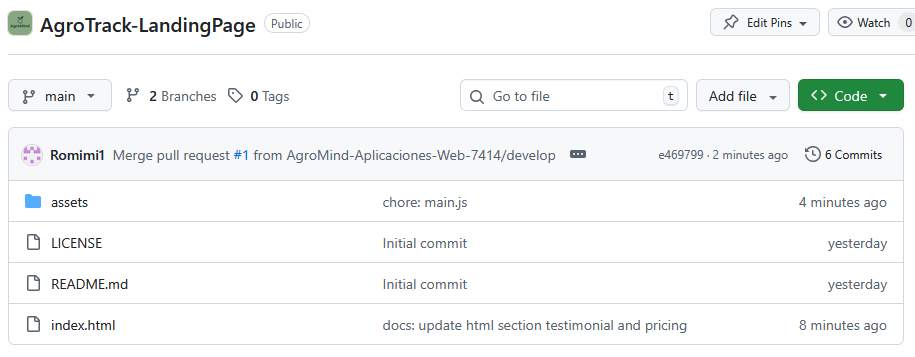

*Figura 2.* Se ingresó a setting y luego a pages.

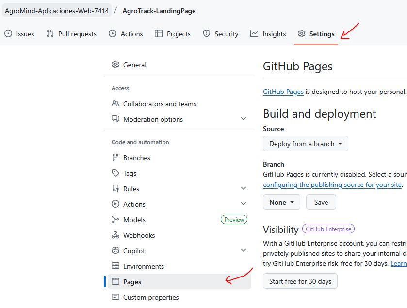

*Figura 3.* seleccionamos la rama en la que se encuentre alojado el proyecto.

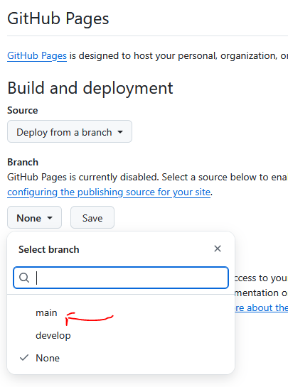

*Figura 4.* Esperamos la URL autogenerada por githubpages.

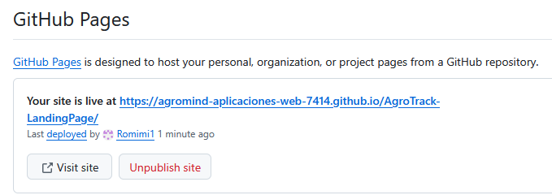

**Link a continuación:**

https://agromind-aplicaciones-web-7414.github.io/ecotrack-landingpage/

#### 5.2.1.8. Team Collaboration Insights during Sprint

Dentro del insight during sprint presentamos los colaboradores del desarollo de la landing page y la cantidad de commits que realizaron:

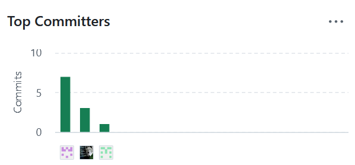

Entre los tres colaboradores que podemos observar se encuentran Romina Tuesta, Anjali Amaro y Cesar Navarro, siendo Romina la que cuenta con la mayor cantidad de commits, continuado por Anjali y finalmente Cesar.

<div style="page-break-after: always;"></div>

### 5.2.2. Sprint 2

#### 5.2.2.1. Sprint Planning 2.

**Sprint Planning Background**

<table>
    <thead>
        <tr>
            <th><strong>Campo</strong></th>
            <th><strong>Contenido</strong></th>
        </tr>
    </thead>
    <tbody>
        <tr>
            <td><strong>Sprint</strong></td>
            <td>Sprint 2</td>
        </tr>
        <tr>
            <td><strong>Date</strong></td>
            <td>01/10/25</td>
        </tr>
        <tr>
            <td><strong>Time</strong></td>
            <td>15:00 PM</td>
        </tr>
        <tr>
            <td><strong>Location</strong></td>
            <td>Reunión virtual (discord)</td>
        </tr>
        <tr>
            <td><strong>Prepared By</strong></td>
            <td>Tuesta Marín, Romina</td>
        </tr>
        <tr>
            <td><strong>Attendees (to planning meeting)</strong></td>
            <td>Tuesta Marín Romina, Amaro Villar Anjali, Baquerizo Cirilo Aaron Santiago, Mostajo Orosco María Fernanda y Navarro Correa César Augusto</td>
        </tr>
        <tr>
            <td><strong>Sprint 2 – 1 Review Summary</strong></td>
            <td>Se completó la estructura base y el despliegue de la landing page del producto. Además, se aprobó la documentación técnica (wireframes, diagramas y guía de estilos) que servirá como referencia visual para el desarrollo de la interfaz del sistema.</td>
        </tr>
        <tr>
            <td><strong>Sprint 2 – 1 Retrospective Summary</strong></td>
            <td>Se identificó la necesidad de definir un flujo de commits más ordenado en GitHub y una mejor asignación de tareas por módulos. Se acordó establecer una convención de nombres para componentes y commits, además de reuniones de seguimiento cada 3 días.</td>
        </tr>
    </tbody>
</table>

<table>
    <thead>
        <tr>
            <th><strong>Campo</strong></th>
            <th><strong>Contenido</strong></th>
        </tr>
    </thead>
    <tbody>
        <tr>
            <td><strong>Sprint 2 Goal</strong></td>
            <td>Nuestro enfoque se centra en entregar la primera versión funcional del front end de EcoTrack con Vue.js y Vite, implementando las vistas principales, el enrutamiento y una estructura de componentes reutilizables. Buscamos ofrecer una <strong>interfaz coherente y dinámica</strong>, validada mediante datos simulados. Esto se confirmará cuando los usuarios puedan navegar entre las vistas sin errores y el equipo de desarrollo pueda ampliar las funcionalidades sin alterar la estructura base.</td>
        </tr>
        <tr>
            <td><strong>Sprint 2 Velocity</strong></td>
            <td>28 points</td>
        </tr>
    </tbody>
</table>

#### 5.2.2.2. Aspect Leaders and Collaborators.

<table>
    <thead>
        <tr>
            <th><strong>Team Member (Last Name, First Name)</strong></th>
            <th><strong>Github Username</strong></th>
            <th><strong>wireframes y MockUps frontend</strong></th>
            <th><strong>Vista Inicio de Sesión</strong></th>
            <th><strong>Vista de Dashboard</strong></th>
            <th><strong>Vista de perfil de usuario</strong></th>
            <th><strong>Establecer estructura</strong></th>
            <th><strong>Despliegue de servicio</strong></th>
            <th></th>
        </tr>
    </thead>
    <tbody>
        <tr>
            <td>Amaro Villar Anjali</td>
            <td>njlmrvllr</td>
            <td>(C)</td>
            <td>(C)</td>
            <td>(L)</td>
            <td>(C)</td>
            <td>(L)</td>
            <td>(L)</td>
            <td>(C)</td>
        </tr>
        <tr>
            <td>Romina Alejanda Tuesta Marin</td>
            <td>Romimi1</td>
            <td>(C)</td>
            <td>(C)</td>
            <td>(L)</td>
            <td>(C)</td>
            <td>(L)</td>
            <td>(C)</td>
            <td>(L)</td>
        </tr>
        <tr>
            <td>Baquerizo Cirilo Aaron Santiago</td>
            <td>AaronBaquerizo2005</td>
            <td>(L)</td>
            <td>(C)</td>
            <td>(C)</td>
            <td>(C)</td>
            <td>(C)</td>
            <td>(C)</td>
            <td>(C)</td>
        </tr>
        <tr>
            <td>Mostajo Orosco Maria Fernanda</td>
            <td>Mafer-m30</td>
            <td>(L)</td>
            <td>(L)</td>
            <td>(C)</td>
            <td>(L)</td>
            <td>(C)</td>
            <td>(C)</td>
            <td>(C)</td>
        </tr>
        <tr>
            <td>Navarro Correa César Augusto</td>
            <td>csr555-ui</td>
            <td>(C)</td>
            <td>(C)</td>
            <td>(C)</td>
            <td>(C)</td>
            <td>(C)</td>
            <td>(C)</td>
            <td>(C)</td>
        </tr>
    </tbody>
</table>

<div style="page-break-after: always;"></div>

#### 5.2.2.3. Sprint Backlog 2.

En este sprint se desarrollará y desplegará la primera version del Front-end completo de EcoTrack. El equipo se enfocó en crear todas las vistas criticas del sistema utilizando una API simulada. Esto estableció las bases visuales y funcionales que permitieron la validación temprana de la experiencia de usuario.

**Herramienta de control: Trello**


URL del Board: [(Link trello)](https://trello.com/b/LNvUn7us/sprint2-ecotrack)

<table>
    <thead>
        <tr>
            <th><strong>User Story ID</strong></th>
            <th><strong>User Story Title</strong></th>
            <th><strong>Task ID</strong></th>
            <th><strong>Task Title</strong></th>
            <th><strong>Description</strong></th>
            <th><strong>Estimation (Hours)</strong></th>
            <th><strong>Asigned To</strong></th>
            <th><strong>Status</strong></th>
        </tr>
    </thead>
    <tbody>
        <tr>
            <td rowspan="2">US01</td>
            <td rowspan="2">Crear organización</td>
            <td>T03</td>
            <td>Desarrollo de Formulario Org</td>
            <td>Diseñar y maquetar el formulario de "Crear Organización" con validaciones FE.</td>
            <td>6</td>
            <td>Maria</td>
            <td>Done</td>
        </tr>
        <tr>
            <td>T04</td>
            <td>Implementar Flujo de Creación</td>
            <td>Desarrollar la lógica de creación y la visualización de la vista de inicio del Agrónomo.</td>
            <td>6</td>
            <td>Maria</td>
            <td>Done</td>
        </tr>
        <tr>
            <td>US02</td>
            <td>Invitar miembros</td>
            <td>T06</td>
            <td>Desarrollo de Flujo de Invitación</td>
            <td>Diseñar e implementar la modal de "Invitar Miembro" y el flujo de envío de invitación simulada.</td>
            <td>9</td>
            <td>Maria</td>
            <td>Done</td>
        </tr>
        <tr>
            <td>US04</td>
            <td>Bitácora de parcela</td>
            <td>T08</td>
            <td>Desarrollo de Bitácora y Registro</td>
            <td>Diseñar e implementar la vista de la línea de tiempo y el formulario "Registrar Actividad".</td>
            <td>10</td>
            <td>Romina</td>
            <td>Done</td>
        </tr>
        <tr>
            <td>US06</td>
            <td>Historial de cultivo</td>
            <td>T09</td>
            <td>Desarrollo de Historial/Filtros</td>
            <td>Diseñar e implementar la vista de "Historial de Cultivo" y los componentes de filtrado.</td>
            <td>9</td>
            <td>Anjali</td>
            <td>In-Progress</td>
        </tr>
        <tr>
            <td>US10</td>
            <td>Creación de parcela</td>
            <td>T05</td>
            <td>Desarrollo de Formulario Parcela</td>
            <td>Diseñar e implementar el formulario "Crear Parcela" con campos de datos y ubicación simulada.</td>
            <td>9</td>
            <td>Maria</td>
            <td>Done</td>
        </tr>
        <tr>
            <td rowspan="2">US13</td>
            <td rowspan="2">Registro de Cultivo</td>
            <td>T01</td>
            <td>Diseño de Formulario de Registro</td>
            <td>Diseñar e implementar el Front-end del formulario de registro (nombre, ubicación simulada, superficie, fecha de siembra).</td>
            <td>8</td>
            <td>Aaron</td>
            <td>Done</td>
        </tr>
        <tr>
            <td>T02</td>
            <td>Implementar Lógica de Guardado</td>
            <td>Desarrollar la lógica de Front-end para guardar la información del cultivo con mensaje de confirmación (usando fake API).</td>
            <td>7</td>
            <td>Aaron</td>
            <td>Done</td>
        </tr>
        <tr>
            <td>US16</td>
            <td>Creación de tareas</td>
            <td>T10</td>
            <td>Desarrollo de Formulario Tarea</td>
            <td>Diseñar e implementar la modal "Crear Tarea" (responsable, fecha, prioridad, checklist).</td>
            <td>9</td>
            <td>Romina</td>
            <td>Done</td>
        </tr>
        <tr>
            <td>US18</td>
            <td>Iniciar tarea</td>
            <td>T11</td>
            <td>Implementar Botón Iniciar</td>
            <td>Diseñar la interfaz de la tarea en detalle y la lógica del botón "Iniciar Tarea" (cambio de estado).</td>
            <td>5</td>
            <td>Aaron</td>
            <td>Done</td>
        </tr>
        <tr>
            <td>US19</td>
            <td>Completar tarea</td>
            <td>T12</td>
            <td>Implementar Checklist y Cierre</td>
            <td>Desarrollar la interacción de la checklist y el flujo de cierre (botón "Completar Tarea").</td>
            <td>5</td>
            <td>Aaron</td>
            <td>Done</td>
        </tr>
        <tr>
            <td>US21</td>
            <td>Reporte general</td>
            <td>T01</td>
            <td>Diseño e Implemntación de Reportes</td>
            <td>Diseñar la interfaz de visualizacion de reportes y el flujo de solicitud de un nuevo reporte</td>
            <td>12</td>
            <td>Anjali</td>
            <td>Done</td>
        </tr>
        <tr>
            <td>US25</td>
            <td>Editar perfil</td>
            <td>T02</td>
            <td>Desarrollo de Edición</td>
            <td>Diseñar e implementar la pantalla de configuración y la lógica de actualización con fake API.</td>
            <td>9</td>
            <td>Cesar</td>
            <td>In-Progress</td>
        </tr>
    </tbody>
</table>

<div style="page-break-after: always;"></div>

#### 5.2.2.4. Development Evidence for Sprint Review.

En esta sección se presentan los avances del desarrollo de la página web y las mejoras implementadas en la solución EcoTrack, enfocadas principalmente en la Landing Page. Durante este periodo, el equipo trabajó en la consolidación del Front-End, incorporando nuevas funcionalidades, componentes reutilizables, simulaciones de datos mediante una Fake API, integración de servicios externos y optimización del código existente. Asimismo, se mejoraron los mecanismos de traducción, la organización del entorno de desarrollo y la documentación técnica del proyecto, fortaleciendo la arquitectura y la mantenibilidad del código.

<table>
    <thead>
        <tr>
            <th>Repositorio</th>
            <th>Rama</th>
            <th>ID de Commit</th>
            <th>Mensaje de Commit</th>
            <th>Descripción del Commit</th>
            <th>Fecha de Commit</th>
        </tr>
    </thead>
    <tbody>
        <tr>
            <td>ecotrack-frontend</td>
            <td>develop</td>
            <td>9558c83</td>
            <td>feat: upload bounded context</td>
            <td>-</td>
            <td>02/10/2025</td>
        </tr>
        <tr>
            <td>ecotrack-frontend</td>
            <td>develop</td>
            <td>021dd42</td>
            <td>feat: add user-organization    component</td>
            <td>-</td>
            <td>06/10/2025</td>
        </tr>
        <tr>
            <td>ecotrack-frontend</td>
            <td>feature/sprint-2-maria</td>
            <td>b643780</td>
            <td>chore: upload db.json</td>
            <td>-</td>
            <td>07/10/2025</td>
        </tr>
        <tr>
            <td>ecotrack-frontend</td>
            <td>feature/sprint-2-romina</td>
            <td>b643780</td>
            <td>chore: upload db.json</td>
            <td>-</td>
            <td>07/10/2025</td>
        </tr>
        <tr>
            <td>ecotrack-frontend</td>
            <td>feature/sprint-2-romina</td>
            <td>740f294</td>
            <td>chore: upload new files</td>
            <td>-</td>
            <td>07/10/2025</td>
        </tr>
        <tr>
            <td>ecotrack-frontend</td>
            <td>feature/sprint-2-aaron</td>
            <td>a261aa1</td>
            <td>feat: add task and cultivation components, and integrate external weather api</td>
            <td>-</td>
            <td>10/10/2025</td>
        </tr>
        <tr>
            <td>ecotrack-frontend</td>
            <td>feature/sprint-2-anjali</td>
            <td>5eaee94</td>
            <td>feat(fake-api): add json-server and configure fake api.</td>
            <td>-</td>
            <td>10/10/2025</td>
        </tr>
        <tr>
            <td>ecotrack-frontend</td>
            <td>feature/sprint-2-anjali</td>
            <td>c6401bd</td>
            <td>feat: add environment configuration and base API classes</td>
            <td>-</td>
            <td>10/10/2025</td>
        </tr>
        <tr>
            <td>ecotrack-frontend</td>
            <td>feature/sprint-2-aaron</td>
            <td>58f72f9</td>
            <td>feat: add initial API contract and frontend structure documentation</td>
            <td>-</td>
            <td>10/10/2025</td>
        </tr>
        <tr>
            <td>ecotrack-landingpage</td>
            <td>main</td>
            <td>ec1bc58</td>
            <td>feat: update translations and improve code</td>
            <td>-</td>
            <td>10/10/2025</td>
        </tr>
    </tbody>
</table>

<div style="page-break-after: always;"></div>

#### 5.2.2.5. Execution Evidence for Sprint Review.

- **Login**


- **Register**


- **Organization**


- **Plots**


- **Reports**


- **Tasks**


- **Weather**


<div style="page-break-after: always;"></div>

#### 5.2.2.6. Services Documentation Evidence for Sprint Review.

Para este segundo sprint, el enfoque se centró exclusivamente en el desarrollo del frontend de la aplicación, utilizando una herramienta para la simulación de un backend.

Se realizó el despliegue de un JSON Server en la plataforma de Azure para simular los servicios de servidor y permitir el consumo de datos desde el frontend.

Link del JSON Server: [agrotrack-mockapi.azurewebsites.net](http://agrotrack-mockapi.azurewebsites.net)

**Endpoints de la API Simulada**

<table>
    <thead>
        <tr>
            <th><strong>Endpoint</strong></th>
            <th><strong>Descripción</strong></th>
        </tr>
    </thead>
    <tbody>
        <tr>
            <td><code>/users</code></td>
            <td>Gestión de usuarios (registro, autenticación, perfil).</td>
        </tr>
        <tr>
            <td><code>/organizations</code></td>
            <td>Gestión de organizaciones agrícolas.</td>
        </tr>
        <tr>
            <td><code>/plots</code></td>
            <td>Gestión de parcelas (creación, edición, eliminación).</td>
        </tr>
        <tr>
            <td><code>/tasks</code></td>
            <td>Gestión de tareas agrícolas (asignación, seguimiento, recordatorios).</td>
        </tr>
        <tr>
            <td><code>/reports</code></td>
            <td>Generación y visualización de reportes agrícolas.</td>
        </tr>
    </tbody>
</table>

<div style="page-break-after: always;"></div>

#### 5.2.2.7. Software Deployment Evidence for Sprint Review.

Para la entrega de este segundo sprint, se implementó la web application de manera parcial.

Los pasos para la connexion del netlify con el github.

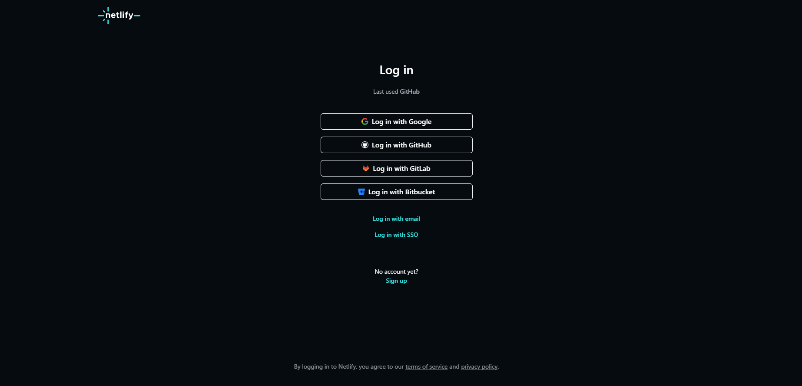
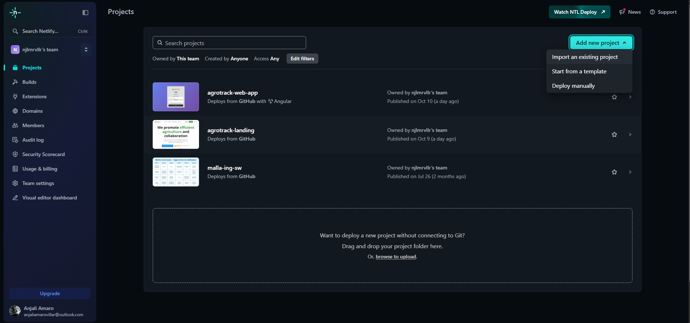
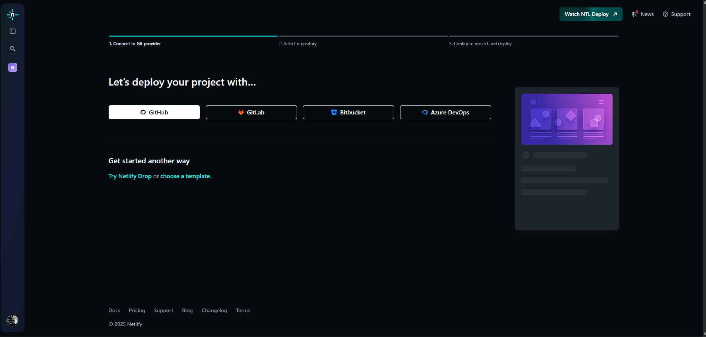
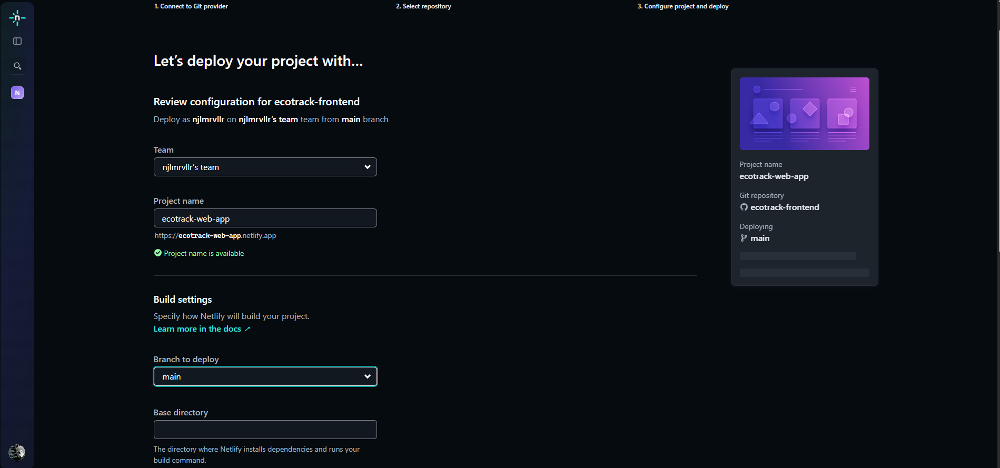
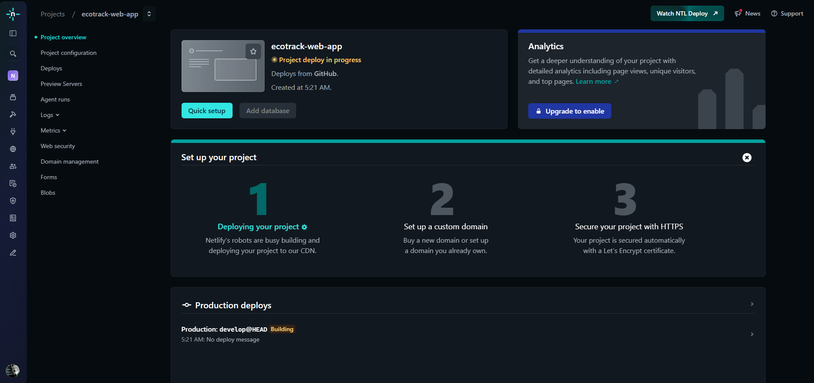

<div style="page-break-after: always;"></div>

#### 5.2.2.8. Team Collaboration Insights during Sprint.

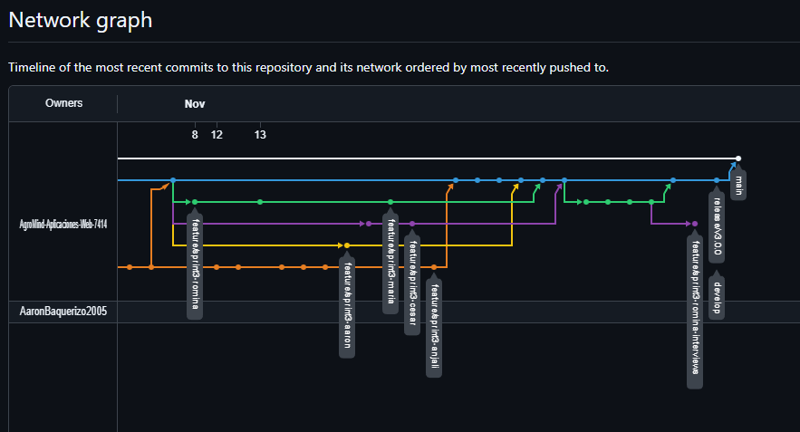


<div style="page-break-after: always;"></div>

### 5.2.3. Sprint 3

#### 5.2.3.1. Sprint Planning 3

**Sprint Planning Background**

<table>
    <thead>
        <tr>
            <th><strong>Campo</strong></th>
            <th><strong>Contenido</strong></th>
        </tr>
    </thead>
    <tbody>
        <tr>
            <td><strong>Sprint</strong></td>
            <td>Sprint 3</td>
        </tr>
        <tr>
            <td><strong>Date</strong></td>
            <td>27/10/25</td>
        </tr>
        <tr>
            <td><strong>Time</strong></td>
            <td>15:00 PM</td>
        </tr>
        <tr>
            <td><strong>Location</strong></td>
            <td>Reunión virtual (discord)</td>
        </tr>
        <tr>
            <td><strong>Prepared By</strong></td>
            <td>Tuesta Marín, Romina</td>
        </tr>
        <tr>
            <td><strong>Attendees (to planning meeting)</strong></td>
            <td>Tuesta Marín Romina, Amaro Villar Anjali, Baquerizo Cirilo Aaron Santiago, Mostajo Orosco María Fernanda y Navarro Correa César Augusto</td>
        </tr>
        <tr>
            <td><strong>Sprint 3 – 2 Review Summary</strong></td>
            <td>Se completó la estructura base y el despliegue del frontend del producto. Además, se coordinó la estructura para el desarrollo del backend.</td>
        </tr>
        <tr>
            <td><strong>Sprint 3 – 2 Retrospective Summary</strong></td>
            <td>Se identificó la necesidad de definir un flujo de commits más ordenado en GitHub y una mejor asignación de tareas por módulos. Se acordó establecer una convención de nombres para componentes y commits, además de reuniones de seguimiento cada 3 días.</td>
        </tr>
    </tbody>
</table>

<table>
    <thead>
        <tr>
            <th><strong>Campo</strong></th>
            <th><strong>Contenido</strong></th>
        </tr>
    </thead>
    <tbody>
        <tr>
            <td><strong>Sprint 3 Goal</strong></td>
            <td>Nuestro enfoque se centra en entregar la versión completa del front end de EcoTrack con Vue.js y Vite. Así como, entregar la primera versión del backend y realizar las correciones dadas en la anterior entrega.</td>
        </tr>
        <tr>
            <td><strong>Sprint 3 Velocity</strong></td>
            <td>32 points</td>
        </tr>
    </tbody>
</table>

#### 5.2.3.2. Aspect Leaders and Collaborators

<table>
    <thead>
        <tr>
            <th><strong>Team Member (Last Name, First Name)</strong></th>
            <th><strong>Github Username</strong></th>
            <th><strong>Completar las vistas del frontend</strong></th>
            <th><strong>Gestionar cuenta</strong></th>
            <th><strong>Vista de Agrónomo y agricultor</strong></th>
            <th><strong>Asignar tareas y gestión de bitácoras</strong></th>
            <th><strong>Visualizar tareas y bitácoras</strong></th>
            <th><strong>Gestión de reportes y generar ficha técnica</strong></th>
            <th></th>
        </tr>
    </thead>
    <tbody>
        <tr>
            <td>Amaro Villar Anjali</td>
            <td>njlmrvllr</td>
            <td>(C)</td>
            <td>(C)</td>
            <td>(C)</td>
            <td>(C)</td>
            <td>(C)</td>
            <td>(L)</td>
            <td>(C)</td>
        </tr>
        <tr>
            <td>Romina Alejanda Tuesta Marin</td>
            <td>Romimi1</td>
            <td>(C)</td>
            <td>(C)</td>
            <td>(L)</td>
            <td>(C)</td>
            <td>(C)</td>
            <td>(C)</td>
            <td>(L)</td>
        </tr>
        <tr>
            <td>Baquerizo Cirilo Aaron Santiago</td>
            <td>AaronBaquerizo2005</td>
            <td>(L)</td>
            <td>(C)</td>
            <td>(C)</td>
            <td>(L)</td>
            <td>(C)</td>
            <td>(C)</td>
            <td>(C)</td>
        </tr>
        <tr>
            <td>Mostajo Orosco Maria Fernanda</td>
            <td>Mafer-m30</td>
            <td>(C)</td>
            <td>(L)</td>
            <td>(C)</td>
            <td>(C)</td>
            <td>(C)</td>
            <td>(C)</td>
            <td>(C)</td>
        </tr>
        <tr>
            <td>Navarro Correa César Augusto</td>
            <td>csr555-ui</td>
            <td>(C)</td>
            <td>(C)</td>
            <td>(C)</td>
            <td>(C)</td>
            <td>(L)</td>
            <td>(C)</td>
            <td>(C)</td>
        </tr>
    </tbody>
</table>

#### 5.2.3.3. Sprint Backlog 3

A continuación podremos observar la organización de tareas dadas para el presente spint dedicado al inicio de la implementación Backend del proyecto, primero se utilizó la herramienta trello para detallas cada tarea, tiempo, complejidad y desarrollador que tomó la tarea.

**Herramienta de control: Trello**


URL del Board: [(Link trello)](https://trello.com/invite/b/68cad1eb2ff733dd8c0d9baf/ATTI10f270255ada0330bbdb76c2e96571f3E5DACF71/sprint-1-ecotrack)

<table>
    <thead>
        <tr>
            <th colspan="2">User Story</th>
            <th colspan="6">Work-Item / Task</th>
        </tr>
        <tr>
            <th><strong>Id</strong></th>
            <th><strong>Title</strong></th>
            <th><strong>Id</strong></th>
            <th><strong>Title</strong></th>
            <th><strong>Description</strong></th>
            <th><strong>Estimation (Hours)</strong></th>
            <th><strong>Assigned To</strong></th>
            <th><strong>Status</strong></th>
        </tr>
    </thead>
    <tbody>
        <tr>
            <td rowspan="3">US01</td>
            <td rowspan="3">Gestión de cuenta</td>
            <td>T01</td>
            <td>Gestionar cuenta</td>
            <td>Implementar funcionalidad para gestionar la cuenta del usuario (inicio de sesión, ajustes generales, etc.).</td>
            <td>4</td>
            <td>Maria Fernanda</td>
            <td>To-do</td>
        </tr>
        <tr>
            <td>T02</td>
            <td>Edición de perfil</td>
            <td>Implementar funcionalidad para editar la información del perfil del usuario.</td>
            <td>6</td>
            <td>Maria Fernanda</td>
            <td>To-do</td>
        </tr>
        <tr>
            <td>T03</td>
            <td>Configuraciones</td>
            <td>Implementar sección de configuraciones del usuario.</td>
            <td>4</td>
            <td>Maria Fernanda</td>
            <td>To-do</td>
        </tr>
        <tr>
            <td rowspan="4">US02</td>
            <td rowspan="3">Vista del agrónomo</td>
            <td>T04</td>
            <td>Crear organización</td>
            <td>Desarrollar vista que permita al agrónomo crear una organización.</td>
            <td>5</td>
            <td>Romina</td>
            <td>To-do</td>
        </tr>
        <tr>
            <td>T05</td>
            <td>Gestionar parcelas y cultivos</td>
            <td>Implementar la gestión de parcelas y cultivos dentro de la vista del agrónomo.</td>
            <td>4</td>
            <td>Romina</td>
            <td>To-do</td>
        </tr>
        <tr>
            <td>T06</td>
            <td>Editar parcela</td>
            <td>Implementar funcionalidad para editar la información de las parcelas.</td>
            <td>3</td>
            <td>Romina</td>
            <td>To-do</td>
        </tr>
        <tr>
            <td>Vista del agricultor</td>
            <td>T07</td>
            <td>Registrar cultivo</td>
            <td>Desarrollar funcionalidad para registrar nuevos cultivos.</td>
            <td>5</td>
            <td>Romina</td>
            <td>To-do</td>
        </tr>
        <tr>
            <td rowspan="4">US03</td>
            <td rowspan="2">Vista del agrónomo</td>
            <td>T08</td>
            <td>Asignar tareas y checklist</td>
            <td>Implementar la vista de agrónomo para asignar tareas y crear checklist de actividades.</td>
            <td>5</td>
            <td>Aaron</td>
            <td>To-do</td>
        </tr>
        <tr>
            <td>T09</td>
            <td>Gestión de bitácoras</td>
            <td>Implementar módulo para registrar y gestionar bitácoras.</td>
            <td>5</td>
            <td>Cesar</td>
            <td>To-do</td>
        </tr>
        <tr>
            <td rowspan="2">Vista del agricultor</td>
            <td>T10</td>
            <td>Visualizar tareas</td>
            <td>Desarrollar vista para que el agricultor visualice sus tareas asignadas.</td>
            <td>4</td>
            <td>Cesar</td>
            <td>To-do</td>
        </tr>
        <tr>
            <td>T11</td>
            <td>Visualizar bitácoras</td>
            <td>Implementar vista que permita al agricultor visualizar las bitácoras.</td>
            <td>4</td>
            <td>Aaron</td>
            <td>To-do</td>
        </tr>
        <tr>
            <td>US04</td>
            <td>Gestión de reportes</td>
            <td>T12</td>
            <td>Generar ficha técnica</td>
            <td>Implementar funcionalidad para generar reportes y fichas técnicas de cultivo.</td>
            <td>5</td>
            <td>Anjali</td>
            <td>To-do</td>
        </tr>
    </tbody>
</table>

#### 5.2.3.4. Development Evidence for Sprint Review

**Avances en la Implementación del Back-End**

En esta sección se presentan los avances del desarrollo del Back-End de la solución Ecotrack, completando la lógica interna del sistema. Se consolidó la arquitectura utilizando Clean Architecture y Domain Driven Design, configurando la infraestructura base, el acceso a datos, la documentación con Swagger y la estructura de servicios e interfaces. Además, se implementaron los módulos principales del dominio, incluyendo la gestión de tareas y checklists, la gestión de bitácoras, al igual que la gestión de parcelas y usuarios, habilitando endpoints funcionales y estables para su integración con el Front-End. Estos avances fortalecen la mantenibilidad del proyecto y dejan el Back-End en un estado completo para las siguientes etapas del desarrollo.

A continuación, se detallan los commits realizados en el repositorio vinculado a la implementación del servidor:

<table>
    <thead>
        <tr>
            <th><strong>Repositorio</strong></th>
            <th><strong>Rama</strong></th>
            <th><strong>ID de Commit</strong></th>
            <th><strong>Mensaje de Commit</strong></th>
            <th><strong>Descripción del Commit</strong></th>
            <th><strong>Fecha de Commit</strong></th>
        </tr>
    </thead>
    <tbody>
        <tr>
            <td>ecotrack-backend</td>
            <td>feature/user-management</td>
            <td>48912f6</td>
            <td>feat(profile): add profile, configuration, iam</td>
            <td>-</td>
            <td>13/11/2025</td>
        </tr>
        <tr>
            <td>ecotrack-backend</td>
            <td>feature/user-management</td>
            <td>aee4ce8</td>
            <td>feat(database): update connection strings to use environment variables</td>
            <td>-</td>
            <td>13/11/2025</td>
        </tr>
        <tr>
            <td>ecotrack-backend</td>
            <td>feature/task-management</td>
            <td>f7eb91b</td>
            <td>feat(monitoringandcontrol): add tasks and checklists management</td>
            <td>-</td>
            <td>13/11/2025</td>
        </tr>
        <tr>
            <td>ecotrack-backend</td>
            <td>feature/task-management</td>
            <td>5a3a7f7</td>
            <td>feat: add logbooks and improve code</td>
            <td>-</td>
            <td>13/11/2025</td>
        </tr>
        <tr>
            <td>ecotrack-backend</td>
            <td>feature/initial-structure</td>
            <td>6a9d0e6</td>
            <td>feat(shared): add IEvent interface and configure dependency injection for shared context and Cortex mediator</td>
            <td>-</td>
            <td>12/11/2025</td>
        </tr>
        <tr>
            <td>ecotrack-backend</td>
            <td>feature/initial-structure</td>
            <td>bfb42fd</td>
            <td>build: add database connection settings and update package references</td>
            <td>-</td>
            <td>22/10/2025</td>
        </tr>
        <tr>
            <td>ecotrack-backend</td>
            <td>feature/initial-structure</td>
            <td>72e6b2a</td>
            <td>feat(shared): implement AppDbContext and repository pattern with snake_case naming convention</td>
            <td>-</td>
            <td>22/10/2025</td>
        </tr>
    </tbody>
</table>

#### 5.2.3.5. Execution Evidence for Sprint Review

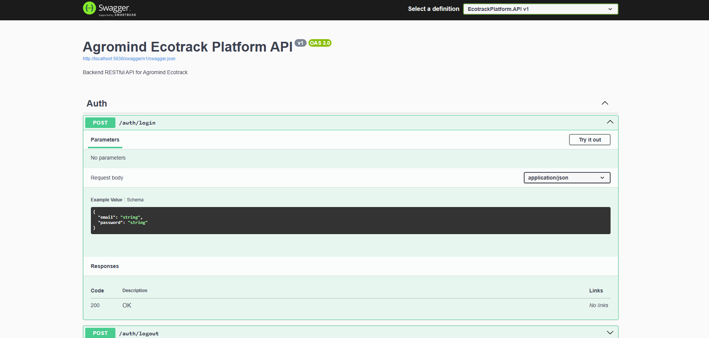
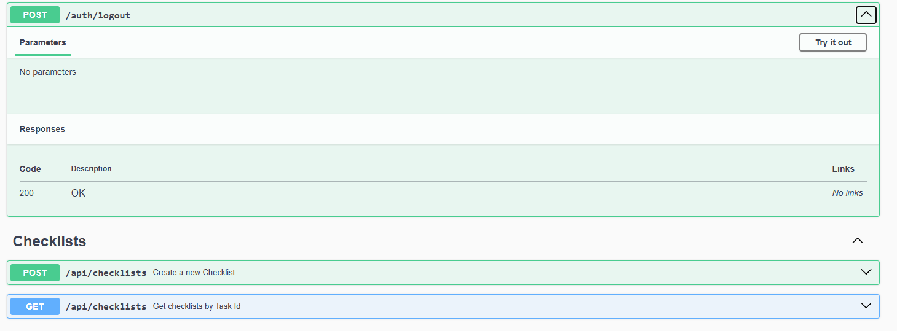
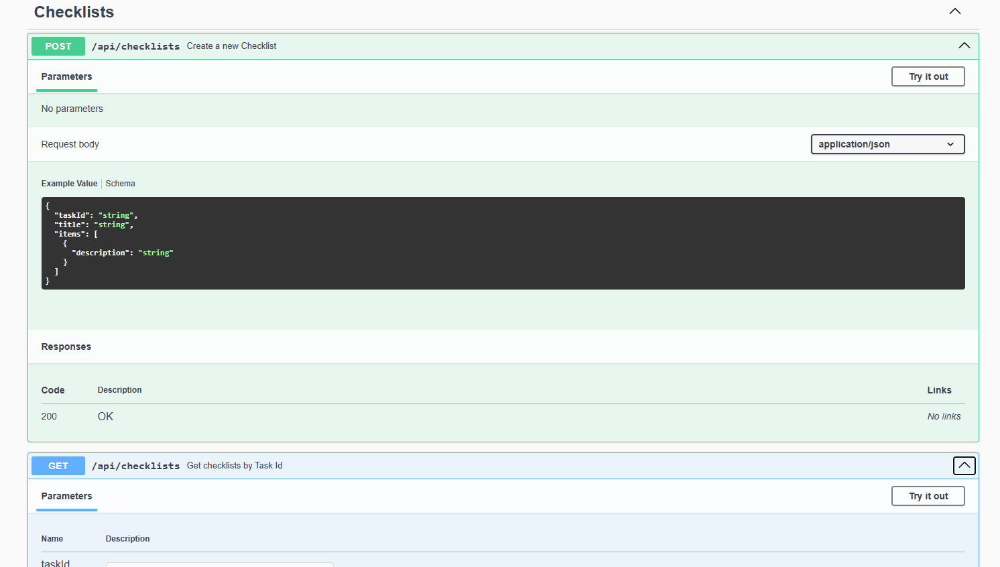
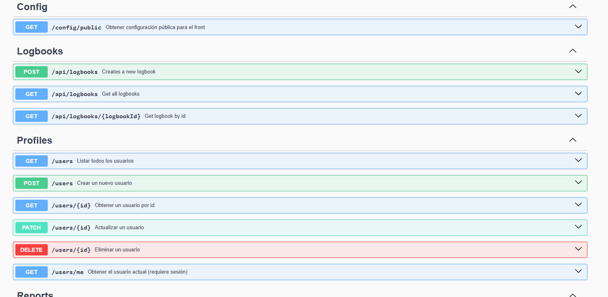
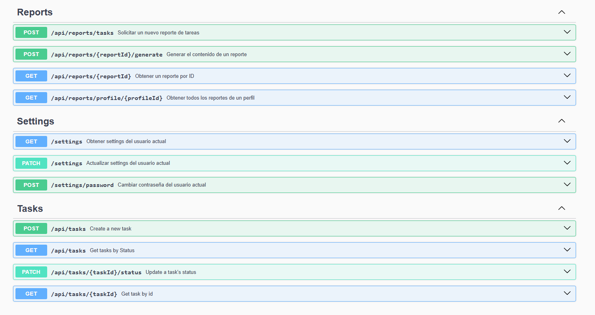

#### 5.2.3.6. Services Documentation Evidence for Sprint Review

<table>
  <thead>
    <tr>
      <th>Endpoint</th>
      <th>Operaciones</th>
      <th>Parámetros</th>
      <th>URL</th>
      <th>Response</th>
    </tr>
  </thead>
  <tbody>
    <tr>
      <td>Auth</td>
      <td>POST</td>
      <td>No tiene</td>
      <td>/auth/login</td>
      <td>Inicia sesión y retorna token</td>
    </tr>
    <tr>
      <td>Auth</td>
      <td>POST</td>
      <td>No tiene</td>
      <td>/auth/logout</td>
      <td>Cierra sesión del usuario actual</td>
    </tr>
    <tr>
      <td>Checklists</td>
      <td>POST</td>
      <td>No tiene</td>
      <td>/api/checklists</td>
      <td>Crea un nuevo checklist</td>
    </tr>
    <tr>
      <td>Checklists</td>
      <td>GET</td>
      <td>taskId</td>
      <td>/api/checklists</td>
      <td>Obtiene checklists por Task Id</td>
    </tr>
    <tr>
      <td>Config</td>
      <td>GET</td>
      <td>No tiene</td>
      <td>/config/public</td>
      <td>Obtiene configuración pública para el front</td>
    </tr>
    <tr>
      <td>Logbooks</td>
      <td>POST</td>
      <td>No tiene</td>
      <td>/api/logbooks</td>
      <td>Crea un nuevo logbook</td>
    </tr>
    <tr>
      <td>Logbooks</td>
      <td>GET</td>
      <td>No tiene</td>
      <td>/api/logbooks</td>
      <td>Obtiene todos los logbooks</td>
    </tr>
    <tr>
      <td>Logbooks</td>
      <td>GET</td>
      <td>{logbookId}</td>
      <td>/api/logbooks/{logbookId}</td>
      <td>Obtiene un logbook por id</td>
    </tr>
    <tr>
      <td>Users</td>
      <td>GET</td>
      <td>No tiene</td>
      <td>/users</td>
      <td>Lista todos los usuarios</td>
    </tr>
    <tr>
      <td>Users</td>
      <td>POST</td>
      <td>No tiene</td>
      <td>/users</td>
      <td>Crea un nuevo usuario</td>
    </tr>
    <tr>
      <td>Users</td>
      <td>GET</td>
      <td>{id}</td>
      <td>/users/{id}</td>
      <td>Obtiene un usuario por id</td>
    </tr>
    <tr>
      <td>Users</td>
      <td>PATCH</td>
      <td>{id}</td>
      <td>/users/{id}</td>
      <td>Actualiza un usuario</td>
    </tr>
    <tr>
      <td>Users</td>
      <td>DELETE</td>
      <td>{id}</td>
      <td>/users/{id}</td>
      <td>Elimina un usuario</td>
    </tr>
    <tr>
      <td>Users</td>
      <td>GET</td>
      <td>No tiene</td>
      <td>/users/me</td>
      <td>Obtiene el usuario actual (requiere sesión)</td>
    </tr>
    <tr>
      <td>Reports</td>
      <td>POST</td>
      <td>No tiene</td>
      <td>/api/reports/tasks</td>
      <td>Solicita un nuevo reporte de tareas</td>
    </tr>
    <tr>
      <td>Reports</td>
      <td>POST</td>
      <td>{reportId}</td>
      <td>/api/reports/{reportId}/generate</td>
      <td>Genera el contenido de un reporte</td>
    </tr>
    <tr>
      <td>Reports</td>
      <td>GET</td>
      <td>{reportId}</td>
      <td>/api/reports/{reportId}</td>
      <td>Obtiene un reporte por id</td>
    </tr>
    <tr>
      <td>Reports</td>
      <td>GET</td>
      <td>{profileId}</td>
      <td>/api/reports/profile/{profileId}</td>
      <td>Obtiene todos los reportes de un perfil</td>
    </tr>
    <tr>
      <td>Settings</td>
      <td>GET</td>
      <td>No tiene</td>
      <td>/settings</td>
      <td>Obtiene ajustes del usuario actual</td>
    </tr>
    <tr>
      <td>Settings</td>
      <td>PATCH</td>
      <td>No tiene</td>
      <td>/settings</td>
      <td>Actualiza los ajustes del usuario actual</td>
    </tr>
    <tr>
      <td>Settings</td>
      <td>POST</td>
      <td>No tiene</td>
      <td>/settings/password</td>
      <td>Cambia la contraseña del usuario</td>
    </tr>
    <tr>
      <td>Tasks</td>
      <td>POST</td>
      <td>No tiene</td>
      <td>/api/tasks</td>
      <td>Crea una nueva tarea</td>
    </tr>
    <tr>
      <td>Tasks</td>
      <td>GET</td>
      <td>status</td>
      <td>/api/tasks</td>
      <td>Obtiene tareas por estado</td>
    </tr>
    <tr>
      <td>Tasks</td>
      <td>PATCH</td>
      <td>{taskId}</td>
      <td>/api/tasks/{taskId}/status</td>
      <td>Actualiza el estado de una tarea</td>
    </tr>
    <tr>
      <td>Tasks</td>
      <td>GET</td>
      <td>{taskId}</td>
      <td>/api/tasks/{taskId}</td>
      <td>Obtiene una tarea por id</td>
    </tr>
  </tbody>
</table>

#### 5.2.3.7. Software Deployment Evidence for Sprint Review

Para la entrega de este tercer sprint, se implementó el backend en swagger y se desplego con Render

Pasos para el despliegue del backend en Rendee:

1. Entrar a la pagina principal

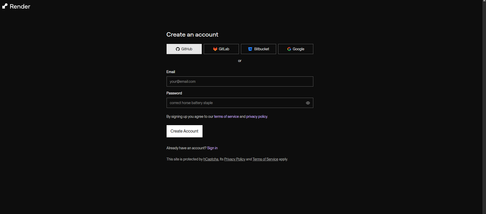

2. Iniciar sesión con github

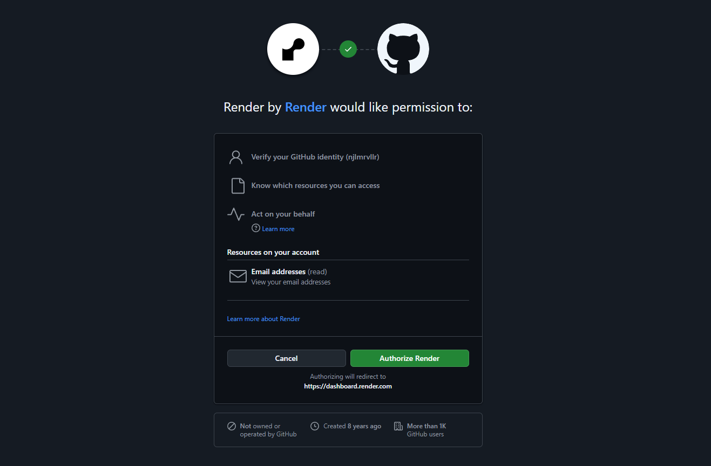

3. Crear un nuevo proyecto

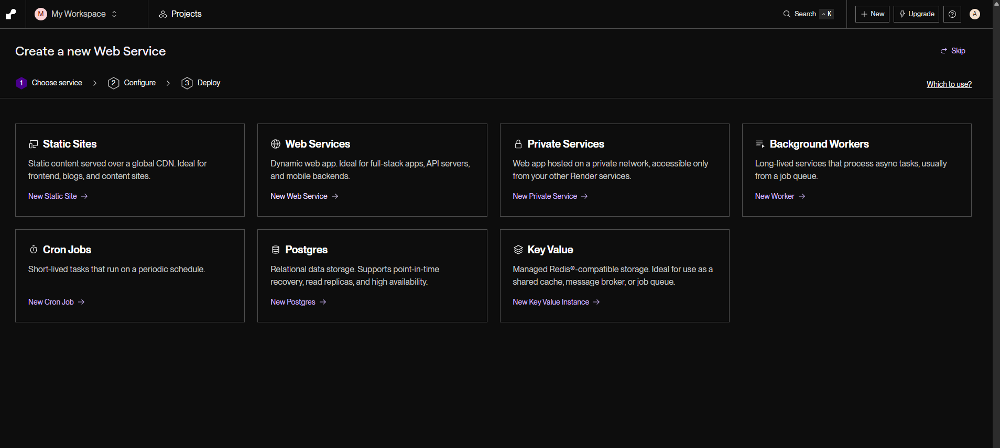

4. Seleccionar el repositorio correspondiente

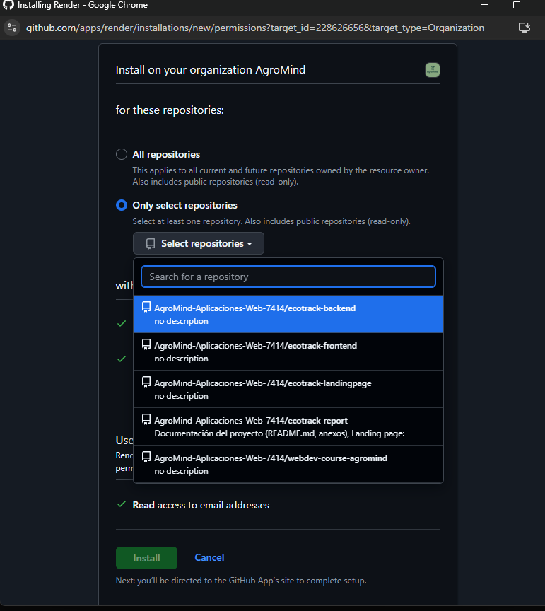


#### 5.2.3.8. Team Collaboration Insights during Sprint

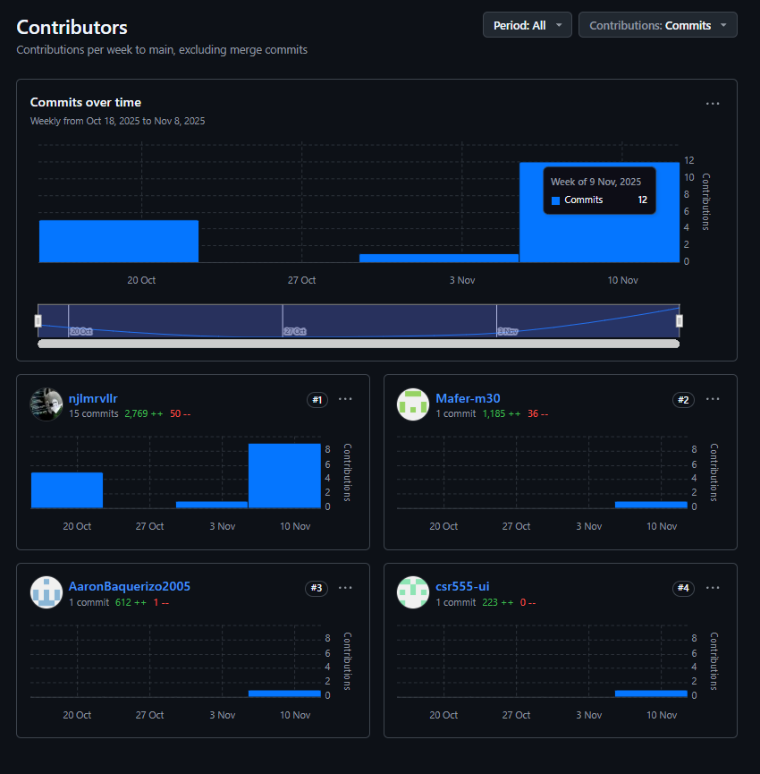
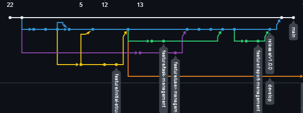

<div style="page-break-after: always;"></div>

### 5.2.4. Sprint 4

#### 5.2.4.1. Sprint Planning 4

<table>
    <thead>
        <tr>
            <th>Campo</th>
            <th>Contenido</th>
        </tr>
    </thead>
    <tbody>
        <tr>
            <td><strong>Sprint 4</strong></td>
            <td>Sprint 4</td>
        </tr>
        <tr>
            <td><strong>Date</strong></td>
            <td>11/11/25</td>
        </tr>
        <tr>
            <td><strong>Time</strong></td>
            <td>15:00 PM</td>
        </tr>
        <tr>
            <td><strong>Location</strong></td>
            <td>Reunión virtual (discord)</td>
        </tr>
        <tr>
            <td><strong>Prepared By</strong></td>
            <td>Tuesta Marín, Romina</td>
        </tr>
        <tr>
            <td><strong>Attendees (to planning meeting)</strong></td>
            <td>Tuesta Marín Romina, Amaro Villar Anjali, Baquerizo Cirilo Aaron Santiago, Mostajo Orosco María Fernanda y Navarro Correa César Augusto</td>
        </tr>
        <tr>
            <td><strong>Sprint 4 – 3 Review Summary</strong></td>
            <td>Durante este sprint se avanzó en la integración del backend con el frontend, se ajustaron componentes visuales y se finalizó la lógica principal de búsqueda de envíos. También se realizaron correcciones derivadas de pruebas internas.</td>
        </tr>
        <tr>
            <td><strong>Sprint 4 – 3 Retrospective Summary</strong></td>
            <td>Se destacó mejoras en la organización del código y mayor coordinación entre los responsables del backend y frontend. Se detectó como oportunidad de mejora una mayor definición técnica antes de iniciar cada tarea para evitar retrabajos.</td>
        </tr>
    </tbody>
</table>

<table>
    <thead>
        <tr>
            <th>Campo</th>
            <th>Contenido</th>
        </tr>
    </thead>
    <tbody>
        <tr>
            <td><strong>Sprint 4 Goal</strong></td>
            <td>Nuestro enfoque se centra en entregar la versión completa del frontend integrado con el backend. Asimismo, realizar las correcciones con respecto a la anterior entrega</td>
        </tr>
        <tr>
            <td><strong>Sprint 4 Velocity</strong></td>
            <td>21 points</td>
        </tr>
    </tbody>
</table>

#### 5.2.4.2. Aspect Leaders and Collaborators

<table>
    <thead>
        <tr>
            <th>Team Member (Last Name, First Name)</th>
            <th>Github Username</th>
            <th>Autenticación</th>
            <th>Gestionar cuenta</th>
            <th>Checklists</th>
            <th>Reportes</th>
            <th>Gestión de tareas</th>
            <th>Gestión de reportes y generar ficha técnica</th>
            <th></th>
        </tr>
    </thead>
    <tbody>
        <tr>
            <td>Amaro Villar Anjali</td>
            <td>njlmrvllr</td>
            <td>(C)</td>
            <td>(C)</td>
            <td>(C)</td>
            <td>(L)</td>
            <td>(C)</td>
            <td>(L)</td>
            <td>(C)</td>
        </tr>
        <tr>
            <td>Romina Alejanda Tuesta Marin</td>
            <td>Romimi1</td>
            <td>(C)</td>
            <td>(C)</td>
            <td>(L)</td>
            <td>(C)</td>
            <td>(C)</td>
            <td>(C)</td>
            <td>(L)</td>
        </tr>
        <tr>
            <td>Baquerizo Cirilo Aaron Santiago</td>
            <td>AaronBaquerizo2005</td>
            <td>(C)</td>
            <td>(C)</td>
            <td>(C)</td>
            <td>(C)</td>
            <td>(C)</td>
            <td>(L)</td>
            <td>(C)</td>
        </tr>
        <tr>
            <td>Mostajo Orosco Maria Fernanda</td>
            <td>Mafer-m30</td>
            <td>(L)</td>
            <td>(L)</td>
            <td>(C)</td>
            <td>(C)</td>
            <td>(C)</td>
            <td>(C)</td>
            <td>(C)</td>
        </tr>
        <tr>
            <td>Navarro Correa César Augusto</td>
            <td>csr555-ui</td>
            <td>(C)</td>
            <td>(C)</td>
            <td>(C)</td>
            <td>(C)</td>
            <td>(L)</td>
            <td>(C)</td>
            <td>(C)</td>
        </tr>
    </tbody>
</table>

#### 5.2.4.3. Sprint Backlog 4

A continuacion se podra observar la organizacion de tareas correspondientes al presente sprint, dedicado a la implementacion y conexion del backend con el frontend. Para ello, se utilizo la herramienta Trello, detallando cada tarea, el tiempo estimado, la complejidad y el desarrollador encargado de la misma.

Herramienta de control: Trello


URL del Board: [(Link del Trello)](https://trello.com/b/LNvUn7us/sprint2-ecotrack)

<table>
  <thead>
    <tr>
      <th>User Story</th>
      <th>Title</th>
      <th>Work-Item / Task</th>
      <th></th>
      <th></th>
      <th></th>
      <th></th>
      <th></th>
    </tr>
  </thead>
  <tbody>
    <tr>
      <td>Id</td>
      <td>Title</td>
      <td>Id</td>
      <td>Title</td>
      <td>Description</td>
      <td>Estimation (Hours)</td>
      <td>Assigned To</td>
      <td>Status (To-do / In-Process / To-Review / Done)</td>
    </tr>
    <tr>
      <td>US01</td>
      <td>Gestión de cuenta</td>
      <td>T01</td>
      <td>Gestionar cuenta</td>
      <td>Implementar funcionalidad para gestionar la cuenta del usuario (inicio de sesión, ajustes generales, etc.).</td>
      <td>4</td>
      <td>Maria Fernanda</td>
      <td>Done</td>
    </tr>
    <tr>
      <td>US01</td>
      <td>Gestión de cuenta</td>
      <td>T02</td>
      <td>Edición de perfil</td>
      <td>Implementar funcionalidad para editar la información del perfil del usuario.</td>
      <td>6</td>
      <td>Maria Fernanda</td>
      <td>Done</td>
    </tr>
    <tr>
      <td>US01</td>
      <td>Gestión de cuenta</td>
      <td>T03</td>
      <td>Configuraciones</td>
      <td>Implementar sección de configuraciones del usuario.</td>
      <td>4</td>
      <td>Maria Fernanda</td>
      <td>Done</td>
    </tr>
    <tr>
      <td>US02</td>
      <td>Vista del agrónomo</td>
      <td>T04</td>
      <td>Crear organización</td>
      <td>Desarrollar vista que permita al agrónomo crear una organización.</td>
      <td>5</td>
      <td>Romina</td>
      <td>Done</td>
    </tr>
    <tr>
      <td>US02</td>
      <td>Vista del agrónomo</td>
      <td>T05</td>
      <td>Gestionar parcelas y cultivos</td>
      <td>Implementar la gestión de parcelas y cultivos dentro de la vista del agrónomo.</td>
      <td>4</td>
      <td>Romina</td>
      <td>Done</td>
    </tr>
    <tr>
      <td>US02</td>
      <td>Vista del agrónomo</td>
      <td>T06</td>
      <td>Editar parcela</td>
      <td>Implementar funcionalidad para editar la información de las parcelas.</td>
      <td>3</td>
      <td>Romina</td>
      <td>Done</td>
    </tr>
    <tr>
      <td>US02</td>
      <td>Vista del agricultor</td>
      <td>T07</td>
      <td>Registrar cultivo</td>
      <td>Desarrollar funcionalidad para registrar nuevos cultivos.</td>
      <td>5</td>
      <td>Romina</td>
      <td>Done</td>
    </tr>
    <tr>
      <td>US03</td>
      <td>Vista del agrónomo</td>
      <td>T08</td>
      <td>Asignar tareas y checklist</td>
      <td>Implementar la vista de agrónomo para asignar tareas y crear checklist de actividades.</td>
      <td>5</td>
      <td>Aaron</td>
      <td>Done</td>
    </tr>
    <tr>
      <td>US03</td>
      <td>Vista del agrónomo</td>
      <td>T09</td>
      <td>Gestión de bitácoras</td>
      <td>Implementar módulo para registrar y gestionar bitácoras.</td>
      <td>5</td>
      <td>Cesar</td>
      <td>Done</td>
    </tr>
    <tr>
      <td>US03</td>
      <td>Vista del agricultor</td>
      <td>T10</td>
      <td>Visualizar tareas</td>
      <td>Desarrollar vista para que el agricultor visualice sus tareas asignadas.</td>
      <td>4</td>
      <td>Cesar</td>
      <td>Done</td>
    </tr>
    <tr>
      <td>US03</td>
      <td>Vista del agricultor</td>
      <td>T11</td>
      <td>Visualizar bitácoras</td>
      <td>Implementar vista que permita al agricultor visualizar las bitácoras.</td>
      <td>4</td>
      <td>Aaron</td>
      <td>Done</td>
    </tr>
    <tr>
      <td>US03</td>
      <td>Vista del agricultor</td>
      <td>T12</td>
      <td>Crear una nueva tarea</td>
      <td>Implementar funcionalidad para crear tareas, asignando al agricultor responsable y la checklist correspondiente.</td>
      <td>5</td>
      <td>Aaron</td>
      <td>Done</td>
    </tr>
    <tr>
      <td>US04</td>
      <td>Gestión de reportes</td>
      <td>T13</td>
      <td>Generar ficha técnica</td>
      <td>Implementar funcionalidad para generar reportes y fichas técnicas de cultivo.</td>
      <td>5</td>
      <td>Anjali</td>
      <td>Done</td>
    </tr>
  </tbody>
</table>


#### 5.2.4.4. Development Evidence for Sprint Review

<table>
    <thead>
        <tr>
            <th>Repositorio</th>
            <th>Rama</th>
            <th>ID de Commit</th>
            <th>Mensaje de Commit</th>
            <th>Descripción del Commit</th>
            <th>Fecha de Commit</th>
        </tr>
    </thead>
    <tbody>
        <tr>
            <td>ecotrack-backend</td>
            <td>main</td>
            <td>da4509f</td>
            <td>fix(database): correct variable name for database connection port in Program.cs</td>
            <td>-</td>
            <td>26/11/2025</td>
        </tr>
	<tr>
            <td>ecotrack-backend</td>
            <td>feature/auth</td>
            <td>da5e00b</td>
            <td>feature: update auth</td>
            <td>-</td>
            <td>2/12/2025</td>
        </tr>
	<tr>
            <td>ecotrack-backend</td>
            <td>main</td>
            <td>984ebb9</td>
            <td>feat(organization): implement crop and organization query services with corresponding queries and controller actions</td>
            <td>-</td>
            <td>2/12/2025</td>
        </tr>
	<tr>
            <td>ecotrack-landingpage</td>
            <td>main</td>
            <td>0318118</td>
            <td>feat: add product and team video sections with descriptions and styles</td>
            <td>-</td>
            <td>2/12/2025</td>
        </tr>
	<tr>
            <td>ecotrack-backend</td>
            <td>main</td>
            <td>4ec8c21</td>
            <td>feat(auth): implement user registration functionality with email validation and password hashing</td>
            <td>-</td>
            <td>2/12/2025</td>
        </tr>
	<tr>
            <td>ecotrack-frontend</td>
            <td>feature/auth</td>
            <td>891f13f</td>
            <td>feature: update auth</td>
            <td>-</td>
            <td>2/12/2025</td>
        </tr>
	<tr>
            <td>ecotrack-frontend</td>
            <td>feature/tasks-management</td>
            <td>374945a</td>
            <td>feat: update Monitoring and Control bounded context and add new task component</td>
            <td>-</td>
            <td>2/12/2025</td>
        </tr>
    </tbody>
</table>


#### 5.2.4.5. Execution Evidence for Sprint Review

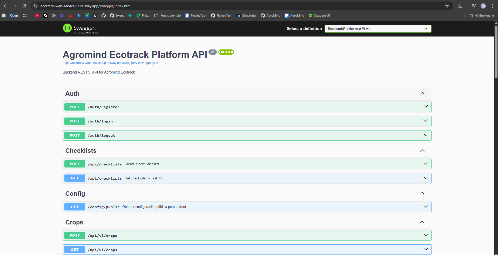
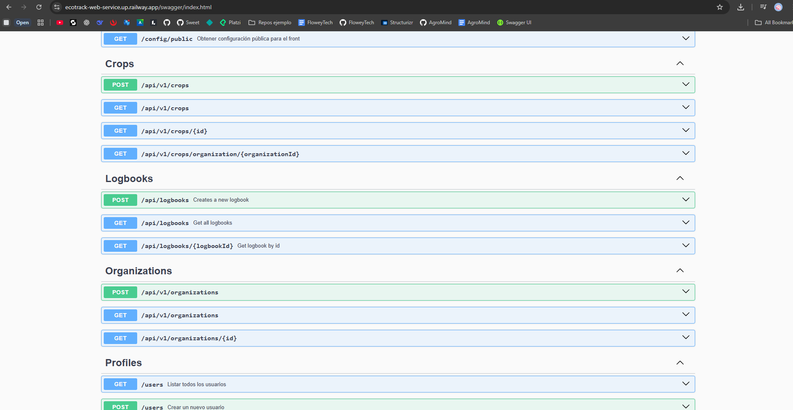
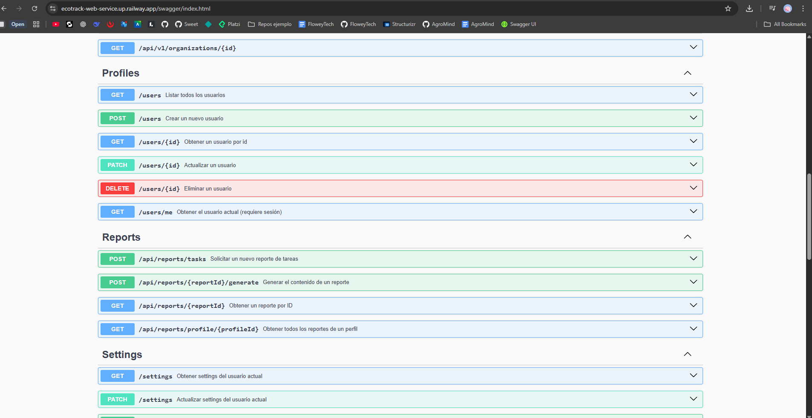
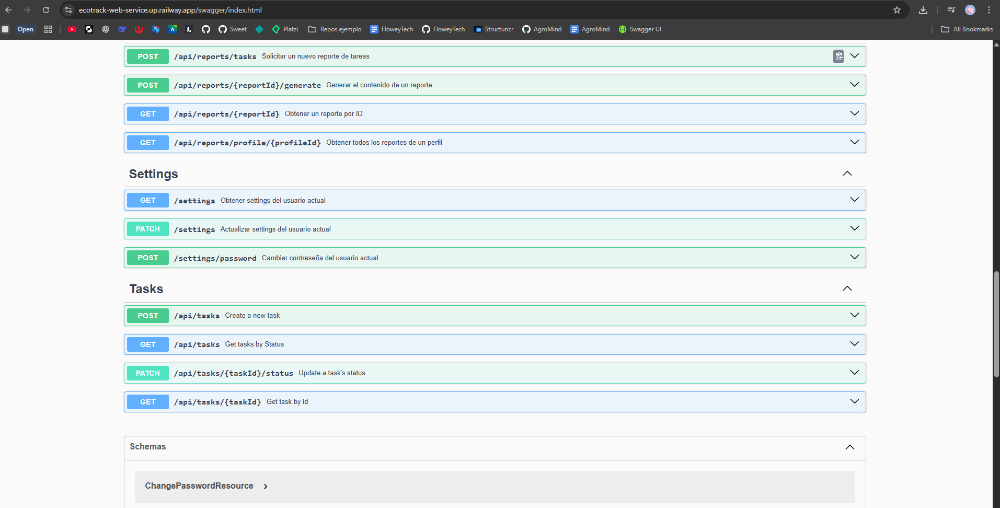

#### 5.2.4.6. Services Documentation Evidence for Sprint Review

<table>
    <thead>
        <tr>
            <th>Endpoint</th>
            <th>Operaciones</th>
            <th>Parámetros</th>
            <th>URL</th>
            <th>Response</th>
        </tr>
    </thead>
    <tbody>
        <tr>
            <td><strong>Auth – Register</strong></td>
            <td>POST</td>
            <td>Body: <code>{ email, password, fullName }</code></td>
            <td>/auth/register</td>
            <td>201 Created – Usuario registrado, retorna usuario + token</td>
        </tr>
        <tr>
            <td><strong>Auth – Login</strong></td>
            <td>POST</td>
            <td>Body: <code>{ email, password }</code></td>
            <td>/auth/login</td>
            <td>200 OK – Retorna token JWT + datos del usuario</td>
        </tr>
        <tr>
            <td><strong>Auth – Logout</strong></td>
            <td>POST</td>
            <td>Header: <code>Authorization: Bearer token</code></td>
            <td>/auth/logout</td>
            <td>200 OK – Sesión cerrada correctamente</td>
        </tr>
        <tr>
            <td><strong>Crops – Crear cultivo</strong></td>
            <td>POST</td>
            <td>Body: <code>{ name, type, organizationId, ... }</code></td>
            <td>/api/v1/crops</td>
            <td>201 Created – Cultivo registrado</td>
        </tr>
        <tr>
            <td><strong>Crops – Listar cultivos</strong></td>
            <td>GET</td>
            <td>Ninguno</td>
            <td>/api/v1/crops</td>
            <td>200 OK – Lista de cultivos</td>
        </tr>
        <tr>
            <td><strong>Crops – Obtener cultivo por ID</strong></td>
            <td>GET</td>
            <td>Path: <code>{id}</code></td>
            <td>/api/v1/crops/{id}</td>
            <td>200 OK – Detalles del cultivo</td>
        </tr>
        <tr>
            <td><strong>Crops – Cultivos por organización</strong></td>
            <td>GET</td>
            <td>Path: <code>{organizationId}</code></td>
            <td>/api/v1/crops/organization/{organizationId}</td>
            <td>200 OK – Lista de cultivos filtrados</td>
        </tr>
        <tr>
            <td><strong>Organizations – Crear organización</strong></td>
            <td>POST</td>
            <td>Body: <code>{ name, address, ownerId }</code></td>
            <td>/api/v1/organizations</td>
            <td>201 Created – Organización registrada</td>
        </tr>
        <tr>
            <td><strong>Organizations – Listar organizaciones</strong></td>
            <td>GET</td>
            <td>Ninguno</td>
            <td>/api/v1/organizations</td>
            <td>200 OK – Lista de organizaciones</td>
        </tr>
        <tr>
            <td><strong>Organizations – Obtener organización por ID</strong></td>
            <td>GET</td>
            <td>Path: <code>{id}</code></td>
            <td>/api/v1/organizations/{id}</td>
            <td>200 OK – Datos de la organización</td>
        </tr>
    </tbody>
</table>

#### 5.2.4.7. Software Deployment Evidence for Sprint Review

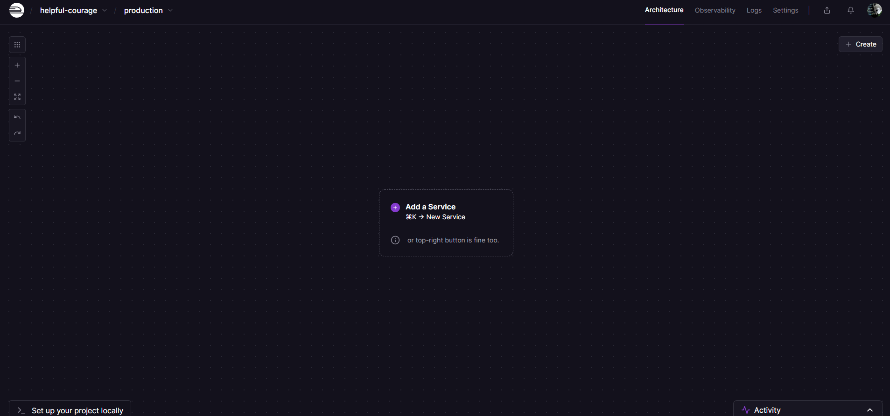
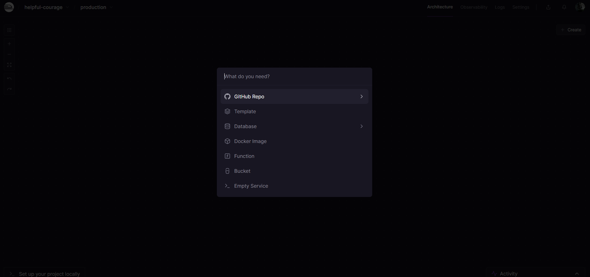
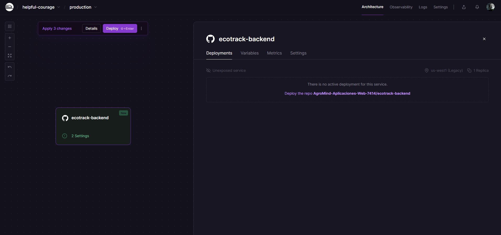
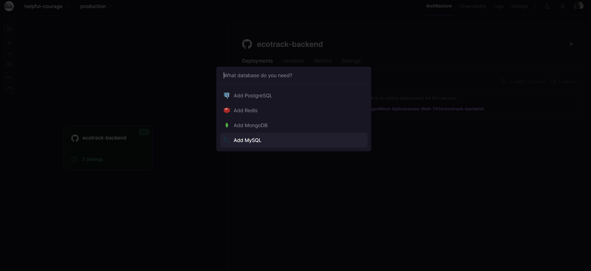
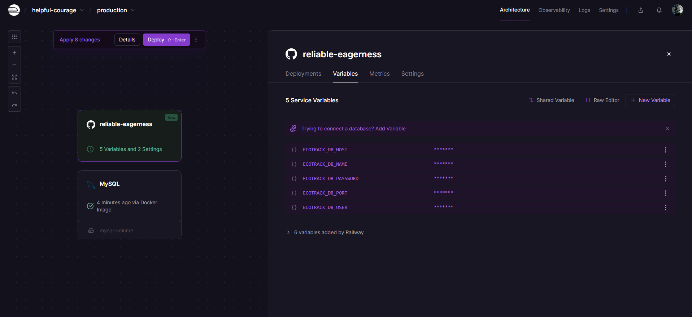
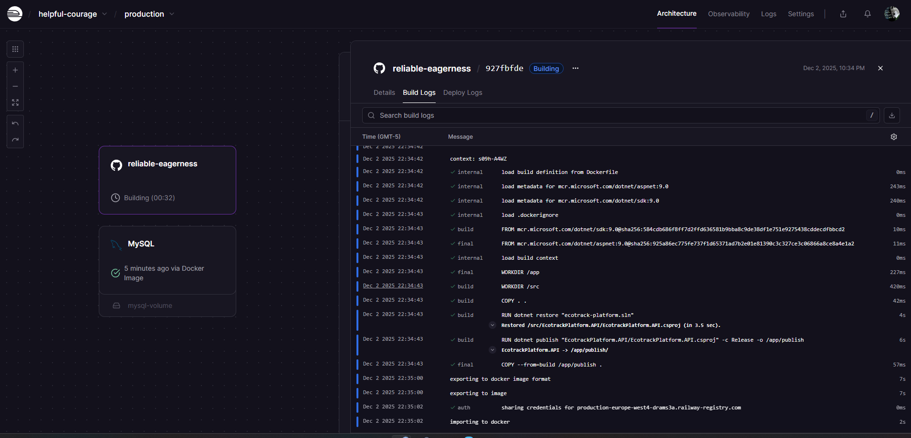
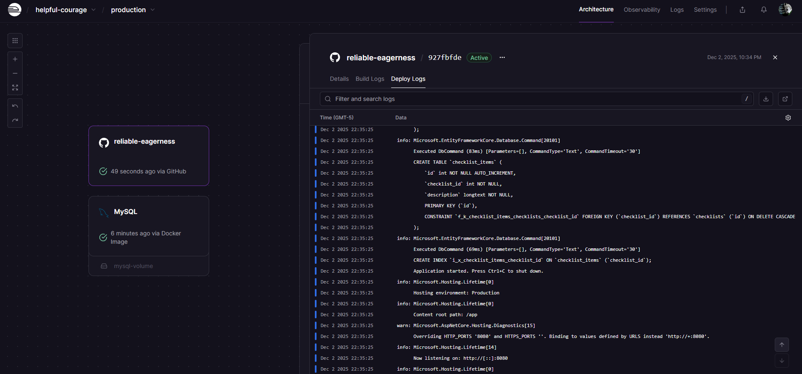

#### 5.2.4.8. Team Collaboration Insights during Sprint

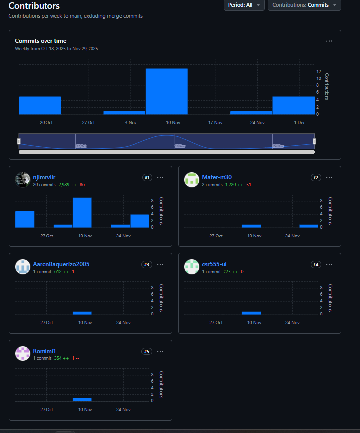


<div style="page-break-after: always;"></div>

## 5.3. Validation Interviews

### 5.3.1. Diseño de entrevistas

**Objetivo de las entrevista**

El objetivo de las entrevistas es validar las hipótesis planteadas en la fase de descubrimiento, obteniendo retroalimentación directa de los usuarios potenciales sobre sus necesidades, desafíos y expectativas en relación con la gestión agrícola digital. Se busca comprender mejor el contexto de uso, identificar posibles mejoras en la propuesta de valor y evaluar la aceptación del producto EcoTrack.

**Landing page**

Se diseñó una landing page que presenta de manera clara y atractiva la propuesta de valor de EcoTrack, destacando sus beneficios, características principales y planes de suscripción. La landing page incluye secciones informativas, testimonios de usuarios y un formulario de contacto para captar el interés de los visitantes.

**Preguntas de validación**

* ¿Qué tan claro te resultó entender qué es EcoTrack y qué beneficios ofrece?
* ¿El diseño, colores e imágenes te transmitieron confianza y profesionalismo?
* ¿Encontraste fácilmente la información que buscabas (funciones, beneficios, contacto)?
* ¿Los botones o llamados a la acción te motivaron a registrarte o pedir más información?
* ¿Qué mejorarías para que la página sea más atractiva o clara para nuevos usuarios?

**Aplicación web**

Se preparó una demostración funcional de la aplicación web EcoTrack, enfocándose en las características clave que abordan las necesidades identificadas durante la fase de descubrimiento. La demo incluye flujos de trabajo típicos, como la creación de parcelas, el registro de cultivos y la gestión de tareas agrícolas.

**Preguntas de validación**

*Agricultor*

1. Inicio de sesión y acceso
    - ¿El proceso de inicio de sesión te pareció sencillo y rápido?
2. Seeleccion de cultivo
    - ¿Pudiste identificar y seleccionar fácilmente tu cultivo principal?
3. Visializacion de tareas
    - ¿Entendiste claramente las tareas pendientes y su estado actual?
4. Alertas asociadas al cultivo
    - ¿Las alertas mostradas te resultaron útiles y comprensibles para tomar decisiones?

*Agrónomo*

1. Inicio de sesión y acceso
    - ¿El proceso de inicio de sesión te pareció sencillo y rápido?
2. Dashboard de organización
    - ¿Pudiste navegar fácilmente por el dashboard y encontrar la información relevante?
3. Creacion de parcelas
    - ¿El proceso de creación de parcelas fue intuitivo y claro?
4. Visualizacion de tareas
    - ¿Te resultó fácil supervisar o actualizar las tareas de los agricultores?
5. Reportes generados
    - ¿Los reportes presentaron información útil y relevante para la gestión agrícola?

<div style="page-break-after: always;"></div>

### 5.3.2. Registro de entrevistas

**Segmento: Ingenieros Agrónomos**

<table>
    <thead>
        <tr>
            <th>Atributo</th>
            <th>Detalle</th>
        </tr>
    </thead>
    <tbody>
        <tr>
            <td>Nombre</td>
            <td>Luis Mendoza</td>
        </tr>
        <tr>
            <td>Edad</td>
            <td>30 años</td>
        </tr>
        <tr>
            <td>Distrito</td>
            <td>Villa El Salvador</td>
        </tr>
        <tr>
            <td>Ocupación</td>
            <td>Ingeniero Agrónomo</td>
        </tr>
        <tr>
            <td>Fecha de entrevista</td>
            <td>10 de noviembre del 2025</td>
        </tr>
        <tr>
            <td>Timing</td>
            <td></td>
        </tr>
        <tr>
            <td>Enlace a la grabación</td>
            <td><a href="https://upcedupe-my.sharepoint.com/:f:/g/personal/u20221g044_upc_edu_pe/IgBwuU7WAsq8T4yiW9A2MDNgAf1oLC4FNp-M7UgV6y70Kk0?e=av9yhd">Ver en Microsoft Stream</a></td>
        </tr>
        <tr>
            <td>Captura de pantalla de la grabación</td>
            <td></td>
        </tr>
        <tr>
            <td>Resumen</td>
            <td>El agrónomo Luis Mendoza comentó que la landing page le permitió comprender de manera clara y rápida qué es EcoTrack y cuál es su propósito. No obstante, recalcó en varias oportunidades que la página carece de imágenes reales relacionadas directamente con el trabajo agrícola, lo cual considera un elemento importante para generar mayor confianza y conexión con los usuarios del sector. Sobre el proceso de inicio de sesión, mencionó que le resultó sencillo y accesible, señalando que esto sería especialmente beneficioso para agricultores que no están acostumbrados a utilizar herramientas digitales. Durante su recorrido por la aplicación web, indicó que la navegación fue fluida e intuitiva, y destacó como oportunidad de mejora la incorporación de gráficos y estadísticas que permitan visualizar mejor la información y apoyar la toma de decisiones en el manejo de cultivos y tareas.</td>
        </tr>
    </tbody>
</table>

<table>
    <thead>
        <tr>
            <th>Atributo</th>
            <th>Detalle</th>
        </tr>
    </thead>
    <tbody>
        <tr>
            <td>Nombre</td>
            <td>Diego Armando Huamán Rojas</td>
        </tr>
        <tr>
            <td>Edad</td>
            <td>27 años</td>
        </tr>
        <tr>
            <td>Distrito</td>
            <td>Ayacucho</td>
        </tr>
        <tr>
            <td>Ocupación</td>
            <td>Ingeniero Agrónomo</td>
        </tr>
        <tr>
            <td>Fecha de entrevista</td>
            <td>10 de noviembre del 2025</td>
        </tr>
        <tr>
            <td>Timing</td>
            <td></td>
        </tr>
        <tr>
            <td>Enlace a la grabación</td>
            <td><a href="https://upcedupe-my.sharepoint.com/:f:/g/personal/u20221g044_upc_edu_pe/IgBwuU7WAsq8T4yiW9A2MDNgAf1oLC4FNp-M7UgV6y70Kk0?e=av9yhd">Ver en Microsoft Stream</a></td>
        </tr>
        <tr>
            <td>Captura de pantalla de la grabación</td>
            <td></td>
        </tr>
        <tr>
            <td>Resumen</td>
            <td>El agrónomo Diego Huamán señaló que la landing page le permitió entender claramente qué es EcoTrack y cuáles son sus beneficios principales. Mencionó que la explicación inicial fue suficiente para captar la propuesta de valor, aunque consideró que se podría reforzar con ejemplos reales de uso en el campo. También destacó que el diseño le transmitió profesionalismo y una buena primera impresión, pero sugirió incluir imágenes auténticas de cooperativas o parcelas para lograr una conexión más directa con usuarios agrícolas. Sobre los llamados a la acción, indicó que eran visibles y fáciles de identificar, aunque comentó que preferiría un botón pensado específicamente para solicitar una demostración. En cuanto a la aplicación web, Diego indicó que el proceso de inicio de sesión fue directo y sin dificultades, aunque sugirió integrar opciones como Google o correos institucionales para facilitar el acceso. El dashboard le pareció útil para obtener una vista general del estado de parcelas y tareas, pero consideró importante incorporar alertas críticas más visibles. Al crear parcelas, destacó que el flujo fue intuitivo y que los campos solicitados eran claros, aunque le gustaría contar con herramientas geográficas como mapas o la opción de cargar límites. Sobre la visualización de tareas, resaltó que la organización era adecuada, pero que filtros más rápidos por fecha o responsable mejorarían la experiencia. Finalmente, comentó que los reportes eran bastante completos.</td>
        </tr>
    </tbody>
</table>

<table>
    <thead>
        <tr>
            <th>Atributo</th>
            <th>Detalle</th>
        </tr>
    </thead>
    <tbody>
        <tr>
            <td>Nombre</td>
            <td>Renzo Sebastián Paredes Castillo</td>
        </tr>
        <tr>
            <td>Edad</td>
            <td>29 años</td>
        </tr>
        <tr>
            <td>Distrito</td>
            <td>Cusco</td>
        </tr>
        <tr>
            <td>Ocupación</td>
            <td>Ingeniero Agrónomo</td>
        </tr>
        <tr>
            <td>Fecha de entrevista</td>
            <td>10 de noviembre del 2025</td>
        </tr>
        <tr>
            <td>Timing</td>
            <td></td>
        </tr>
        <tr>
            <td>Enlace a la grabación</td>
            <td><a href="https://upcedupe-my.sharepoint.com/:f:/g/personal/u20221g044_upc_edu_pe/IgBwuU7WAsq8T4yiW9A2MDNgAf1oLC4FNp-M7UgV6y70Kk0?e=av9yhd">Ver en Microsoft Stream</a></td>
        </tr>
        <tr>
            <td>Captura de pantalla de la grabación</td>
            <td></td>
        </tr>
        <tr>
            <td>Resumen</td>
            <td>El agrónomo Renzo Paredes indicó que la landing page comunicaba de manera clara el valor de EcoTrack desde el primer vistazo, especialmente las partes relacionadas con trazabilidad y reportes, las cuales considera muy importantes en su labor. El diseño le pareció limpio, profesional y fácil de recorrer, aunque sugirió incorporar más ejemplos visuales reales del uso de la plataforma en contextos agrícolas para fortalecer la comprensión. También comentó que encontró rápidamente la información relevante y que quizá sería útil agregar un detalle más explícito sobre precios o planes. Dentro de la aplicación web, Renzo mencionó que el inicio de sesión funcionó bien y sin dificultades, aunque una opción de "recordar sesión" sería muy conveniente. Sobre el dashboard, destacó que ofrece una buena vista general, pero le gustaría ver más elementos visuales como gráficos rápidos o indicadores clave para facilitar la lectura del estado de la organización. En la creación de parcelas, el flujo le pareció rápido y práctico, aunque consideró necesaria una ayuda visual como un mapa para ubicar las parcelas de forma más precisa. En la visualización de tareas encontró útil la organización y el seguimiento de actividades, sugiriendo la incorporación de un calendario para optimizar la planificación. Con respecto a los reportes, opinó que están bien estructurados, pero que sería valioso poder personalizar métricas según cultivo o temporada. Concluyó que sí usaría EcoTrack, ya que podría reducir su carga administrativa y mejorar la supervisión del personal.</td>
        </tr>
    </tbody>
</table>

**Segmento: Agricultores**

<table>
    <thead>
        <tr>
            <th>Atributo</th>
            <th>Detalle</th>
        </tr>
    </thead>
    <tbody>
        <tr>
            <td>Nombre</td>
            <td>Erica Marin Rios</td>
        </tr>
        <tr>
            <td>Edad</td>
            <td>45 años</td>
        </tr>
        <tr>
            <td>Distrito</td>
            <td>Lima</td>
        </tr>
        <tr>
            <td>Ocupación</td>
            <td>Agricultor</td>
        </tr>
        <tr>
            <td>Fecha de entrevista</td>
            <td>13 de noviembre del 2025</td>
        </tr>
        <tr>
            <td>Timing</td>
            <td></td>
        </tr>
        <tr>
            <td>Enlace a la grabación</td>
            <td><a href="https://upcedupe-my.sharepoint.com/:v:/g/personal/u202211706_upc_edu_pe/IQB_flnKF7aESYCUKao0crInAeAfP8ickNdFOBT_elO4Pf8?e=4CgOo9">Ver en Microsoft Stream</a></td>
        </tr>
        <tr>
            <td>Captura de pantalla de la grabación</td>
            <td></td>
        </tr>
        <tr>
            <td>Resumen</td>
            <td>La agricultora Erica Marin manifiesta que La visibilidad de la landing page es buena, atractiva y facil de entender, además que le brinda la información básica de EcoTrack y le da curiosidad conocer más acerca de sus servicios. Sin embargo hay algunos mensajes perdidos que no se pudieron identificar facilmente en la landing, en la parte del slider podría ser más intuitivo, ya que la animación no se puede devolver, las llamadas a la acción fueron intuitivas, pero los iconos deberían ser más grandes para mejor visuazilación, además de agregar un pequeño video en el que planeteen la ayuda en el campo. Para la pagina web, la navegación fue fácil e intuitiva.</td>
        </tr>
    </tbody>
</table>

<table>
    <thead>
        <tr>
            <th>Atributo</th>
            <th>Detalle</th>
        </tr>
    </thead>
    <tbody>
        <tr>
            <td>Nombre</td>
            <td>Luis Alberto Campos Salvatierra</td>
        </tr>
        <tr>
            <td>Edad</td>
            <td>25 años</td>
        </tr>
        <tr>
            <td>Distrito</td>
            <td>Chiclayo</td>
        </tr>
        <tr>
            <td>Ocupación</td>
            <td>Agricultor</td>
        </tr>
        <tr>
            <td>Fecha de entrevista</td>
            <td>10 de noviembre del 2025</td>
        </tr>
        <tr>
            <td>Timing</td>
            <td></td>
        </tr>
        <tr>
            <td>Enlace a la grabación</td>
            <td><a href="https://upcedupe-my.sharepoint.com/:f:/g/personal/u20221g044_upc_edu_pe/IgBwuU7WAsq8T4yiW9A2MDNgAf1oLC4FNp-M7UgV6y70Kk0?e=av9yhd">Ver en Microsoft Stream</a></td>
        </tr>
        <tr>
            <td>Captura de pantalla de la grabación</td>
            <td></td>
        </tr>
        <tr>
            <td>Resumen</td>
            <td>El agricultor Luis Campos mencionó que comprendió sin dificultad qué hace EcoTrack al revisar la landing page, ya que explica de manera sencilla cómo ayuda a organizar cultivos y tareas diarias. Indicó que la página le pareció confiable y ordenada, aunque preferiría ver ejemplos más concretos de cómo usar la plataforma en situaciones reales del campo. También señaló que estaría dispuesto a registrarse, pero comentó que inicialmente necesitaría apoyo porque no está acostumbrado a usar plataformas digitales. En la aplicación web, Luis señaló que el inicio de sesión fue sencillo, pero que él preferiría ingresar con su número de celular, ya que es su método más habitual. Sobre la selección de cultivos, indicó que pudo encontrar el suyo con facilidad, aunque fotos o iconos ayudarían a diferenciar cultivos con nombres similares. La visualización de tareas le resultó clara y útil, destacando especialmente que se indique qué actividades corresponden al día, aunque sugirió mejorar la identificación de tareas urgentes con colores. En cuanto a las alertas del cultivo, mencionó que fue la parte que más valor le generó, ya que lo ayudaría a evitar problemas, y agregó que sería ideal recibirlas también por WhatsApp. Concluyó que sí usaría EcoTrack si le facilita organizar su trabajo y si su agrónomo también adopta la plataforma.</td>
        </tr>
    </tbody>
</table>

<table>
    <thead>
        <tr>
            <th>Atributo</th>
            <th>Detalle</th>
        </tr>
    </thead>
    <tbody>
        <tr>
            <td>Nombre</td>
            <td>Rommer Tuesta Gatica</td>
        </tr>
        <tr>
            <td>Edad</td>
            <td>63 años</td>
        </tr>
        <tr>
            <td>Distrito</td>
            <td>Lima</td>
        </tr>
        <tr>
            <td>Ocupación</td>
            <td>Agricultor</td>
        </tr>
        <tr>
            <td>Fecha de entrevista</td>
            <td>13 de noviembre del 2025</td>
        </tr>
        <tr>
            <td>Timing</td>
            <td></td>
        </tr>
        <tr>
            <td>Enlace a la grabación</td>
            <td><a href="https://upcedupe-my.sharepoint.com/:f:/g/personal/u202211706_upc_edu_pe/IgBJqYFVv4_vQZiN05e2Twx7Aam9e7TBxqESM_TZfBtLI1w?e=7vo2LH">Ver en Microsoft Stream</a></td>
        </tr>
        <tr>
            <td>Captura de pantalla de la grabación</td>
            <td></td>
        </tr>
        <tr>
            <td>Resumen</td>
            <td>El agricultor Rommer Tuesta señaló que al ingresar a la landing page entendió de forma general qué ofrece EcoTrack, aunque mencionó que algunos términos técnicos podrían simplificarse para que resulten más familiares para agricultores con menor experiencia digital. Consideró que la página transmite seriedad y orden, pero que un video corto mostrando el uso de la plataforma ayudaría a reforzar la confianza. Dentro de la aplicación web, indicó que el proceso de registro y acceso fue intuitivo, aunque mencionó que sería útil mostrar mensajes más visibles de confirmación cuando realiza una acción. En la selección de cultivos, pudo identificar los suyos sin dificultad, pero sugirió incluir filtros por región para acelerar la búsqueda. Al revisar la sección de tareas, valoró que se muestre de forma clara qué actividades corresponden a cada cultivo, aunque recomendó permitir reorganizarlas según sus prioridades diarias. Sobre las alertas del cultivo, comentó que le parecieron muy útiles para anticipar riesgos, especialmente las relacionadas con riego y plagas. Sin embargo, indicó que le gustaría recibir un breve resumen semanal que integre todas las alertas para planificar mejor. Finalmente, mencionó que usaría EcoTrack si se mantiene como una herramienta sencilla y si puede integrarla en la rutina del trabajo que realiza junto a su familia.</td>
        </tr>
    </tbody>
</table>

<div style="page-break-after: always;"></div>

### 5.3.3. Evaluaciones según heurísticas

**CARRERA:** Ingeniería de Software

**CURSO:** Aplicaciones Web

**CLIENTE:** Usuarios agrícolas (Agricultores y Agrónomos)

**AUDITOR:** Equipo del proyecto EcoTrack

**APP A EVALUAR: EcoTrack – Plataforma Web para Gestión Agrícola**

**TAREAS EVALUADAS**

Las tareas incluidas en la evaluación fueron:

1. Registro e inicio de sesión
2. Visualización del dashboard
3. Selección de cultivos
4. Creación de parcelas
5. Visualización y gestión de tareas
6. Revisión de alertas del cultivo
7. Generación y consulta de reportes
8. Uso de la landing page para conocer el producto

**TABLA DE ESCALA DE SEVERIDAD**

<table>
    <thead>
        <tr>
            <th>Nivel</th>
            <th>Descripción</th>
        </tr>
    </thead>
    <tbody>
        <tr>
            <td><strong>1</strong></td>
            <td>Problema superficial: puede ser superado fácilmente o ocurre con poca frecuencia. No necesita ser arreglado salvo que haya tiempo disponible.</td>
        </tr>
        <tr>
            <td><strong>2</strong></td>
            <td>Problema menor: ocurre más frecuentemente o es algo más difícil para el usuario. Recomendado arreglarlo en un siguiente release con baja prioridad.</td>
        </tr>
        <tr>
            <td><strong>3</strong></td>
            <td>Problema mayor: ocurre frecuentemente o el usuario no puede resolverlo. Se debe corregir con prioridad alta.</td>
        </tr>
        <tr>
            <td><strong>4</strong></td>
            <td>Problema muy grave: impide al usuario continuar. Debe corregirse antes del lanzamiento.</td>
        </tr>
    </tbody>
</table>


**TABLA RESUMEN DE PROBLEMAS**

<table>
    <thead>
        <tr>
            <th>#</th>
            <th>Problema identificado</th>
            <th>Severidad</th>
            <th>Heurística / Principio violado</th>
        </tr>
    </thead>
    <tbody>
        <tr>
            <td>1</td>
            <td>Falta opción de inicio de sesión alternativo (Google, celular)</td>
            <td>2</td>
            <td>Usability – Flexibilidad y eficiencia</td>
        </tr>
        <tr>
            <td>2</td>
            <td>Landing page sin imágenes reales del campo</td>
            <td>2</td>
            <td>Inclusive Design – Experiencias comparables</td>
        </tr>
        <tr>
            <td>3</td>
            <td>Selección de cultivos sin apoyo visual (iconos/fotos)</td>
            <td>3</td>
            <td>Usability – Reconocimiento mejor que recuerdo</td>
        </tr>
        <tr>
            <td>4</td>
            <td>Alertas poco visibles; falta diferenciación por criticidad</td>
            <td>3</td>
            <td>Usability – Visibilidad del estado del sistema</td>
        </tr>
        <tr>
            <td>5</td>
            <td>Tareas urgentes no tienen color o jerarquía destacada</td>
            <td>3</td>
            <td>Usability – Señalización y prioridades</td>
        </tr>
        <tr>
            <td>6</td>
            <td>Dashboard con pocos gráficos o indicadores visuales</td>
            <td>2</td>
            <td>Information Architecture – Is it understandable?</td>
        </tr>
        <tr>
            <td>7</td>
            <td>Crear parcelas sin mapa o soporte geográfico visual</td>
            <td>3</td>
            <td>Usability – Correspondencia con el mundo real</td>
        </tr>
        <tr>
            <td>8</td>
            <td>Falta opción “Recordar sesión”</td>
            <td>1</td>
            <td>Usability – Minimizar carga del usuario</td>
        </tr>
        <tr>
            <td>9</td>
            <td>Falta calendario para ver tareas</td>
            <td>2</td>
            <td>Usability – Control del usuario</td>
        </tr>
        <tr>
            <td>10</td>
            <td>Alertas importantes no enviadas por WhatsApp</td>
            <td>2</td>
            <td>Inclusive Design – Ajuste al contexto real</td>
        </tr>
    </tbody>
</table>

**DESCRIPCIÓN DETALLADA DE PROBLEMAS**

## **Problema #1 – Falta opción de inicio de sesión alternativo**

**Severidad:** 2

**Heurística violada:** Usability – Flexibilidad y eficiencia del uso

**Problema:**

Los usuarios prefieren iniciar sesión con Google, correo institucional o número de celular, lo cual no está disponible y genera fricción.

**Recomendación:**

Agregar login con Google, instituciones y celular.


## **Problema #2 – Falta de imágenes reales en la landing page**

**Severidad:** 2

**Heurística violada:** Inclusive Design – Experiencias comparables

**Problema:**

Las imágenes no representan el contexto real agrícola, lo que reduce conexión emocional.

**Recomendación:**

Incluir fotografías reales del campo, cooperativas o agrónomos.


## **Problema #3 – Selección de cultivos sin apoyo visual**

**Severidad:** 3

**Heurística violada:** Usability – Reconocimiento mejor que recuerdo

**Problema:**

Los cultivos con nombres similares generan confusión sin iconos o fotos de referencia.

**Recomendación:**

Añadir iconografía o imágenes pequeñas para cada cultivo.


## **Problema #4 – Alertas poco visibles**

**Severidad:** 3

**Heurística violada:** Usability – Visibilidad del estado del sistema

**Problema:**

Las alertas no destacan ni indican su severidad.

**Recomendación:**

Usar colores por nivel, banners y señales visuales fuertes para alertas críticas.


## **Problema #5 – Tareas urgentes sin jerarquía visual**

**Severidad:** 3

**Heurística violada:** Usability – Señalización y prioridades

**Problema:**
Las tareas urgentes se ven idénticas a las normales.

**Recomendación:**
Colores, etiquetas o iconos para urgencia.


## **Problema #6 – Dashboard con poca visualización gráfica**

**Severidad:** 2

**Heurística violada:** Information Architecture – Is it understandable?

**Problema:**

La vista inicial carece de indicadores gráficos que permitan interpretar rápidamente el estado de la organización.

**Recomendación:**

Añadir KPIs, gráficos de barras, indicadores de cultivo y alertas activas.


## **Problema #7 – Crear parcelas sin soporte geográfico**

**Severidad:** 3

**Heurística violada:** Usability – Correspondencia con el mundo real

**Problema:**

Los usuarios necesitan ubicar parcelas en un mapa, no solo datos textuales.

**Recomendación:**

Integrar mapas interactivos para delimitar la parcela.


## **Problema #8 – Falta opción “Recordar sesión”**

**Severidad:** 1

**Heurística violada:** Usability – Minimizar carga del usuario

**Problema:**
El usuario debe loguearse siempre, poco ideal en campo.

**Recomendación:**
Implementar “Mantener sesión iniciada”.

## **Problema #9 – Falta calendario para visualizar tareas**

**Severidad:** 2

**Heurística violada:** Usability – Control y eficiencia del usuario

**Problema:**

No existe vista de calendario para planificar semanal o mensualmente.

**Recomendación:**

Añadir calendario con vista semanal, mensual y por responsable.


## **Problema #10 – Alertas no enviadas por WhatsApp**

**Severidad:** 2

**Heurística violada:** Inclusive Design – Adaptación al contexto

**Problema:**
Los usuarios agrícolas dependen más de WhatsApp que del correo.

**Recomendación:**
Integrar notificaciones vía WhatsApp API.

<div style="page-break-after: always;"></div>

## 5.4. Video About the Product

A continuación, presentaremos el video about the product de Agromind.

El video "About-the-Product" está dirigido principalmente a los visitantes del Landing Page de Agromind, quienes desean conocer más sobre el modelo de negocio y las características principales de la solución. Además, este video tiene como objetivo proporcionar información útil a los usuarios de las aplicaciones que ya están utilizando la plataforma, mostrando cómo la herramienta apoya en su gestión de los cultivos y generar métricas claras.

Link del video en Youtube: [https://youtu.be/q8EpvrpFKiU](https://youtu.be/q8EpvrpFKiU)

Link del video en Microsoft Stream: [https://upcedupe-my.sharepoint.com/:v:/g/personal/u202312874_upc_edu_pe/IQBCgptpG8GDSZekuUmahqJMAWcsF9ZMxOFE9HbFPnptys0?e=CGb3dr](https://upcedupe-my.sharepoint.com/:v:/g/personal/u202312874_upc_edu_pe/IQBCgptpG8GDSZekuUmahqJMAWcsF9ZMxOFE9HbFPnptys0?e=CGb3dr)

<div style="page-break-after: always;"></div>

# Capítulo VI: Product Verification & Validation

## 6.1. Testing Suites & Validation

### 6.1.1. Core Entities Unit Tests


<div style="page-break-after: always;"></div>

### 6.1.2. Core Integration Tests


<div style="page-break-after: always;"></div>

### 6.1.3. Core Behavior-Driven Development


<div style="page-break-after: always;"></div>

### 6.1.4. Core System Tests


<div style="page-break-after: always;"></div>

# Capítulo VII: DevOps Practices

## 7.1. Continuous Integration

### 7.1.1. Tools and Practices

El proyecto implementa Integración Continua (CI) mediante el uso de GitHub Actions. Cada vez que se realiza un push o pull request al repositorio, se ejecuta automáticamente un pipeline que valida la integridad del código, compila el proyecto y ejecuta pruebas automatizadas. Esto permite detectar errores de manera temprana y asegurar la calidad del código antes de su integración.

<div style="page-break-after: always;"></div>

### 7.1.2. Build & Test Suite Pipeline Components

El pipeline de integración continua está compuesto por las siguientes etapas:
- Instalación de dependencias del proyecto (frontend y backend).
- Compilación del proyecto (build).
- Ejecución de pruebas automatizadas (unitarias o de integración, según el módulo).
- Validación de calidad de código.
En el frontend se utilizan comandos como `npm install` y `npm run build`, mientras que en el backend se utilizan comandos como `dotnet build`.


<div style="page-break-after: always;"></div>

## 7.2. Continuous Delivery

### 7.2.1. Tools and Practices

El proyecto implementa entrega continua mediante GitHub Actions, donde los artefactos generados en el pipeline de integración son desplegados automáticamente en un entorno de staging. Esto permite validar los cambios antes de su publicación en producción.


<div style="page-break-after: always;"></div>

### 7.2.2. Stages Deployment Pipeline Components

El pipeline de entrega continua incluye:
- Generación del build del frontend y backend.
- Creación de artefactos listos para despliegue.
- Despliegue automático en un entorno de pruebas (staging).
- Validación del funcionamiento del sistema en el entorno de preproducción.


<div style="page-break-after: always;"></div>

## 7.3. Continuous Deployment

### 7.3.1. Tools and Practices


<div style="page-break-after: always;"></div>

### 7.3.2. Production Deployment Pipeline Components


<div style="page-break-after: always;"></div>

# Conclusiones


<div style="page-break-after: always;"></div>

# Bibliografía


<div style="page-break-after: always;"></div>

# Anexos


<div style="page-break-after: always;"></div>

