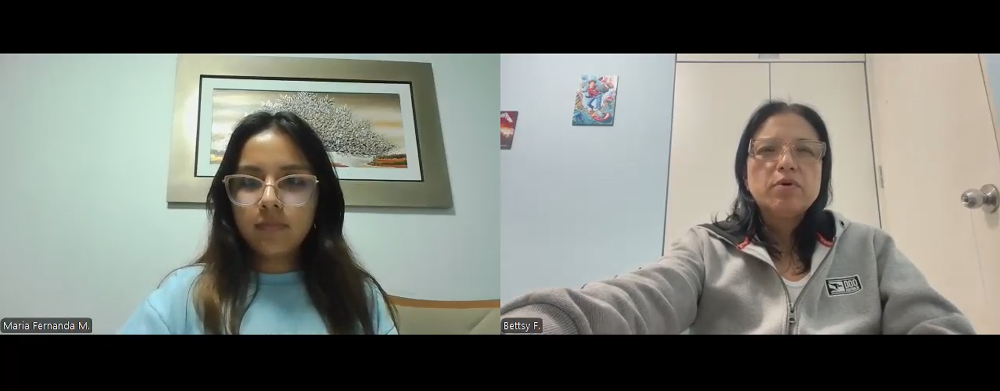

**SEGMENTO AGRICULTOR:**

**Entrevista 1:**

<table>
    <thead>
        <tr>
            <th scope="col">Atributo</th>
            <th scope="col">Detalle</th>
        </tr>
    </thead>
    <tbody>
        <tr>
            <th scope="row">Nombre</th>
            <td>Rommer Tuesta</td>
        </tr>
        <tr>
            <th scope="row">Edad</th>
            <td>62 años</td>
        </tr>
        <tr>
            <th scope="row">Distrito</th>
            <td>Santiago de Surco</td>
        </tr>
        <tr>
            <th scope="row">Ocupación</th>
            <td>Emprendedor agricultor</td>
        </tr>
        <tr>
            <th scope="row">Fecha de entrevista</th>
            <td>09 de Setiembre del 2025</td>
        </tr>
        <tr>
            <th scope="row">Timing</th>
            <td>00:00:00 - 00:15:09</td>
        </tr>
        <tr>
            <th scope="row">Enlace a la grabación</th>
            <td><a href="https://upcedupe-my.sharepoint.com/:v:/g/personal/u20221g044_upc_edu_pe/EWIynez_N45IjdJ6JFNpOusBxo9mDCzON9DF0V6rEsRh9A?e=S7WqUn"><em>Ver en Microsoft Stream</em></a></td>
        </tr>
        <tr>
            <th scope="row">Captura de pantalla de la grabación</th>
            <td></td>
        </tr>
        <tr>
            <th scope="row">Resumen</th>
            <td>Rommer comenta que utiliza principalmente la aplicación Whatsapp en su celular para mantener registro de los avances, trabajos, etc. que se realicen en las plantas, algunas veces, pasa la información de su celular a Excel o Word, pero que no cuenta con una aplicación determinada para esto. Con respecto al trabajo diario, manifiesta que se organizan de manera semanal para cumplir con las necesidades de cuidado de las plantas, asigna las tareas por medio de Whatsapp y manteniene record de esto mismo en la misma aplicación. Además, expresó que desearía conocer con exactitud la ubicación de cada planta con un tablero y mantener un registro de las caracteristicas principales de cada planta como tamaño, ramaje, etc. Cuenta con el trabajo de un agrónomo y a su vez con asesoría de un grupo de agrónomos que son proporcionados por la empresa que compra el producto cocechado. Finalmente, menciona que estaría dispuesto a utilizar una solución tecnológica si es que esta es sencilla y llamativa de usar.</td>
        </tr>
    </tbody>
</table>

**Entrevista 2:**

<table>
    <thead>
        <tr>
            <th scope="col">Atributo</th>
            <th scope="col">Detalle</th>
        </tr>
    </thead>
    <tbody>
        <tr>
            <th scope="row">Nombre</th>
            <td>Miguel Naito</td>
        </tr>
        <tr>
            <th scope="row">Edad</th>
            <td>53 años</td>
        </tr>
        <tr>
            <th scope="row">Distrito</th>
            <td>Lima</td>
        </tr>
        <tr>
            <th scope="row">Ocupación</th>
            <td>Paisajista</td>
        </tr>
        <tr>
            <th scope="row">Fecha de entrevista</th>
            <td>10 de Setiembre del 2025</td>
        </tr>
        <tr>
            <th scope="row">Timing</th>
            <td>00:15:10 - 00:40:46</td>
        </tr>
        <tr>
            <th scope="row">Enlace a la grabación</th>
            <td><a href="https://upcedupe-my.sharepoint.com/:v:/g/personal/u20221g044_upc_edu_pe/EWIynez_N45IjdJ6JFNpOusBxo9mDCzON9DF0V6rEsRh9A?e=S7WqUn"><em>Ver en Microsoft Stream</em></a></td>
        </tr>
        <tr>
            <th scope="row">Captura de pantalla de la grabación</th>
            <td></td>
        </tr>
        <tr>
            <th scope="row">Resumen</th>
            <td>Miguel, comentó que durante la época de cultivo de arándanos se solía utilizar hojas impresas con los planos y posición de cada planta, en estas registraban las caracteristicas de cada una, esto debido a que existía la posibilidad de malograr los dispositivos electrónicos en el barro o averiar de alguna manera, lo cual generaría costo extra y posible pérdida de información valiosa; Realizaban la planificación de la siembra, cosecha, desplantación, abono, etc. anual, mensual y semanalmente. La tecnología que utilizaban eran sensores de tierra que mandaban alertas casi a tiempo real. Expresó que podria utilizar una aplicación dirigida a la gestión agrícola siempre y cuando sea fácil de usar, intuitiva, especifica para cada cultivo y rápida.</td>
        </tr>
    </tbody>
</table>

**Entrevista 3:**

<table>
    <thead>
        <tr>
            <th scope="col">Atributo</th>
            <th scope="col">Detalle</th>
        </tr>
    </thead>
    <tbody>
        <tr>
            <th scope="row">Nombre</th>
            <td>Erica Marin</td>
        </tr>
        <tr>
            <th scope="row">Edad</th>
            <td>45 años</td>
        </tr>
        <tr>
            <th scope="row">Distrito</th>
            <td>Santiago de Surco</td>
        </tr>
        <tr>
            <th scope="row">Ocupación</th>
            <td>Emprendedor agricultor - administrador</td>
        </tr>
        <tr>
            <th scope="row">Fecha de entrevista</th>
            <td>12 de Setiembre del 2025</td>
        </tr>
        <tr>
            <th scope="row">Timing</th>
            <td>00:00:00 - 00:15:09</td>
        </tr>
        <tr>
            <th scope="row">Enlace a la grabación</th>
            <td><a href="https://upcedupe-my.sharepoint.com/:v:/g/personal/u20221g044_upc_edu_pe/EWIynez_N45IjdJ6JFNpOusBxo9mDCzON9DF0V6rEsRh9A?e=S7WqUn"><em>Ver en Microsoft Stream</em></a></td>
        </tr>
        <tr>
            <th scope="row">Captura de pantalla de la grabación</th>
            <td></td>
        </tr>
        <tr>
            <th scope="row">Resumen</th>
            <td>Erica comenta que utiliza ocasionalmente Excel en su computadora para llevar el registro de los avances, tareas y actividades realizadas en las plantas. En ocasiones, complementa esta información trasladándola a documentos en Word. En cuanto a la organización del trabajo diario, explica que planifican las labores de forma semanal para atender las necesidades de cuidado de las plantas, asignando las tareas en Excel y manteniendo allí el registro de las mismas. Además, manifestó que le gustaría contar con un tablero que le permita visualizar con precisión la ubicación de cada planta y registrar sus principales características, como tamaño, ramaje, entre otras. Actualmente trabaja con un agrónomo y recibe asesoría de un grupo de especialistas proporcionados por la empresa compradora de la cosecha. Finalmente, mencionó que estaría dispuesto a adoptar una solución tecnológica siempre que sea sencilla y en el que no deba de invertir mucho en capacitación del personal.</td>
        </tr>
    </tbody>
</table>

**Segmento 2: Agrónomos**

**Entrevista 1:**

<table>
    <thead>
        <tr>
            <th scope="col">Atributo</th>
            <th scope="col">Detalle</th>
        </tr>
    </thead>
    <tbody>
        <tr>
            <th scope="row">Nombre</th>
            <td>Luis Mendoza</td>
        </tr>
        <tr>
            <th scope="row">Edad</th>
            <td>30 años</td>
        </tr>
        <tr>
            <th scope="row">Distrito</th>
            <td>Villa el Salvador</td>
        </tr>
        <tr>
            <th scope="row">Ocupación</th>
            <td>Ingeniero Agrónomo</td>
        </tr>
        <tr>
            <th scope="row">Fecha de entrevista</th>
            <td>06 de Setiembre del 2025</td>
        </tr>
        <tr>
            <th scope="row">Timing</th>
            <td>40:46 - 48:23</td>
        </tr>
        <tr>
            <th scope="row">Enlace a la grabación</th>
            <td><a href="https://upcedupe-my.sharepoint.com/:v:/g/personal/u20221g044_upc_edu_pe/EWIynez_N45IjdJ6JFNpOusBxo9mDCzON9DF0V6rEsRh9A?e=FnurJA&nav=eyJyZWZlcnJhbEluZm8iOnsicmVmZXJyYWxBcHAiOiJTdHJlYW1XZWJBcHAiLCJyZWZlcnJhbFZpZXciOiJTaGFyZURpYWxvZy1MaW5rIiwicmVmZXJyYWxBcHBQbGF0Zm9ybSI6IldlYiIsInJlZmVycmFsTW9kZSI6InZpZXcifSwicGxheWJhY2tPcHRpb25zIjp7InN0YXJ0VGltZUluU2Vjb25kcyI6MjQ0OC4xfX0%3D"><em>Ver en Microsoft Stream</em></a></td>
        </tr>
        <tr>
            <th scope="row">Captura de pantalla de la grabación</th>
            <td></td>
        </tr>
        <tr>
            <th scope="row">Resumen</th>
            <td>Luis comenta que utiliza su celular para anotar en el bloc de notas los conteos que realiza y luego transfiere la información a Excel. Señala que, en ocasiones, resulta complicado trabajar con los agrónomos, ya que muchos no cuentan con conocimientos especializados sobre el suelo y otros aspectos técnicos. Considera que lo ideal sería realizar visitas semanales, y en su labor prepara reportes sobre análisis de suelo, consumo de agua y estudios meteorológicos. También menciona que los agricultores suelen mostrarse reacios a incorporar nuevos conocimientos. En el pasado probó una aplicación que solo permitía registrar conteos, pero no le resultó útil porque funcionaba prácticamente como un bloc de notas. Para él, sería valioso contar con una aplicación que le permita registrar información más completa y que, además, facilite la comunicación directa con los agricultores.</td>
        </tr>
    </tbody>
</table>

**Entrevista 2:**

<table>
    <thead>
        <tr>
            <th scope="col">Atributo</th>
            <th scope="col">Detalle</th>
        </tr>
    </thead>
    <tbody>
        <tr>
            <th scope="row">Nombre</th>
            <td>Lucas Aliaga</td>
        </tr>
        <tr>
            <th scope="row">Edad</th>
            <td>24 años</td>
        </tr>
        <tr>
            <th scope="row">Distrito</th>
            <td>Jicamarca</td>
        </tr>
        <tr>
            <th scope="row">Ocupación</th>
            <td>Ingeniero Agrónomo</td>
        </tr>
        <tr>
            <th scope="row">Fecha de entrevista</th>
            <td>05 de  Setiembre del 2025</td>
        </tr>
        <tr>
            <th scope="row">Timing</th>
            <td>48:23 - 01:05:59</td>
        </tr>
        <tr>
            <th scope="row">Enlace a la grabación</th>
            <td><a href="https://upcedupe-my.sharepoint.com/:v:/g/personal/u20221g044_upc_edu_pe/EWIynez_N45IjdJ6JFNpOusBxo9mDCzON9DF0V6rEsRh9A?e=hsBPPh&nav=eyJyZWZlcnJhbEluZm8iOnsicmVmZXJyYWxBcHAiOiJTdHJlYW1XZWJBcHAiLCJyZWZlcnJhbFZpZXciOiJTaGFyZURpYWxvZy1MaW5rIiwicmVmZXJyYWxBcHBQbGF0Zm9ybSI6IldlYiIsInJlZmVycmFsTW9kZSI6InZpZXcifSwicGxheWJhY2tPcHRpb25zIjp7InN0YXJ0VGltZUluU2Vjb25kcyI6MjkwOS4yMn19"><em>Ver en Microsoft Stream</em></a></td>
        </tr>
        <tr>
            <th scope="row">Captura de pantalla de la grabación</th>
            <td></td>
        </tr>
        <tr>
            <th scope="row">Resumen</th>
            <td>Lucas comenta que, para recopilar información, debe necesariamente acudir al lugar. Su trabajo se enfoca en el control de plagas y en la selección de productos adecuados para resolver esos problemas. Generalmente, realiza visitas al campo una vez o cuando lo llaman. Actualmente no utiliza ninguna aplicación digital que le ayude a registrar sus datos y señala que resulta complicado conectar con los agricultores al intentar enseñarles nuevas prácticas. Sin embargo, percibe una oportunidad de mejora en los jóvenes, quienes muestran mayor disposición a adaptarse a los cambios y a mejorar los procesos. En el pasado probó una aplicación que brindaba información sobre insecticidas y sus componentes, pero no fue suficiente para sus necesidades. Para él, sería valioso contar con una aplicación que le permita conocer el tipo de suelo, las condiciones climáticas y la información básica de los cultivos en cada parcela. Además, considera útil que la app ofrezca gráficos de barras para representar los datos recopilados.</td>
        </tr>
    </tbody>
</table>

**Entrevista 3:**

<table>
    <thead>
        <tr>
            <th scope="col">Atributo</th>
            <th scope="col">Detalle</th>
        </tr>
    </thead>
    <tbody>
        <tr>
            <th scope="row">Nombre</th>
            <td>Sofia Riquez Esteban</td>
        </tr>
        <tr>
            <th scope="row">Edad</th>
            <td>25 años</td>
        </tr>
        <tr>
            <th scope="row">Distrito</th>
            <td>San Mateo de Otao</td>
        </tr>
        <tr>
            <th scope="row">Ocupación</th>
            <td>Ingeniera Agrónoma</td>
        </tr>
        <tr>
            <th scope="row">Fecha de entrevista</th>
            <td>05 de Setiembre del 2025</td>
        </tr>
        <tr>
            <th scope="row">Timing</th>
            <td>01:00:08 - 01:05:44</td>
        </tr>
        <tr>
            <th scope="row">Enlace a la grabación</th>
            <td><a href="https://upcedupe-my.sharepoint.com/:v:/g/personal/u20221g044_upc_edu_pe/EWIynez_N45IjdJ6JFNpOusBxo9mDCzON9DF0V6rEsRh9A?e=L84IuG&nav=eyJyZWZlcnJhbEluZm8iOnsicmVmZXJyYWxBcHAiOiJTdHJlYW1XZWJBcHAiLCJyZWZlcnJhbFZpZXciOiJTaGFyZURpYWxvZy1MaW5rIiwicmVmZXJyYWxBcHBQbGF0Zm9ybSI6IldlYiIsInJlZmVycmFsTW9kZSI6InZpZXcifSwicGxheWJhY2tPcHRpb25zIjp7InN0YXJ0VGltZUluU2Vjb25kcyI6MzYwOS4zOH19"><em>Ver en Microsoft Stream</em></a></td>
        </tr>
        <tr>
            <th scope="row">Captura de pantalla de la grabación</th>
            <td></td>
        </tr>
        <tr>
            <th scope="row">Resumen</th>
            <td>Sofía comenta que realiza el recuento de datos utilizando plataformas como Excel y Python. Su trabajo se centra en identificar plagas, enfermedades de las plantas y en evaluar el estado del suelo de cada parcela. Generalmente, realiza visitas de campo cada 15 días o una vez al mes, lo que le lleva a manejar una gran cantidad de información por parcela. Sin embargo, enfrenta conflictos con los agricultores, ya que muchos suelen confiar únicamente en sus propios conocimientos. Además, las aplicaciones que ha probado hasta ahora no le han resultado útiles. Para ella, sería valioso contar con una aplicación que le permita registrar la información necesaria y recibir alertas sobre el clima.</td>
        </tr>
    </tbody>
</table>