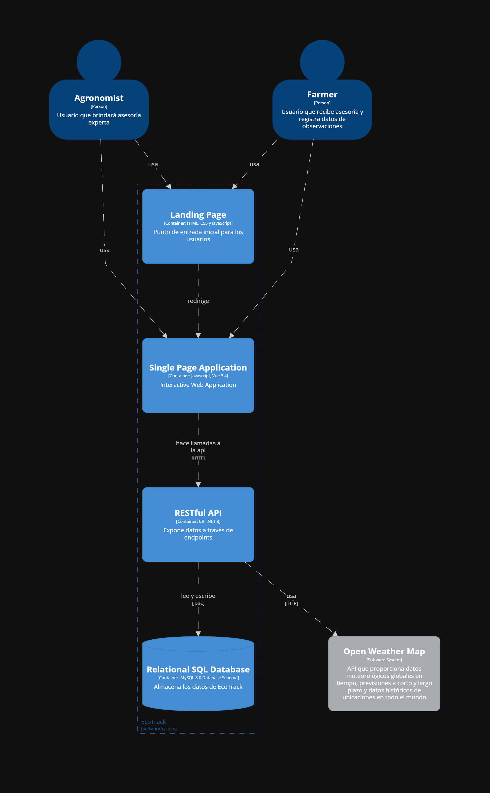

En el diagrama de contenedores de EcoTrack se representan los principales componentes del sistema y la forma en que interactúan entre sí. Los usuarios acceden inicialmente a través de la Landing Page, desde donde son redirigidos a la Single Page Application (SPA). En esta aplicación se gestionan funcionalidades clave como la creación de parcelas, la invitación de nuevos miembros, así como el registro y asignación de tareas.
La SPA se comunica con la API de EcoTrack, que a su vez realiza consultas a la base de datos para recuperar y administrar la información registrada en el sistema.

